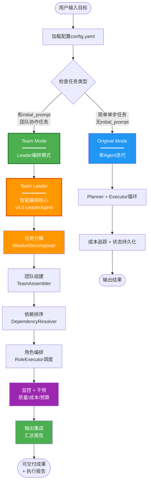
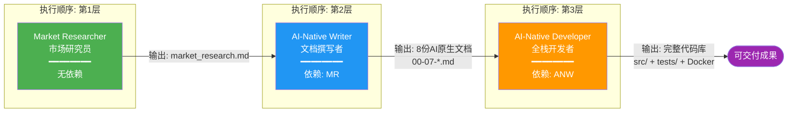
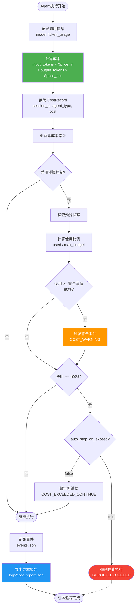
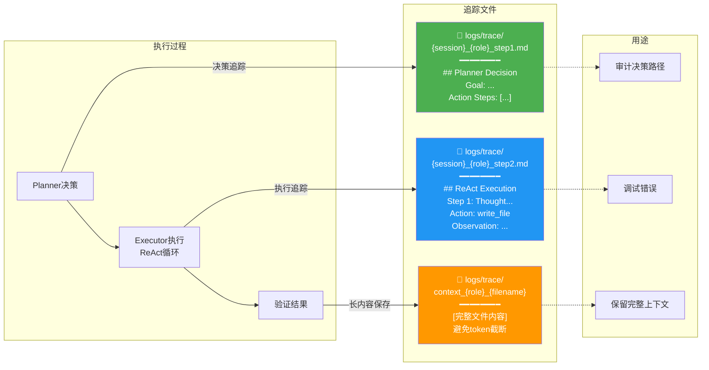

# AI原生团队工作流程图

本文档展示了claude-code-auto系统中AI原生团队的完整工作流程。

---

## 1️⃣ 整体系统架构流程（两层模式）

**架构说明**: Leader是Team Mode的内部编排者，而非独立模式



---

## 2️⃣ Team Mode with Leader 详细工作流

**核心变化**: Team Leader（LeaderAgent）作为编排核心，调用TeamAssembler/DependencyResolver

```mermaid
flowchart TD
    Start([Team Mode启动<br/>initial_prompt]) --> InitLeader[初始化 Team Leader<br/>━━━━━━━━<br/>v4.0 LeaderAgent]

    InitLeader --> LeaderConfig[配置Leader参数<br/>• 质量阈值: 70.0<br/>• 最大重试: 3次<br/>• 预算限制<br/>• 干预策略]

    LeaderConfig --> TaskDecomp[Leader: 任务分解<br/>━━━━━━━━<br/>调用 MissionDecomposer<br/>LLM分解goal]

    TaskDecomp --> ParseMissions[解析SubMissions<br/>• 任务类型<br/>• 成功标准<br/>• 依赖关系]

    ParseMissions --> CallAssembler[Leader: 组装团队<br/>━━━━━━━━<br/>调用 TeamAssembler<br/>选择角色]

    CallAssembler -->|选中的角色| LoadRoles[加载角色定义<br/>roles/*.yaml]
    LoadRoles --> BuildGraph[构建依赖图<br/>Dependency Graph]

    BuildGraph --> CallResolver[Leader: 依赖排序<br/>━━━━━━━━<br/>调用 DependencyResolver]

    CallResolver --> TopoSort[拓扑排序<br/>Kahn算法]
    TopoSort --> CheckCycle{检测循环依赖}

    CheckCycle -->|有循环| Error1([Leader终止<br/>错误: 循环依赖])
    CheckCycle -->|无循环| SortedRoles[获得执行顺序<br/>已排序角色列表]

    SortedRoles --> LeaderOrch[Leader: 开始编排<br/>━━━━━━━━<br/>遍历每个角色]

    LeaderOrch --> LoopCheck{还有角色?}
    LoopCheck -->|否| FinalIntegrate
    LoopCheck -->|是| NextRole[Leader: 取出下一个角色<br/>+ 匹配SubMission]

    NextRole --> InjectRes[Leader: 资源注入<br/>━━━━━━━━<br/>• 工具集<br/>• 技能提示<br/>• MCP服务器]

    InjectRes --> CreateExecutor[Leader: 创建执行器<br/>━━━━━━━━<br/>RoleExecutor实例]

    CreateExecutor --> AssignTask[Leader: 下发任务<br/>━━━━━━━━<br/>• SubMission goal<br/>• 上游context<br/>• 资源配置]

    AssignTask --> MonitorStart[Leader: 开始监控<br/>━━━━━━━━<br/>成本/质量/时间追踪]

    MonitorStart --> PersonaSwitch[Persona切换<br/>根据角色推荐]

    PersonaSwitch --> TaskLoop[任务执行循环<br/>max_iterations次]

    TaskLoop --> UsePlanner{使用Planner?}
    UsePlanner -->|是| PlannerStep[Planner分解任务]
    UsePlanner -->|否| DirectExec

    PlannerStep --> DirectExec[Executor执行<br/>ReAct循环]
    DirectExec --> GetOutput[获取角色输出<br/>+ 执行统计]

    GetOutput --> FormatValid{格式验证}
    FormatValid -->|失败| RetryCheck{重试次数 < max?}
    RetryCheck -->|是| TaskLoop
    RetryCheck -->|否| Error2([角色执行失败])

    FormatValid -->|通过| QualityCheck{启用质量检查?}
    QualityCheck -->|否| LeaderEval
    QualityCheck -->|是| LLMValidate[LLM语义质量评分<br/>Haiku模型]

    LLMValidate --> ScoreCheck{分数 >= 阈值?}
    ScoreCheck -->|否| RetryCheck
    ScoreCheck -->|是| LeaderEval[Leader: 质量评估<br/>━━━━━━━━<br/>• 语义评分<br/>• 成本检查<br/>• 预算检查]

    LeaderEval --> DecideIntervention[Leader: 干预决策<br/>━━━━━━━━<br/>5种策略]

    DecideIntervention --> ActionType{干预类型?}

    ActionType -->|CONTINUE<br/>成功| SaveOutput[Leader: 收集输出<br/>━━━━━━━━<br/>保存角色输出]
    ActionType -->|RETRY<br/>临时失败| RetryLoop{重试 < max_retries?}
    ActionType -->|ENHANCE<br/>需求不清| EnhanceTask[Leader: 增强任务<br/>━━━━━━━━<br/>LLM细化需求]
    ActionType -->|ESCALATE<br/>能力不足| AddHelper[Leader: 升级角色<br/>━━━━━━━━<br/>添加辅助角色]
    ActionType -->|TERMINATE<br/>无法完成| Terminate([Leader终止流程<br/>任务失败])

    RetryLoop -->|是| MonitorStart
    RetryLoop -->|否| Error2

    EnhanceTask --> MonitorStart
    AddHelper --> CreateExecutor

    Error2 --> LogFailure[Leader记录失败日志]
    LogFailure --> UserDecision{用户干预?}
    UserDecision -->|继续| LoopCheck
    UserDecision -->|停止| End

    SaveOutput --> ContextPrepare[准备上下文传递]
    ContextPrepare --> LengthCheck{输出长度}

    LengthCheck -->|< 500字符| FullEmbed[完整内容嵌入context]
    LengthCheck -->|>= 500字符| Summary[生成摘要<br/>前300+后100]

    Summary --> SaveTrace[完整内容保存到<br/>trace文件]
    SaveTrace --> FullEmbed

    FullEmbed --> UpdateContext[Leader: 更新Context<br/>━━━━━━━━<br/>传递给下游角色]
    UpdateContext --> LogTrace[记录Markdown Trace<br/>logs/trace/]

    LogTrace --> CheckBudget{Leader: 预算检查}
    CheckBudget -->|超限| BudgetStop([Leader终止<br/>预算超限])
    CheckBudget -->|正常| LoopCheck

    FinalIntegrate[Leader: 输出集成<br/>━━━━━━━━<br/>调用OutputIntegrator]
    FinalIntegrate --> GenSummary[生成汇总文档<br/>• README<br/>• 项目总结]

    GenSummary --> GenReport[Leader: 生成报告<br/>━━━━━━━━<br/>• 成本报告<br/>• 质量报告<br/>• 干预决策日志<br/>• 执行时间线]

    GenReport --> End([Team任务完成<br/>可交付成果 + 报告])

    Error1 -.-> End
    Terminate -.-> End
    BudgetStop -.-> End

    style InitLeader fill:#FF9800,color:#fff,stroke:#E65100,stroke-width:3px
    style TaskDecomp fill:#FF9800,color:#fff
    style CallAssembler fill:#4CAF50,color:#fff
    style CallResolver fill:#2196F3,color:#fff
    style LeaderEval fill:#FF9800,color:#fff
    style DecideIntervention fill:#9C27B0,color:#fff
    style DirectExec fill:#FF9800,color:#fff
    style LLMValidate fill:#9C27B0,color:#fff
    style SaveOutput fill:#4CAF50,color:#fff
    style FinalIntegrate fill:#4CAF50,color:#fff
    style GenReport fill:#2196F3,color:#fff
```



---

## 3️⃣ 角色依赖关系图 (示例场景)

**场景**: 漫画利基市场App开发



---

## 4️⃣ 单个角色执行流程 (Role Executor)

```mermaid
flowchart TD
    Start([角色任务开始]) --> Init[初始化 Role Executor]
    Init --> LoadDef[加载角色定义<br/>role.yaml]

    LoadDef --> ReadContext[读取上游角色输出<br/>Context传递]
    ReadContext --> SetPersona[切换到推荐Persona<br/>coder/researcher等]

    SetPersona --> IterLoop{迭代 < max_iterations?}

    IterLoop -->|是| CheckPlanner{配置use_planner?}
    IterLoop -->|否| MaxIterFail([超出最大迭代])

    CheckPlanner -->|true| CallPlanner[调用 Planner Agent<br/>分解子任务]
    CheckPlanner -->|false| DirectCall

    CallPlanner --> ParsePlan[解析计划<br/>提取action_steps]
    ParsePlan --> DirectCall[调用 Executor Agent<br/>ReAct执行]

    DirectCall --> WaitReact[ReAct循环运行<br/>最大30步]
    WaitReact --> GetResult[获取执行结果]

    GetResult --> FormatVal[格式验证]
    FormatVal --> CheckFiles{required_files<br/>存在?}

    CheckFiles -->|否| RecordError1[记录错误]
    CheckFiles -->|是| CheckContent{content_check<br/>通过?}

    CheckContent -->|否| RecordError2[记录错误]
    CheckContent -->|是| CheckLength{满足min_length?}

    CheckLength -->|否| RecordError3[记录错误]
    CheckLength -->|是| CheckPlaceholder{有占位符<br/>TODO/PLACEHOLDER?}

    CheckPlaceholder -->|是| RecordError4[记录错误]
    CheckPlaceholder -->|否| QualityGate{启用质量检查?}

    RecordError1 --> DupeCheck
    RecordError2 --> DupeCheck
    RecordError3 --> DupeCheck
    RecordError4 --> DupeCheck

    DupeCheck{连续2次<br/>相同错误?}
    DupeCheck -->|是| InfiniteLoop([检测到无限循环<br/>退出])
    DupeCheck -->|否| IterLoop

    QualityGate -->|false| Success
    QualityGate -->|true| CallLLM[调用 Haiku LLM<br/>语义质量评分]

    CallLLM --> ParseScore[解析 QualityScore<br/>overall_score]
    ParseScore --> ScoreOK{score >= threshold?}

    ScoreOK -->|否| LogIssues[记录质量问题<br/>+ 改进建议]
    LogIssues --> IterLoop

    ScoreOK -->|是| Success[验证成功]

    Success --> CollectOutput[收集角色输出<br/>文件列表]
    CollectOutput --> PrepContext[准备上下文传递]

    PrepContext --> LenCheck{总长度 < 500?}
    LenCheck -->|是| EmbedFull[完整内容嵌入]
    LenCheck -->|否| GenSummary[生成摘要<br/>前300+后100]

    GenSummary --> SaveFull[保存完整内容<br/>trace/{role}_{filename}]
    SaveFull --> EmbedFull

    EmbedFull --> LogMD[记录 Markdown Trace<br/>logs/trace/{session}_{role}_stepX.md]
    LogMD --> Return([返回角色输出<br/>+ context])

    InfiniteLoop -.-> End([流程结束])
    MaxIterFail -.-> End
    Return -.-> End

    style CallPlanner fill:#4CAF50,color:#fff
    style DirectCall fill:#FF9800,color:#fff
    style CallLLM fill:#9C27B0,color:#fff
    style Success fill:#4CAF50,color:#fff
```

---

## 5️⃣ ReAct执行引擎循环

```mermaid
flowchart TD
    Start([Executor启动]) --> InitReact[初始化 ReAct Agent<br/>加载工具注册表]
    InitReact --> BuildPrompt[构建系统提示<br/>+ 角色定义 + 工具列表]

    BuildPrompt --> StepLoop{step < 30?}

    StepLoop -->|是| SendPrompt[发送消息到 Claude SDK]
    StepLoop -->|否| MaxStep([达到最大步数<br/>返回当前结果])

    SendPrompt --> WaitResp[等待 Claude 响应]
    WaitResp --> ParseResp[解析响应内容]

    ParseResp --> TypeCheck{响应类型?}

    TypeCheck -->|文本| CheckFinal{包含 Final Answer?}
    TypeCheck -->|工具调用| ExtractTool[提取工具调用<br/>tool_name + input]

    CheckFinal -->|是| ExtractAnswer[提取最终答案]
    CheckFinal -->|否| AddThought[添加思考内容<br/>到历史]

    ExtractAnswer --> Success([ReAct成功完成])
    AddThought --> StepLoop

    ExtractTool --> ValidateTool{工具存在?}
    ValidateTool -->|否| ErrorMsg1[返回错误消息<br/>"工具不存在"]
    ValidateTool -->|是| ParseInput[解析工具输入<br/>JSON]

    ErrorMsg1 --> AddObserv1[添加 Observation<br/>到历史]
    AddObserv1 --> StepLoop

    ParseInput --> JSONValid{JSON合法?}
    JSONValid -->|否| ErrorMsg2[返回错误消息<br/>"JSON解析失败"]
    JSONValid -->|是| CallTool[调用工具函数<br/>沙箱执行]

    ErrorMsg2 --> AddObserv2[添加 Observation]
    AddObserv2 --> StepLoop

    CallTool --> TryCatch{执行成功?}
    TryCatch -->|异常| CatchError[捕获异常<br/>格式化错误消息]
    TryCatch -->|成功| GetResult[获取工具返回值]

    CatchError --> AddObserv3[添加错误 Observation]
    GetResult --> AddObserv4[添加成功 Observation]

    AddObserv3 --> StepLoop
    AddObserv4 --> StepLoop

    Success -.-> End([返回结果])
    MaxStep -.-> End

    style SendPrompt fill:#4CAF50,color:#fff
    style CallTool fill:#FF9800,color:#fff
    style Success fill:#4CAF50,color:#fff

    classDef thoughtNode fill:#2196F3,color:#fff
    class AddThought,CheckFinal thoughtNode
```

---

## 6️⃣ 依赖解析算法 (Kahn拓扑排序)

```mermaid
flowchart TD
    Start([输入: 角色列表 + 依赖关系]) --> BuildGraph[构建有向图<br/>节点=角色<br/>边=依赖]

    BuildGraph --> CalcIndegree[计算每个节点的入度<br/>indegree[node]]
    CalcIndegree --> FindZero[找到所有入度=0的节点<br/>无依赖角色]

    FindZero --> InitQueue[初始化队列 Q<br/>Q = [入度0的节点]]
    InitQueue --> InitResult[初始化结果列表<br/>result = []]

    InitResult --> LoopCheck{Q 非空?}

    LoopCheck -->|是| Dequeue[Q.pop 取出节点 u]
    LoopCheck -->|否| FinalCheck{result长度 == 总节点数?}

    Dequeue --> AddResult[result.append(u)]
    AddResult --> GetNeighbors[获取 u 的所有邻居<br/>依赖u的角色]

    GetNeighbors --> ForEach{遍历每个邻居 v}
    ForEach -->|还有| DecreaseIndegree[indegree[v] -= 1]
    ForEach -->|完成| LoopCheck

    DecreaseIndegree --> CheckZero{indegree[v] == 0?}
    CheckZero -->|是| Enqueue[Q.append(v)]
    CheckZero -->|否| ForEach

    Enqueue --> ForEach

    FinalCheck -->|是| Success([成功: 返回排序结果<br/>执行顺序确定])
    FinalCheck -->|否| DetectCycle[检测到循环依赖]

    DetectCycle --> FindCycle[找出循环路径<br/>DFS回溯]
    FindCycle --> Error([错误: 循环依赖<br/>列出循环路径])

    Success -.-> End([流程结束])
    Error -.-> End

    style BuildGraph fill:#4CAF50,color:#fff
    style CalcIndegree fill:#2196F3,color:#fff
    style Dequeue fill:#FF9800,color:#fff
    style Success fill:#4CAF50,color:#fff
    style Error fill:#f44336,color:#fff
```

---

## 7️⃣ 质量验证双层架构

```mermaid
flowchart LR
    subgraph "第1层: 格式验证"
        Input([角色输出]) --> FileCheck[文件存在性检查<br/>required_files]
        FileCheck --> ContentCheck[内容检查<br/>content_check]
        ContentCheck --> LenCheck[最小长度检查<br/>min_length × complexity]
        LenCheck --> PlaceholderCheck[占位符检查<br/>TODO/PLACEHOLDER禁止]
    end

    PlaceholderCheck -->|通过| Gate{启用<br/>质量检查?}
    PlaceholderCheck -->|失败| FormatFail([格式验证失败])

    Gate -->|否| DirectPass([验证通过])
    Gate -->|是| Layer2

    subgraph "第2层: 语义质量验证"
        Layer2[调用 Haiku LLM] --> BuildPrompt[构建评分提示<br/>+ 成功标准]
        BuildPrompt --> GetScore[获取 QualityScore<br/>overall_score: 0-100]
        GetScore --> ParseCriteria[解析各项评分<br/>criteria_scores]
        ParseCriteria --> ExtractIssues[提取问题列表<br/>issues]
        ExtractIssues --> ExtractSuggest[提取改进建议<br/>suggestions]
    end

    ExtractSuggest --> ThresholdCheck{score >= threshold?}
    ThresholdCheck -->|是| QualityPass([质量验证通过])
    ThresholdCheck -->|否| QualityFail([质量验证失败<br/>+改进建议])

    FormatFail -.-> Retry[重新执行角色任务]
    QualityFail -.-> Retry
    DirectPass -.-> NextRole[下一个角色]
    QualityPass -.-> NextRole

    style FileCheck fill:#2196F3,color:#fff
    style Layer2 fill:#9C27B0,color:#fff
    style QualityPass fill:#4CAF50,color:#fff
    style QualityFail fill:#f44336,color:#fff
```



---

## 8️⃣ 成本控制和预算追踪



---

## 9️⃣ Markdown Trace日志系统



---

## 📊 完整执行示例: 漫画App开发项目

```mermaid
gantt
    title AI原生团队执行时间线 (漫画利基市场App)
    dateFormat  HH:mm
    axisFormat %H:%M

    section 第1层 (无依赖)
    Market Researcher           :mr, 00:00, 25m
    - 市场调研                  :00:00, 10m
    - 竞品分析                  :10:00, 8m
    - 输出报告                  :18:00, 7m

    section 第2层 (依赖MR)
    AI-Native Writer            :anw, after mr, 40m
    - 读取研究报告              :25:00, 3m
    - 生成8份文档               :28:00, 32m
    - 验证文档质量              :60:00, 5m

    section 第3层 (依赖ANW)
    AI-Native Developer         :and, after anw, 50m
    - 读取8份文档               :65:00, 5m
    - 实现代码                  :70:00, 25m
    - 编写测试                  :95:00, 10m
    - Docker配置                :105:00, 5m
    - 质量验证                  :110:00, 5m

    section 可交付成果
    最终输出                    :crit, after and, 5m
```

**总执行时间**: ~2小时
**总成本**: ~$1.50 USD (预估)
**输出文件**:
- `market_research.md`
- `docs/00-07-*.md` (8份)
- `src/main.py`
- `tests/test_main.py`
- `Dockerfile`
- `README.md`
- `.env.example`
- `requirements.txt`

---

## 📝 关键流程说明

### 1. **Team Assembly (团队组建)**
- LLM分析`initial_prompt`，识别需要的角色
- 从`roles/`目录加载角色定义
- 验证角色依赖关系

### 2. **Dependency Resolution (依赖解析)**
- 使用Kahn算法进行拓扑排序
- O(V+E)时间复杂度
- 检测并拒绝循环依赖
- 计算执行层级（可视化/并行化）

### 3. **Role Execution (角色执行)**
- 每个角色独立执行，最大`max_iterations`次
- 可选Planner分解任务
- Executor执行ReAct循环
- 双层验证（格式+语义）

### 4. **Context Passing (上下文传递)**
- 短内容(<500字符)：完整嵌入
- 长内容(>=500字符)：摘要+完整保存
- 避免token浪费和内容截断

### 5. **Quality Control (质量控制)**
- 格式验证：文件存在、内容检查、长度、占位符
- 语义验证：LLM评分（0-100）、问题识别、改进建议
- 自适应标准：基于任务复杂度调整阈值

### 6. **Cost Management (成本管理)**
- 实时token追踪
- 预算警告（80%阈值）
- 自动停止（可选）
- 详细成本报告

### 7. **Trace Logging (追踪日志)**
- Planner决策日志
- ReAct执行日志
- 完整上下文保存
- Markdown格式，便于审计

---

## 🎯 总结

这个AI原生团队工作流系统通过以下创新实现了真正的自主协作：

✅ **智能编排**: 三层模式适应不同复杂度
✅ **依赖管理**: 拓扑排序保证执行顺序
✅ **质量保证**: 双层验证（格式+语义）
✅ **成本控制**: 实时追踪+预算门
✅ **可审计性**: 完整Trace日志
✅ **角色专业化**: YAML定义清晰职责
✅ **上下文保留**: 避免截断和信息丢失

这是一个完整的生产级AI原生自主工作流系统！🚀

---

## 🔄 架构演进说明 (v4.0 重构)

### 旧架构问题（三层并列）

**问题设计**：
```
main.py 三层分支：
├─ Original Mode (单Agent)
├─ Team Mode (静态编排)
└─ Leader Mode (独立编排)  ← ❌ 概念混淆
```

**核心问题**：
1. ❌ **概念混淆**：Leader应该是Team的编排者，而非独立的第三种模式
2. ❌ **职责重叠**：LeaderAgent和TeamOrchestrator都在做编排工作
3. ❌ **配置复杂**：需要在`leader.enabled`和`initial_prompt`之间做选择
4. ❌ **维护困难**：三条执行路径，测试和维护成本高

---

### 新架构设计（两层模式）

**清晰设计**：
```
main.py 两层决策：
├─ Original Mode (单Agent迭代)
└─ Team Mode (Leader作为内部编排核心)
     └─ Team Leader (v4.0 LeaderAgent)
          ├─ 任务分解 (MissionDecomposer)
          ├─ 团队组建 (TeamAssembler)
          ├─ 依赖排序 (DependencyResolver)
          ├─ 执行监控 (RoleExecutor调度)
          ├─ 干预决策 (5种策略)
          └─ 输出集成 (OutputIntegrator)
```

**决策逻辑**：
```python
# 简化后的模式选择
if config.task.initial_prompt:
    run_team_mode_with_leader()  # ✅ Team Mode（自动启用Leader）
else:
    run_original_mode()          # ✅ 单Agent模式
```

---

### Leader职责边界

| 组件 | 旧架构 | 新架构 | 备注 |
|------|--------|--------|------|
| **Leader位置** | 独立模式 | Team内部编排者 | ✅ 清晰定位 |
| **TeamAssembler** | 独立调用 | Leader调用 | ✅ 职责明确 |
| **DependencyResolver** | 独立调用 | Leader调用 | ✅ 职责明确 |
| **RoleExecutor** | Team直接调度 | Leader监控调度 | ✅ 增加智能 |
| **干预策略** | 无 | Leader负责 | ✅ 新增能力 |
| **输出集成** | 无 | Leader负责 | ✅ 新增能力 |

---

### 配置变化

**旧配置（问题）**：
```yaml
# 需要两个开关
leader:
  enabled: false  # ❌ 容易混淆

task:
  initial_prompt: "..."  # ❌ 和leader.enabled冲突
```

**新配置（清晰）**：
```yaml
# 只需一个条件
task:
  initial_prompt: "..."  # ✅ 有此字段 → Team Mode（自动启用Leader）

# Leader参数（Team Mode自动使用）
leader:
  max_mission_retries: 3
  quality_threshold: 70.0
  enable_intervention: true
```

---

### 架构对比

| 维度 | 旧架构 | 新架构 |
|------|--------|--------|
| **模式数量** | 3种 (Original/Team/Leader) | 2种 (Original/Team with Leader) |
| **概念清晰度** | ⭐⭐ 混淆 | ⭐⭐⭐⭐⭐ 清晰 |
| **配置复杂度** | ⭐⭐ 两个开关 | ⭐⭐⭐⭐⭐ 一个条件 |
| **代码维护性** | ⭐⭐ 三条路径 | ⭐⭐⭐⭐⭐ 两条路径 |
| **职责划分** | ⭐⭐⭐ 部分重叠 | ⭐⭐⭐⭐⭐ 完全清晰 |
| **用户理解** | ⭐⭐ "Leader是什么?" | ⭐⭐⭐⭐⭐ "Leader编排Team" |

---

### 升级指南

**对于现有用户**：

1. **配置文件更新**：
   ```yaml
   # 删除此行：
   # leader.enabled: false

   # 保留Leader参数：
   leader:
     max_mission_retries: 3
     quality_threshold: 70.0
     enable_intervention: true
   ```

2. **模式触发逻辑**：
   - 之前：`leader.enabled=true` → Leader Mode
   - 现在：`initial_prompt` 有值 → Team Mode（自动使用Leader）

3. **无需代码修改**：
   - 角色定义（roles/*.yaml）保持不变
   - 资源配置（resources/*.yaml）保持不变
   - MCP服务器配置保持不变

**详细重构文档**：参见 `docs/Architecture-Refactor-v4.0.md`

---

## 📚 相关文档

- **架构重构方案**: `docs/Architecture-Refactor-v4.0.md` - 详细的重构设计和代码实现建议
- **版本历史**: `CHANGELOG.md` - 完整的版本演进记录
- **项目说明**: `README.md` - 项目概述和快速开始

---

**文档版本**: v4.0-refactored
**更新日期**: 2025-01-22
**架构变更**: 从三层并列模式重构为两层清晰模式（Team Mode内嵌Leader）
