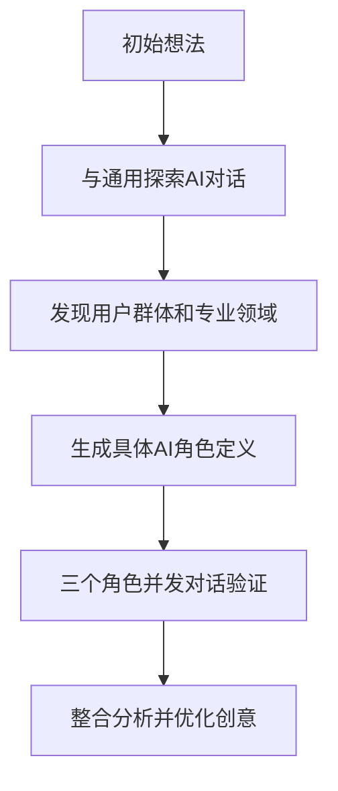

# 创意构思阶段 - 动态AI角色生成框架

## 概述

创意构思阶段采用创新的动态AI角色生成方法，从一个初始想法出发，通过AI对话逐步明确用户群体、专业领域和企业背景，实现更真实、更灵活的创意验证。

## 核心创新

不同于传统的预设AI角色，本框架通过AI对话动态生成和定义AI角色，能够：
- 发现意想不到的用户群体
- 识别真实的专业需求
- 提供更具体的实施洞察

## 关键文档

### 1. [动态AI角色生成框架](dynamic-ai-role-framework.md)
完整的理论说明和软著生成系统案例演示，包括：
- 从初始想法到角色定义的完整流程
- 三个AI角色的并发对话验证
- 框架优势分析

### 2. [实施工具包](dynamic-ai-role-toolkit.md)
即用型工具和模板，包括：
- 通用探索AI提示词模板
- 角色生成AI提示词模板
- 创意探索工作表
- 角色定义模板
- 对话启动器和整合分析工具

### 3. [软著生成系统案例](copyright-system-case-study.md)
详细展示如何将框架应用于具体项目，包括：
- 初始想法："自动生成软著申请材料"
- 三轮AI对话过程
- 角色定义生成
- 整合分析和决策建议

## 使用流程

## 快速开始

1. 阅读[动态AI角色生成框架](dynamic-ai-role-framework.md)了解方法论
2. 使用[工具包](dynamic-ai-role-toolkit.md)中的模板开始实践
3. 参考[案例](copyright-system-case-study.md)理解具体应用

## 预期收益

- 创意质量提升：通过多维度验证发现盲点
- 用户洞察加深：发现真实用户需求
- 实施路径清晰：提前识别资源需求
- 效率提升：创意生成速度提升10-100倍