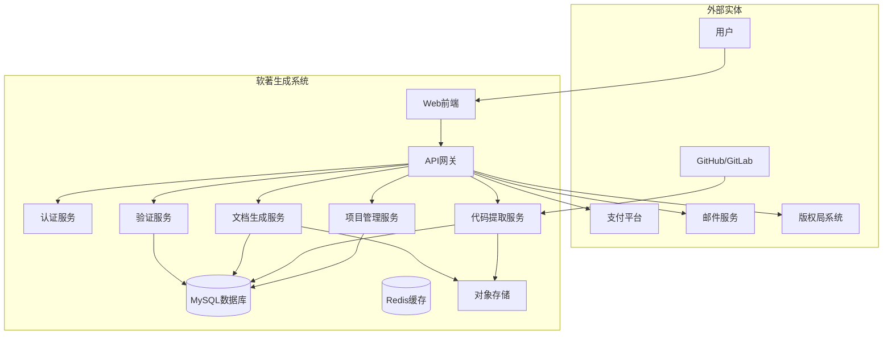
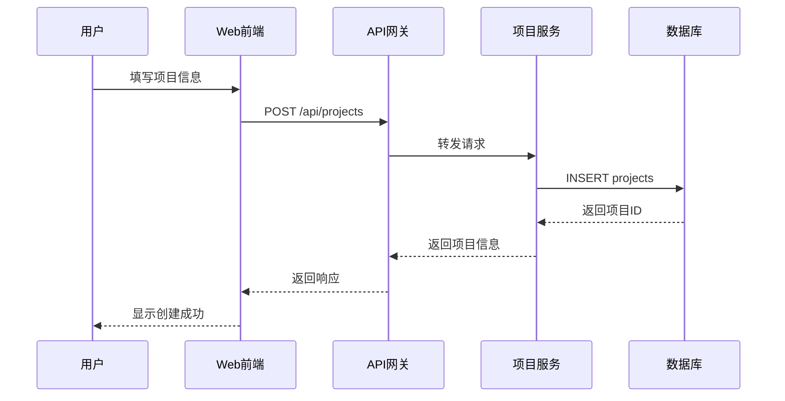
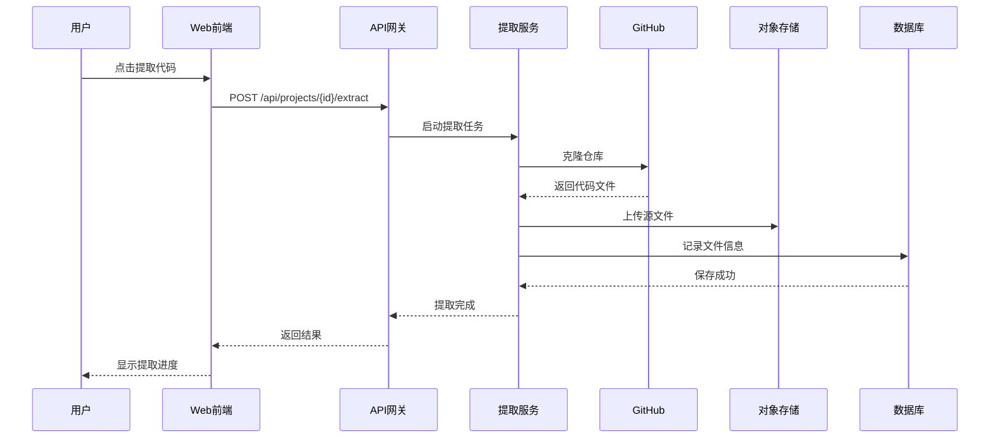
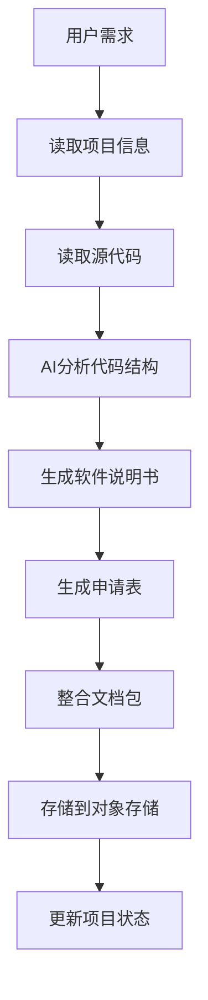

# 软著生成系统 - 规格文档生成案例演示

## 项目背景

基于创意构思阶段的讨论，我们将为"软著生成系统"生成完整的技术规格文档。本案例展示如何使用5个AI角色协同工作，生成一致的技术规格。

## 阶段一：需求准备

### 需求输入卡片
```markdown
# 项目需求卡片 - 软著生成系统

## 基本信息
- 项目名称：软著宝 - 软件著作权申请材料生成平台
- 项目类型：Web应用（SaaS）
- 开发周期：2个月
- 团队规模：5人（1产品、2前端、1后端、1UI）

## 目标用户
- 主要用户群体：独立开发者、小型技术团队
- 用户痛点：
  1. 软著申请流程复杂，不知如何准备材料
  2. 担心材料格式错误被驳回
  3. 没时间研究详细的申请要求
  4. 代理服务费用太高
- 使用场景：用户需要快速生成符合要求的软著申请材料

## 核心功能
1. 源代码提取工具 - 优先级：高
2. 软件说明书自动生成 - 优先级：高
3. 申请表自动填写 - 优先级：高
4. 材料格式检查 - 优先级：中
5. 申请进度跟踪 - 优先级：低
6. 法规更新提醒 - 优先级：中

## 技术约束
- 技术栈：React + Node.js + MySQL + Redis
- 性能要求：页面加载<3秒，API响应<1秒
- 安全要求：用户数据加密存储，支持OAuth2登录
- 集成要求：支付接口、邮件服务、短信服务

## 非功能需求
- 可用性：99.5%
- 扩展性：支持未来增加其他知识产权服务
- 维护性：模块化设计，便于功能扩展
```

## 阶段二：并行规格生成

### 1. UI描述JSON（产品规格AI输出）
```json
{
  "project_info": {
    "name": "软著宝",
    "version": "1.0.0",
    "description": "软件著作权申请材料自动生成平台",
    "type": "Web应用"
  },
  "modules": [
    {
      "module_id": "dashboard",
      "module_name": "控制台",
      "description": "用户工作台，展示项目概览和快捷操作",
      "category": "display",
      "display_order": 1,
      "fields": [
        {
          "field_id": "project_stats",
          "label": "项目统计",
          "type": "info_card",
          "required": false,
          "default_value": null,
          "description": "显示创建的项目数、完成数、进行中数量"
        },
        {
          "field_id": "recent_projects",
          "label": "最近项目",
          "type": "list",
          "required": false,
          "description": "显示最近操作的5个项目"
        }
      ],
      "actions": [
        {
          "action_id": "create_project",
          "label": "创建新项目",
          "type": "primary",
          "api_endpoint": "POST /api/projects"
        }
      ]
    },
    {
      "module_id": "project_creation",
      "module_name": "项目创建",
      "description": "创建新的软著申请项目",
      "category": "input",
      "display_order": 2,
      "fields": [
        {
          "field_id": "software_name",
          "label": "软件名称",
          "type": "text",
          "required": true,
          "max_length": 100,
          "placeholder": "请输入软件全称",
          "validation": {
            "required": true,
            "min_length": 2,
            "pattern": "^[\\u4e00-\\u9fa5a-zA-Z0-9\\s-_]+$"
          },
          "description": "软件的全称，应与版本管理中的名称一致"
        },
        {
          "field_id": "software_version",
          "label": "软件版本号",
          "type": "text",
          "required": true,
          "default_value": "V1.0",
          "placeholder": "如：V1.0",
          "validation": {
            "required": true,
            "pattern": "^V\\d+(\\.\\d+)*$"
          },
          "description": "版本号格式：V主版本号.次版本号"
        },
        {
          "field_id": "code_repo",
          "label": "代码仓库地址",
          "type": "url",
          "required": false,
          "placeholder": "https://github.com/username/repo",
          "description": "用于自动提取源代码"
        },
        {
          "field_id": "software_type",
          "label": "软件类别",
          "type": "select",
          "required": true,
          "options": [
            "应用软件",
            "系统软件",
            "中间件",
            "嵌入式软件",
            "其他"
          ],
          "description": "选择软件所属类别"
        }
      ],
      "actions": [
        {
          "action_id": "submit_project",
          "label": "创建项目",
          "type": "primary",
          "confirm_message": "确认创建项目并开始生成申请材料？",
          "api_endpoint": "POST /api/projects"
        }
      ]
    },
    {
      "module_id": "code_extractor",
      "module_name": "源代码提取",
      "description": "从代码仓库自动提取需要的源代码片段",
      "category": "operation",
      "display_order": 3,
      "fields": [
        {
          "field_id": "extract_progress",
          "label": "提取进度",
          "type": "progress",
          "required": false,
          "description": "显示代码提取进度"
        },
        {
          "field_id": "extracted_files",
          "label": "已提取文件",
          "type": "file_list",
          "required": false,
          "description": "列出已提取的源代码文件"
        }
      ],
      "actions": [
        {
          "action_id": "start_extract",
          "label": "开始提取",
          "type": "primary",
          "api_endpoint": "POST /api/projects/{id}/extract"
        },
        {
          "action_id": "manual_upload",
          "label": "手动上传",
          "type": "secondary",
          "api_endpoint": "POST /api/projects/{id}/upload"
        }
      ]
    },
    {
      "module_id": "document_generator",
      "module_name": "文档生成",
      "description": "自动生成软件说明书和申请表",
      "category": "operation",
      "display_order": 4,
      "fields": [
        {
          "field_id": "software_desc",
          "label": "软件功能说明",
          "type": "textarea",
          "required": true,
          "min_length": 100,
          "max_length": 2000,
          "placeholder": "请详细描述软件的主要功能、特点和用途...",
          "description": "用于生成软件说明书，应包含软件的主要功能模块"
        },
        {
          "field_id": "tech_stack",
          "label": "开发工具和技术",
          "type": "tags",
          "required": true,
          "placeholder": "如：React, Node.js, MySQL",
          "description": "标签形式输入使用的开发语言和工具"
        },
        {
          "field_id": "generated_docs",
          "label": "生成文档预览",
          "type": "document_preview",
          "required": false,
          "description": "显示生成的说明书和申请表预览"
        }
      ],
      "actions": [
        {
          "action_id": "generate_docs",
          "label": "生成文档",
          "type": "primary",
          "api_endpoint": "POST /api/projects/{id}/generate"
        },
        {
          "action_id": "edit_manual",
          "label": "手动编辑",
          "type": "secondary",
          "api_endpoint": "GET /api/projects/{id}/docs/edit"
        }
      ]
    },
    {
      "module_id": "validation",
      "module_name": "格式检查",
      "description": "检查生成的材料是否符合要求",
      "category": "validation",
      "display_order": 5,
      "fields": [
        {
          "field_id": "validation_result",
          "label": "检查结果",
          "type": "validation_report",
          "required": false,
          "description": "显示材料格式检查结果"
        },
        {
          "field_id": "issue_list",
          "label": "问题列表",
          "type": "error_list",
          "required": false,
          "description": "列出发现的所有问题及修改建议"
        }
      ],
      "actions": [
        {
          "action_id": "run_validation",
          "label": "开始检查",
          "type": "primary",
          "api_endpoint": "POST /api/projects/{id}/validate"
        },
        {
          "action_id": "auto_fix",
          "label": "自动修复",
          "type": "secondary",
          "api_endpoint": "POST /api/projects/{id}/autofix"
        }
      ]
    }
  ]
}
```

### 2. 设计风格文档（UI设计AI输出）

```markdown
# 设计风格方案 I - 简约专业

## 1. 风格概述
- **风格名称**：简约专业风
- **核心理念**：简洁、高效、可信赖
- **适合场景**：专业工具类产品，面向开发者群体
- **目标用户感受**：专业、可靠、高效

## 2. 色彩系统
### 主色调
- **Primary 50**: #F0F7FF
- **Primary 100**: #D6E9FF
- **Primary 500**: #2E7DFF（主按钮、重要链接）
- **Primary 700**: #1B5FC7

### 辅助色
- **Success**: #00C896
- **Warning**: #FFA940
- **Error**: #F53F3F
- **Info**: #2E7DFF

### 中性色
- **Gray 50**: #F7F8FA
- **Gray 100**: #F2F3F5
- **Gray 200**: #E5E6EB
- **Gray 300**: #C9CDD4
- **Gray 400**: #A9AEB8
- **Gray 500**: #86909C
- **Gray 600**: #4E5969
- **Gray 700**: #272E3B
- **Gray 800**: #1D2129
- **Gray 900**: #0F1419

## 3. 字体系统
### 字体选择
- **中文字体**：PingFang SC
- **英文字体**：SF Pro Text / Inter
- **代码字体**：JetBrains Mono

### 字号规范
- **Display**: 36px/44px
- **H1**: 28px/36px
- **H2**: 24px/32px
- **H3**: 20px/28px
- **H4**: 18px/26px
- **Body Large**: 16px/24px
- **Body Medium**: 14px/22px
- **Body Small**: 12px/20px
- **Caption**: 11px/16px

## 4. 组件风格

### 按钮
- **高度**：32px（小）、40px（中）、48px（大）
- **圆角**：6px
- **字体权重**：500
- **过渡动画**：0.2s ease

### 输入框
- **高度**：40px
- **圆角**：6px
- **边框**：1px solid #E5E6EB
- **聚焦边框**：2px solid #2E7DFF
- **内边距**：0 12px

### 卡片
- **圆角**：8px
- **背景**：白色
- **阴影**：0 1px 2px rgba(0,0,0,0.06)
- **内边距**：24px

# 设计风格方案 II - 友好活力

## 1. 风格概述
- **风格名称**：友好活力风
- **核心理念**：友好、轻松、高效
- **适合场景**：降低专业工具的使用门槛
- **目标用户感受**：轻松、友好、值得信赖

## 2. 色彩系统
### 主色调
- **Primary 50**: #F0F9FF
- **Primary 100**: #E0F2FE
- **Primary 500**: #0EA5E9
- **Primary 700**: #0369A1

### 辅助色
- **Success**: #10B981
- **Warning**: #F59E0B
- **Error**: #EF4444
- **Info**: #6366F1

...（其他设计元素省略）...
```

### 3. 数据库设计（数据架构AI输出）

```json
{
  "database_info": {
    "name": "copyright_system",
    "version": "1.0.0",
    "description": "软著生成系统数据库",
    "engine": "InnoDB",
    "charset": "utf8mb4"
  },
  "tables": [
    {
      "table_name": "users",
      "description": "用户表",
      "fields": [
        {
          "name": "id",
          "type": "bigint",
          "unsigned": true,
          "nullable": false,
          "auto_increment": true,
          "primary_key": true,
          "comment": "用户ID"
        },
        {
          "name": "email",
          "type": "varchar",
          "length": 100,
          "nullable": false,
          "unique": true,
          "comment": "邮箱地址"
        },
        {
          "name": "password_hash",
          "type": "varchar",
          "length": 255,
          "nullable": false,
          "comment": "密码哈希"
        },
        {
          "name": "name",
          "type": "varchar",
          "length": 50,
          "nullable": true,
          "comment": "用户昵称"
        },
        {
          "name": "avatar",
          "type": "varchar",
          "length": 255,
          "nullable": true,
          "comment": "头像URL"
        },
        {
          "name": "user_type",
          "type": "enum",
          "values": ["individual", "team", "enterprise"],
          "default": "individual",
          "comment": "用户类型"
        },
        {
          "name": "created_at",
          "type": "timestamp",
          "default": "CURRENT_TIMESTAMP",
          "comment": "创建时间"
        },
        {
          "name": "updated_at",
          "type": "timestamp",
          "default": "CURRENT_TIMESTAMP on update CURRENT_TIMESTAMP",
          "comment": "更新时间"
        }
      ],
      "indexes": [
        {
          "name": "idx_email",
          "type": "UNIQUE",
          "fields": ["email"]
        }
      ]
    },
    {
      "table_name": "projects",
      "description": "项目表",
      "fields": [
        {
          "name": "id",
          "type": "bigint",
          "unsigned": true,
          "nullable": false,
          "auto_increment": true,
          "primary_key": true,
          "comment": "项目ID"
        },
        {
          "name": "user_id",
          "type": "bigint",
          "unsigned": true,
          "nullable": false,
          "foreign_key": {
            "reference": "users",
            "field": "id",
            "on_delete": "CASCADE"
          },
          "comment": "所属用户ID"
        },
        {
          "name": "software_name",
          "type": "varchar",
          "length": 200,
          "nullable": false,
          "comment": "软件名称"
        },
        {
          "name": "software_version",
          "type": "varchar",
          "length": 20,
          "nullable": false,
          "comment": "软件版本号"
        },
        {
          "name": "software_type",
          "type": "varchar",
          "length": 50,
          "nullable": false,
          "comment": "软件类别"
        },
        {
          "name": "code_repo_url",
          "type": "varchar",
          "length": 500,
          "nullable": true,
          "comment": "代码仓库地址"
        },
        {
          "name": "software_description",
          "type": "text",
          "nullable": true,
          "comment": "软件功能描述"
        },
        {
          "name": "tech_stack",
          "type": "json",
          "nullable": true,
          "comment": "技术栈JSON数组"
        },
        {
          "name": "status",
          "type": "enum",
          "values": ["draft", "extracting", "generating", "validating", "completed", "submitted"],
          "default": "draft",
          "comment": "项目状态"
        },
        {
          "name": "progress",
          "type": "int",
          "default": 0,
          "comment": "进度百分比"
        },
        {
          "name": "created_at",
          "type": "timestamp",
          "default": "CURRENT_TIMESTAMP",
          "comment": "创建时间"
        },
        {
          "name": "updated_at",
          "type": "timestamp",
          "default": "CURRENT_TIMESTAMP on update CURRENT_TIMESTAMP",
          "comment": "更新时间"
        }
      ],
      "indexes": [
        {
          "name": "idx_user_id",
          "type": "NORMAL",
          "fields": ["user_id"]
        },
        {
          "name": "idx_status",
          "type": "NORMAL",
          "fields": ["status"]
        }
      ]
    },
    {
      "table_name": "extracted_files",
      "description": "提取的源代码文件表",
      "fields": [
        {
          "name": "id",
          "type": "bigint",
          "unsigned": true,
          "nullable": false,
          "auto_increment": true,
          "primary_key": true,
          "comment": "文件ID"
        },
        {
          "name": "project_id",
          "type": "bigint",
          "unsigned": true,
          "nullable": false,
          "foreign_key": {
            "reference": "projects",
            "field": "id",
            "on_delete": "CASCADE"
          },
          "comment": "项目ID"
        },
        {
          "name": "file_path",
          "type": "varchar",
          "length": 500,
          "nullable": false,
          "comment": "文件路径"
        },
        {
          "name": "file_name",
          "type": "varchar",
          "length": 255,
          "nullable": false,
          "comment": "文件名"
        },
        {
          "name": "file_type",
          "type": "varchar",
          "length": 50,
          "nullable": false,
          "comment": "文件类型（源代码/文档/配置等）"
        },
        {
          "name": "content",
          "type": "longtext",
          "nullable": true,
          "comment": "文件内容"
        },
        {
          "name": "line_count",
          "type": "int",
          "default": 0,
          "comment": "代码行数"
        },
        {
          "name": "extracted_at",
          "type": "timestamp",
          "default": "CURRENT_TIMESTAMP",
          "comment": "提取时间"
        }
      ]
    },
    {
      "table_name": "generated_documents",
      "description": "生成的文档表",
      "fields": [
        {
          "name": "id",
          "type": "bigint",
          "unsigned": true,
          "nullable": false,
          "auto_increment": true,
          "primary_key": true,
          "comment": "文档ID"
        },
        {
          "name": "project_id",
          "type": "bigint",
          "unsigned": true,
          "nullable": false,
          "foreign_key": {
            "reference": "projects",
            "field": "id",
            "on_delete": "CASCADE"
          },
          "comment": "项目ID"
        },
        {
          "name": "doc_type",
          "type": "enum",
          "values": ["software_manual", "application_form", "source_code_collection"],
          "nullable": false,
          "comment": "文档类型"
        },
        {
          "name": "doc_content",
          "type": "longtext",
          "nullable": false,
          "comment": "文档内容"
        },
        {
          "name": "doc_url",
          "type": "varchar",
          "length": 500,
          "nullable": true,
          "comment": "文档下载URL"
        },
        {
          "name": "validation_result",
          "type": "json",
          "nullable": true,
          "comment": "验证结果JSON"
        },
        {
          "name": "created_at",
          "type": "timestamp",
          "default": "CURRENT_TIMESTAMP",
          "comment": "创建时间"
        },
        {
          "name": "updated_at",
          "type": "timestamp",
          "default": "CURRENT_TIMESTAMP on update CURRENT_TIMESTAMP",
          "comment": "更新时间"
        }
      ]
    }
  ],
  "er_diagram": "erDiagram\n    users ||--o{ projects : has\n    projects ||--o{ extracted_files : contains\n    projects ||--o{ generated_documents : generates\n    \n    users {\n        bigint id PK\n        varchar email UK\n        varchar password_hash\n        varchar name\n        varchar avatar\n        enum user_type\n        timestamp created_at\n        timestamp updated_at\n    }\n    \n    projects {\n        bigint id PK\n        bigint user_id FK\n        varchar software_name\n        varchar software_version\n        varchar software_type\n        varchar code_repo_url\n        text software_description\n        json tech_stack\n        enum status\n        int progress\n        timestamp created_at\n        timestamp updated_at\n    }"
}
```

### 4. 数据流图（系统架构AI输出）

```markdown
# 软著生成系统数据流设计

## 1. 系统边界图


## 2. 核心数据流

### 创建项目数据流


### 代码提取数据流


### 文档生成数据流


## 3. 数据存储说明

| 存储类型 | 用途 | 保留期 |
|----------|------|--------|
| MySQL | 用户数据、项目元数据 | 永久 |
| Redis | 会话、缓存、队列 | 24小时 |
| 对象存储 | 源代码文件、生成文档 | 3年 |
| 日志 | 操作日志、错误日志 | 90天 |

## 4. 安全设计
- 传输加密：HTTPS/TLS 1.3
- 数据加密：敏感字段AES-256加密
- 访问控制：JWT Token + RBAC权限控制
- 操作审计：记录所有关键操作
```

### 5. API文档（API设计AI输出）

```yaml
openapi: 3.0.0
info:
  title: 软著生成系统 API
  version: 1.0.0
  description: 软件著作权申请材料生成平台API文档
  contact:
    name: 软著宝技术团队
    email: tech@copyrighteasy.com

servers:
  - url: https://api.copyrighteasy.com/v1
    description: 生产环境

security:
  - BearerAuth: []

paths:
  /projects:
    get:
      summary: 获取项目列表
      description: 分页获取当前用户的项目列表
      parameters:
        - name: page
          in: query
          schema:
            type: integer
            minimum: 1
            default: 1
        - name: limit
          in: query
          schema:
            type: integer
            minimum: 1
            maximum: 100
            default: 20
        - name: status
          in: query
          schema:
            type: string
            enum: [draft, extracting, generating, validating, completed, submitted]
      responses:
        '200':
          description: 成功响应
          content:
            application/json:
              schema:
                type: object
                properties:
                  code:
                    type: integer
                    example: 200
                  message:
                    type: string
                    example: success
                  data:
                    type: object
                    properties:
                      total:
                        type: integer
                        example: 25
                      items:
                        type: array
                        items:
                          $ref: '#/components/schemas/Project'
                          
    post:
      summary: 创建新项目
      description: 创建新的软著申请项目
      requestBody:
        required: true
        content:
          application/json:
            schema:
              $ref: '#/components/schemas/CreateProjectRequest'
      responses:
        '201':
          description: 创建成功
          content:
            application/json:
              schema:
                type: object
                properties:
                  code:
                    type: integer
                    example: 201
                  message:
                    type: string
                    example: created
                  data:
                    $ref: '#/components/schemas/Project'

  /projects/{id}:
    get:
      summary: 获取项目详情
      description: 获取指定项目的详细信息
      parameters:
        - name: id
          in: path
          required: true
          schema:
            type: integer
      responses:
        '200':
          description: 成功响应
          content:
            application/json:
              schema:
                type: object
                properties:
                  code:
                    type: integer
                    example: 200
                  message:
                    type: string
                    example: success
                  data:
                    $ref: '#/components/schemas/ProjectDetail'
                    
    put:
      summary: 更新项目
      description: 更新项目信息
      parameters:
        - name: id
          in: path
          required: true
          schema:
            type: integer
      requestBody:
        required: true
        content:
          application/json:
            schema:
              $ref: '#/components/schemas/UpdateProjectRequest'
      responses:
        '200':
          description: 更新成功
          content:
            application/json:
              schema:
                type: object
                properties:
                  code:
                    type: integer
                    example: 200
                  message:
                    type: string
                    example: updated
                  data:
                    $ref: '#/components/schemas/Project'

  /projects/{id}/extract:
    post:
      summary: 开始提取源代码
      description: 从代码仓库提取源代码文件
      parameters:
        - name: id
          in: path
          required: true
          schema:
            type: integer
      requestBody:
        content:
          application/json:
            schema:
              type: object
              properties:
                repo_url:
                  type: string
                  format: uri
                  description: 代码仓库地址
                branch:
                  type: string
                  default: main
                  description: 分支名称
      responses:
        '202':
          description: 提取任务已启动
          content:
            application/json:
              schema:
                type: object
                properties:
                  code:
                    type: integer
                    example: 202
                  message:
                    type: string
                    example: extraction started
                  data:
                    type: object
                    properties:
                      task_id:
                        type: string
                        description: 任务ID

  /projects/{id}/generate:
    post:
      summary: 生成申请文档
      description: 基于项目信息和源代码生成申请材料
      parameters:
        - name: id
          in: path
          required: true
          schema:
            type: integer
      requestBody:
        content:
          application/json:
            schema:
              type: object
              properties:
                template_id:
                  type: string
                  description: 使用模板ID
                custom_settings:
                  type: object
                  description: 自定义设置
      responses:
        '200':
          description: 生成成功
          content:
            application/json:
              schema:
                type: object
                properties:
                  code:
                    type: integer
                    example: 200
                  message:
                    type: string
                    example: generated
                  data:
                    type: object
                    properties:
                      documents:
                        type: array
                        items:
                          $ref: '#/components/schemas/Document'

components:
  schemas:
    Project:
      type: object
      properties:
        id:
          type: integer
          example: 1
        user_id:
          type: integer
          example: 1001
        software_name:
          type: string
          example: "软著宝管理系统"
        software_version:
          type: string
          example: "V1.0"
        software_type:
          type: string
          example: "应用软件"
        status:
          type: string
          example: "draft"
        progress:
          type: integer
          example: 0
        created_at:
          type: string
          format: date-time
          example: "2023-01-01T00:00:00Z"
        updated_at:
          type: string
          format: date-time
          example: "2023-01-01T00:00:00Z"
    
    CreateProjectRequest:
      type: object
      required:
        - software_name
        - software_version
        - software_type
      properties:
        software_name:
          type: string
          minLength: 2
          maxLength: 200
          example: "软著宝管理系统"
        software_version:
          type: string
          pattern: "^V\\d+(\\.\\d+)*$"
          example: "V1.0"
        software_type:
          type: string
          enum: [应用软件, 系统软件, 中间件, 嵌入式软件, 其他]
        code_repo_url:
          type: string
          format: uri
          example: "https://github.com/user/repo"
        software_description:
          type: string
          maxLength: 2000
        tech_stack:
          type: array
          items:
            type: string
    
    Document:
      type: object
      properties:
        id:
          type: integer
        doc_type:
          type: string
          enum: [software_manual, application_form, source_code_collection]
        doc_url:
          type: string
          format: uri
        created_at:
          type: string
          format: date-time
  
  securitySchemes:
    BearerAuth:
      type: http
      scheme: bearer
      bearerFormat: JWT

tags:
  - name: 项目管理
    description: 项目CRUD操作
  - name: 代码提取
    description: 源代码提取相关
  - name: 文档生成
    description: 申请材料生成
```

## 阶段三：一致性验证

### 验证结果示例
```json
{
  "validation_summary": {
    "total_checks": 25,
    "passed": 23,
    "failed": 2,
    "warnings": 1
  },
  "issues": [
    {
      "type": "error",
      "category": "API-UI一致性",
      "description": "项目创建页面缺少'技术栈'字段",
      "impact": "影响项目创建功能",
      "suggestion": "在UI描述中添加tech_stack字段"
    },
    {
      "type": "error",
      "category": "数据完整性",
      "description": "generated_documents表缺少下载字段",
      "impact": "无法追踪文档下载次数",
      "suggestion": "添加download_count字段"
    },
    {
      "type": "warning",
      "category": "性能考虑",
      "description": "源代码文件建议使用分表存储",
      "impact": "大项目时性能问题",
      "suggestion": "考虑按项目ID分表"
    }
  ]
}
```

## 阶段四：迭代优化

根据验证报告，各个AI角色需要修复相应问题，然后重新生成最终规格文档。

---

*案例展示完毕*