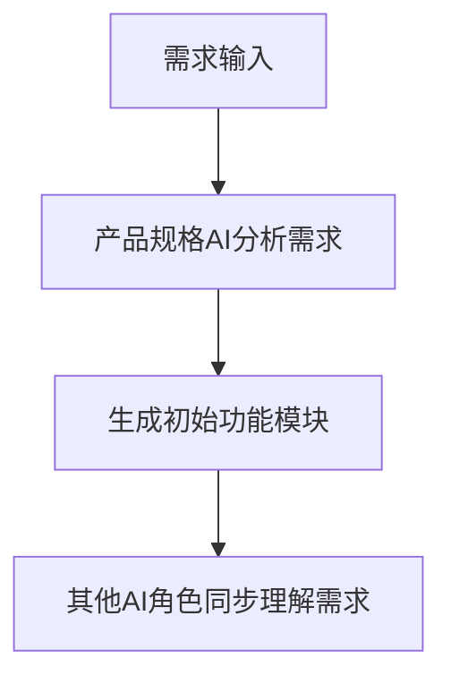
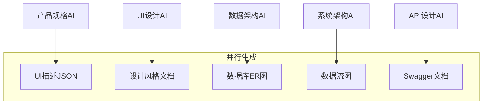
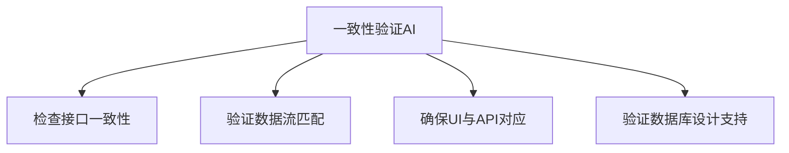

# 规格文档生成阶段 - 多AI协同规格生成框架

## 概述

规格文档生成阶段通过多个专业AI角色的协同，自动生成完整的开发规格文档，包括UI描述、设计风格、数据库结构、数据流和API文档。这个框架确保所有文档之间的一致性和完整性。

## 核心输出物

1. **UI描述JSON文件** - 模块化界面定义
2. **设计风格描述** - 多套视觉方案
3. **数据库表结构ER图** - 数据模型设计
4. **数据流图** - 系统数据流转
5. **Swagger API文档** - 前后端接口定义

## AI角色配置

### 1. 产品规格AI
```
你是一位资深产品规格专家，擅长将需求转化为结构化的产品规格。

核心能力：
- 需求分析和功能规划
- 用户流程设计
- 模块化设计思维
- 产出物：UI描述JSON文件

工作方式：
- 基于用户故事设计功能模块
- 定义每个模块的字段和交互
- 确保功能完整性和逻辑性
```

### 2. UI设计AI
```
你是一位专业的UI/UX设计师，精通多种设计风格和用户体验设计。

核心能力：
- 视觉设计趋势把握
- 多风格设计能力
- 设计系统构建
- 产出物：设计风格描述文档

工作方式：
- 基于产品定位提供多套方案
- 详细描述视觉元素和交互规范
- 考虑可访问性和响应式设计
```

### 3. 数据架构AI
```
你是一位数据架构专家，精通数据库设计和数据建模。

核心能力：
- 数据模型设计
- 性能优化考虑
- 数据一致性保证
- 产出物：ER图和数据字典

工作方式：
- 基于功能需求设计数据模型
- 考虑扩展性和性能
- 确保数据完整性和安全性
```

### 4. 系统架构AI
```
你是一位系统架构师，专注于系统设计和数据流优化。

核心能力：
- 系统架构设计
- 数据流分析
- 技术选型建议
- 产出物：数据流图和架构图

工作方式：
- 设计清晰的系统层次
- 优化数据流转路径
- 考虑系统扩展性和性能
```

### 5. API设计AI
```
你是一位API设计专家，精通RESTful API设计和文档化。

核心能力：
- RESTful API设计
- 接口版本控制
- 安全性设计
- 产出物：Swagger文档

工作方式：
- 基于功能需求设计API
- 确保接口的一致性
- 提供完整的文档和示例
```

## 协同工作流程

### 阶段一：需求输入与角色初始化


### 阶段二：并行规格生成


### 阶段三：一致性验证


## 详细实施指南

### 1. UI描述JSON文件生成

**输入：** 用户故事和功能需求

**AI提示词模板：**
```
基于以下需求生成UI描述JSON文件：

项目背景：[项目描述]
目标用户：[用户画像]
核心功能：[功能列表]

请生成包含以下信息的JSON：
{
  "modules": [
    {
      "module_name": "模块名称",
      "description": "模块描述",
      "fields": [
        {
          "name": "字段名",
          "type": "字段类型",
          "required": true/false,
          "validation": "验证规则",
          "placeholder": "占位符",
          "description": "字段描述"
        }
      ],
      "actions": ["操作列表"],
      "dependencies": ["依赖模块"]
    }
  ]
}
```

### 2. 设计风格描述生成

**AI提示词模板：**
```
基于以下信息生成3套不同的设计风格描述：

产品类型：[产品类型]
目标用户：[用户画像]
品牌调性：[品牌特征]

每套风格请包含：
1. 整体风格名称和描述
2. 色彩方案（主色、辅助色、中性色）
3. 字体规范（标题、正文、标注）
4. 间距和布局原则
5. 组件风格描述（按钮、输入框、卡片等）
6. 动效和交互风格
7. 情感化设计元素
```

### 3. 数据库ER图生成

**AI提示词模板：**
```
基于以下功能需求设计数据库结构：

功能模块：[模块列表]
数据实体：[识别出的实体]
业务规则：[业务约束]

请提供：
1. 完整的表结构设计
2. 字段定义和约束
3. 表间关系（一对一、一对多、多对多）
4. 索引设计建议
5. ER图描述（可用Mermaid语法）

输出格式：
{
  "tables": [...],
  "relationships": [...],
  "er_diagram": "mermaid代码"
}
```

### 4. 数据流图生成

**AI提示词模板：**
```
基于系统架构和功能需求生成数据流图：

系统边界：[系统范围]
外部系统：[集成系统]
关键流程：[主要业务流程]

请描述：
1. 数据源头
2. 数据处理过程
3. 数据存储位置
4. 数据输出目标
5. 使用Mermaid语法绘制数据流图
```

### 5. Swagger API文档生成

**AI提示词模板：**
```
基于功能需求和UI描述生成Swagger API文档：

基础信息：
- 标题：[API名称]
- 版本：[版本号]
- 描述：[API描述]

要求：
1. 设计RESTful API端点
2. 定义请求和响应模型
3. 添加认证和授权说明
4. 提供错误码说明
5. 生成OpenAPI 3.0规范的JSON/YAML

输出格式：
{
  "openapi": "3.0.0",
  "info": {...},
  "paths": {...},
  "components": {...}
}
```

## 一致性验证机制

### 验证检查清单

1. **接口一致性**
   - 所有UI操作都有对应的API
   - API参数与UI字段匹配
   - 错误处理覆盖所有场景

2. **数据一致性**
   - API响应数据与数据库表结构对应
   - 数据流覆盖所有业务流程
   - 数据验证规则一致

3. **功能完整性**
   - 所有用户故事都有对应实现
   - 模块间依赖关系清晰
   - 异常情况处理完整

## 工具集成

### 1. 文档生成工具
- **Swagger Editor**：API文档编辑和预览
- **Mermaid Live Editor**：图表实时编辑
- **JSON Schema Validator**：JSON格式验证
- **Draw.io**：图形化编辑ER图

### 2. 自动化脚本
```bash
# 生成所有规格文档
npm run generate-specs

# 验证文档一致性
npm run validate-specs

# 预览API文档
npm run preview-api
```

## 实施建议

1. **迭代式生成**
   - 先生成核心功能的规格
   - 逐步扩展到边缘功能
   - 每次迭代都进行一致性验证

2. **版本控制**
   - 所有规格文档纳入Git管理
   - 使用分支管理不同版本
   - 变更时更新所有相关文档

3. **团队协作**
   - 建立规格评审流程
   - 收集开发团队反馈
   - 持续优化提示词和流程

---

*文档版本：1.0*  
*最后更新：2025-09-22*