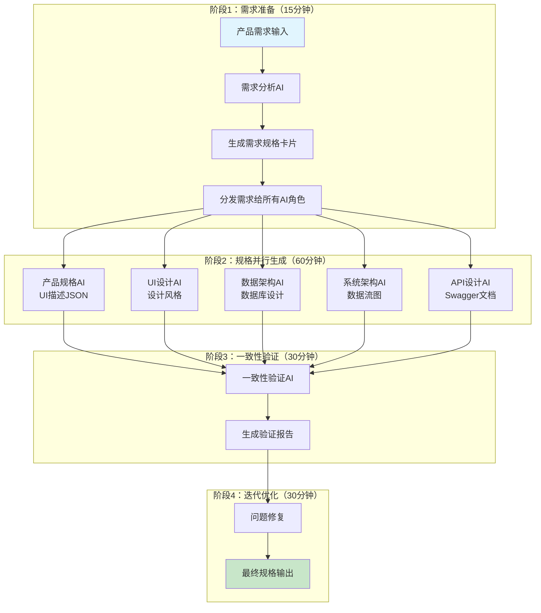

# 多AI协同规格生成工作流程

## 工作流程概览

本流程定义了如何协调5个专业AI角色，高效生成完整一致的技术规格文档。整个流程分为需求理解、并行生成、一致性验证和输出整合四个阶段。

## 详细流程图



## 阶段一：需求准备（15分钟）

### 1.1 需求输入标准化
**输入模板：**
```markdown
# 项目需求卡片

## 基本信息
- 项目名称：[名称]
- 项目类型：[Web应用/移动应用/API服务]
- 开发周期：[时间]
- 团队规模：[人数]

## 目标用户
- 主要用户群体：[描述]
- 用户痛点：[列表]
- 使用场景：[场景描述]

## 核心功能
1. [功能1] - [优先级：高/中/低]
2. [功能2] - [优先级：高/中/低]
3. [功能3] - [优先级：高/中/低]

## 技术约束
- 技术栈：[前端/后端/数据库]
- 性能要求：[响应时间/并发量]
- 安全要求：[认证/加密/合规]
- 集成要求：[第三方服务]

## 非功能需求
- 可用性：[%]
- 扩展性：[描述]
- 维护性：[描述]
```

### 1.2 需求分析AI处理
**提示词：**
```
你是一位资深的需求分析师，请基于输入的需求生成标准化的需求规格卡片，要求：
1. 识别和补充隐含需求
2. 明确功能边界
3. 识别依赖关系
4. 评估技术可行性
5. 输出结构化的需求文档
```

## 阶段二：规格并行生成（60分钟）

### 2.1 AI角色同时工作
每个AI角色收到相同的需求规格卡片，根据自己的专业领域生成对应的规格文档。

### 2.2 进度追踪
**时间分配：**
- UI描述JSON：15分钟
- 设计风格文档：15分钟
- 数据库设计：15分钟
- 数据流图：15分钟
- API文档：15分钟

## 阶段三：一致性验证（30分钟）

### 3.1 验证维度

| 验证类型 | 验证内容 | 工具 |
|----------|----------|------|
| 接口一致性 | UI字段与API参数匹配 | 自动化脚本 |
| 数据一致性 | API响应与数据库表对应 | Schema对比 |
| 功能完整性 | 所有需求都有对应实现 | 需求追踪矩阵 |
| 性能可行性 | 设计满足性能要求 | 性能评估 |

### 3.2 一致性验证AI提示词
```
你是一位系统整合专家，负责验证5个规格文档的一致性。请：

1. **接口验证**
   - 检查每个UI操作都有对应的API
   - 验证字段名称、类型、验证规则一致
   - 确保错误处理完整

2. **数据验证**
   - API响应数据能在数据库中找到对应字段
   - 数据流图覆盖所有数据操作
   - 数据类型和约束一致

3. **功能验证**
   - 所有需求功能都有对应实现
   - 业务流程完整
   - 异常情况处理完善

4. **输出验证报告**
   - 列出所有不一致问题
   - 提供修复建议
   - 评估整体完整性
```

## 阶段四：迭代优化（30分钟）

### 4.1 问题修复流程
1. 将验证报告分发给相关AI角色
2. 每个AI负责修复自己领域的问题
3. 重新进行验证（如需要）

### 4.2 最终输出
```markdown
# 技术规格文档包

## 文档结构
├── 01-ui-description.json     # UI描述文件
├── 02-design-styles.md        # 设计风格文档
├── 03-database-design.md     # 数据库设计（含ER图）
├── 04-data-flow.md           # 数据流图
├── 05-api-docs.yaml          # Swagger文档
└── specification-summary.md  # 规格总览
```

## 实施工具

### 1. 自动化脚本
**generate-specs.py**
```python
import asyncio
import json
from datetime import datetime

class SpecGenerator:
    def __init__(self, requirements):
        self.requirements = requirements
        self.timestamp = datetime.now().isoformat()
    
    async def generate_all_specs(self):
        """并行生成所有规格文档"""
        tasks = [
            self.generate_ui_spec(),
            self.generate_design_spec(),
            self.generate_database_spec(),
            self.generate_dataflow_spec(),
            self.generate_api_spec()
        ]
        return await asyncio.gather(*tasks)
    
    async def validate_consistency(self, specs):
        """验证规格一致性"""
        validator = ConsistencyValidator()
        return await validator.validate(specs)
```

### 2. 项目模板
**spec-template/**
```
├── prompts/
│   ├── ui-design-prompt.txt
│   ├── database-prompt.txt
│   ├── api-design-prompt.txt
│   └── validation-prompt.txt
├── templates/
│   ├── ui-template.json
│   ├── swagger-template.yaml
│   └── er-diagram-template.mmd
├── scripts/
│   ├── generate.py
│   └── validate.py
└── output/
    └── specs/
```

## 最佳实践

### 1. 需求阶段
- 确保需求完整且清晰
- 识别关键约束条件
- 明确优先级和依赖关系

### 2. 生成阶段
- 使用标准化的模板
- 保持AI角色的独立性
- 设置合理的生成时间

### 3. 验证阶段
- 自动化验证脚本
- 人工复核关键部分
- 迭代直到一致性达标

### 4. 输出管理
- 版本控制所有规格文档
- 建立变更追踪机制
- 定期更新和优化

## 常见问题处理

### Q1: 不同AI生成的内容冲突怎么办？
A: 一致性验证AI会标记所有冲突，根据优先级和业务逻辑决定采用哪个方案。

### Q2: 如何确保规格文档的可执行性？
A: 在提示词中强调可行性，要求AI考虑技术约束和最佳实践。

### Q3: 如何处理复杂业务逻辑？
A: 在需求阶段详细描述业务规则，可以提供示例场景帮助AI理解。

### Q4: 如何维护规格文档的更新？
A: 建立变更管理流程，任何需求变更都触发规格文档的相应更新。

---

*工作流程版本：1.0*  
*最后更新：2025-09-22*