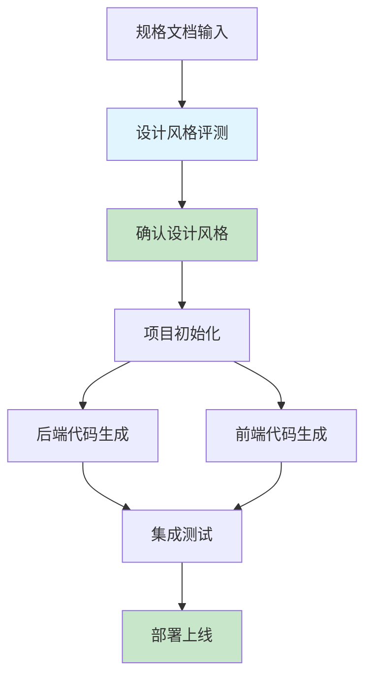

# 程序开发阶段 - AI协同开发实现

## 📋 概述

程序开发阶段基于第二阶段生成的规格文档，通过多个专业AI角色的协同，将设计转化为可运行的代码。本阶段核心是**设计风格评测确认**和**基于规格文档的自动化代码生成**，相比传统开发效率提升7倍以上。

### 🎯 核心流程



### 🤖 AI角色配置（6个专业角色）

| 角色 | 核心职责 | 主要产出 |
|------|----------|----------|
| 设计评测AI | 组织用户评测，确定最终设计 | 设计规范、原型 |
| 前端架构AI | 项目架构、组件库规划 | 项目结构、技术栈 |
| 后端架构AI | 系统架构、数据库设计 | 架构设计、技术选型 |
| 前端开发AI | 组件开发、页面实现 | React/Vue组件、页面 |
| 后端开发AI | 实体、API、业务逻辑 | Controller、Service、Entity |
| 测试AI | 单元测试、集成测试 | 测试用例、测试报告 |

## 🚀 快速开始

### 1. 设计风格评测与确认（1-2天）
- **输入**：多套设计风格文档
- **输出**：最终确认的设计规范
- **工具**：Figma、用户评测平台

```bash
# 执行设计评测流程
design-evaluation \
  --input design-styles.md \
  --users 15 \
  --output final-design-spec
```

### 2. 项目初始化（半天）
```bash
# 根据项目类型选择模板
project-init --type=admin --react    # 管理后台
project-init --type=c-end --nextjs   # C端应用
project-init --type=mobile --uniapp  # 移动端应用
```

### 3. 代码生成（2-3天）
```bash
# 后端代码生成
backend-generator \
  --database db-design.json \
  --api swagger.yaml \
  --output src/

# 前端代码生成
frontend-generator \
  --ui-desc ui-description.json \
  --design-spec design-spec.md \
  --output src/
```

### 4. 集成与部署（1-2天）
```bash
# 自动化测试和部署
ci-cd pipeline --test --build --deploy
```

## 📚 文档指南

### 📖 [AI协同开发框架详解](ai-collaborative-development-framework.md)
完整的框架理论说明，包括：
- 6个AI角色的详细配置
- 四阶段开发流程
- 质量保证机制
- 工具集成方案

### 🎨 [设计风格评测流程](design-evaluation-process.md)
详细的设计评测流程，包括：
- 6步评测方法论
- 评测工具和模板
- 数据分析方法
- 最佳实践指南

### 🛠️ [项目初始化提示词模板](project-initialization-prompts.md)
三种项目类型的完整初始化模板：
- **管理后台**：React + Ant Design Pro
- **C端应用**：Next.js + Tailwind CSS
- **移动端**：UniApp (Vue3)

### 💻 [代码生成提示词模板](code-generation-prompts.md)
基于规格文档的代码生成模板：
- 后端：实体类、DTO、Controller、Service
- 前端：React组件、表单、API服务
- 测试：单元测试、E2E测试

### 🎯 [功能导向代码组织方法](feature-oriented-code-organization.md)
AI辅助编程的最佳实践，包括：
- 功能清单管理
- 基于功能ID的文件组织
- 依赖关系管理
- 与AI协作的工作流程

### 💡 [软著生成系统开发案例](copyright-system-development-case.md)
完整实战案例，展示：
- 从设计到部署的完整流程
- 实际代码生成示例
- 效率对比数据（7倍提升）
- 经验总结和最佳实践

## ⚡ 效率对比

| 开发环节 | 传统方式 | AI协同方式 | 效率提升 |
|----------|----------|------------|----------|
| 项目初始化 | 2天 | 2小时 | 24倍 |
| 代码生成 | 2周 | 2天 | 7倍 |
| 测试编写 | 3天 | 4小时 | 18倍 |
| 部署配置 | 1天 | 2小时 | 12倍 |
| **总计** | **3周** | **3天** | **7倍** |

## 🎯 核心特点

### 1. 基于规格文档的自动化生成
- UI描述JSON → React组件
- 数据库设计 → JPA实体类
- Swagger文档 → RESTful API
- 设计规范 → 样式系统

### 2. 多种项目类型支持
- **管理后台**：React + Ant Design Pro
- **C端应用**：Next.js + SSR
- **移动端**：UniApp跨平台

### 3. 完整的质量保证
- 自动化测试生成
- 代码质量检查
- 安全漏洞扫描
- 性能优化建议

## 🔧 技术栈支持

### 前端技术栈
- **React生态**：React 18 + TypeScript + Ant Design
- **现代框架**：Next.js 14 + App Router
- **跨平台**：UniApp + Vue3
- **工程化**：Vite + ESLint + Prettier

### 后端技术栈
- **主框架**：Spring Boot 3.x + Java 17
- **安全**：Spring Security + JWT
- **数据**：MySQL + Redis + MyBatis
- **文档**：OpenAPI 3.0 + Swagger

### DevOps工具
- **CI/CD**：GitHub Actions + Docker
- **监控**：Prometheus + Grafana
- **测试**：Jest + Cypress + Playwright
- **质量**：SonarQube + ESLint

## 📋 实施检查清单

### ✓ 设计风格评测
- [ ] 生成多套原型
- [ ] 组织用户评测（10-15人）
- [ ] 分析评测数据
- [ ] 确认最终设计规范

### ✓ 项目初始化
- [ ] 选择合适的技术栈
- [ ] 生成标准项目结构
- [ ] 配置开发环境
- [ ] 搭建CI/CD流水线

### ✓ 代码生成
- [ ] 后端实体类生成
- [ ] API接口实现
- [ ] 前端组件生成
- [ ] 页面路由配置

### ✓ 测试与部署
- [ ] 单元测试生成
- [ ] 集成测试配置
- [ ] E2E测试编写
- [ ] 容器化部署

## ⚠️ 常见陷阱

### 1. 规格文档质量不足
- **问题**：AI生成代码偏离预期
- **解决**：确保第二阶段输出完整准确的规格

### 2. 忽略设计评测
- **问题**：用户体验不佳
- **解决**：严格执行设计评测流程

### 3. 过度依赖AI
- **问题**：代码质量不可控
- **解决**：保留关键节点的人工审核

### 4. 缺乏增量更新
- **问题**：无法维护现有代码
- **解决**：实现增量生成策略

## 📈 进阶技巧

### 1. 提示词优化
- 积累项目特定的提示词
- 建立提示词版本管理
- 根据反馈持续优化

### 2. 模板库建设
- 保存成功的项目模板
- 建立组件库
- 形成最佳实践集

### 3. 自动化流水线
- 端到端自动化工具链
- 集成到现有CI/CD
- 实现一键部署

## 🎓 学习路径

1. **入门**：阅读案例文档，理解基本流程
2. **实践**：使用模板尝试小型项目
3. **定制**：根据团队特点调整提示词
4. **精通**：建立完整的自动化体系

---

**程序开发阶段 - 让AI成为你的超级开发伙伴，专注创意，告别重复劳动**