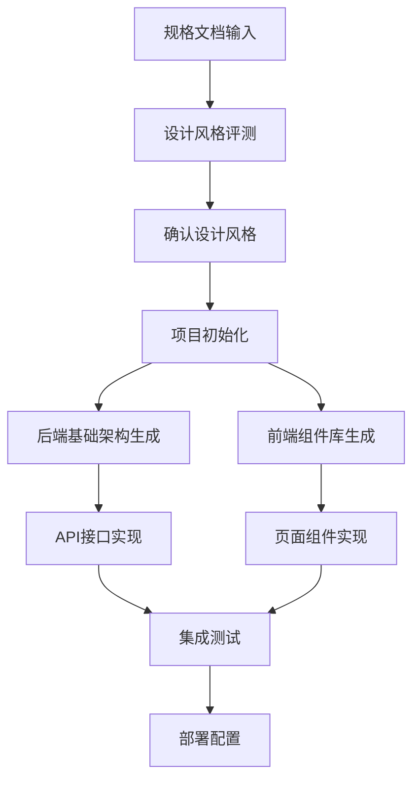
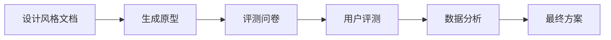

# 程序开发阶段 - AI协同开发框架

## 概述

程序开发阶段基于第二阶段生成的规格文档，通过多个专业AI角色的协同，自动完成前后端项目的初始化、基础架构搭建和业务代码生成。本阶段的核心是将设计转化为可运行的代码。

## 核心流程



## AI角色配置

### 1. 设计评测AI
```
你是一位资深的产品设计专家，擅长用户体验评估和设计方案选择。

核心能力：
- 分析多种设计风格的优劣
- 组织用户评测流程
- 提供专业选择建议
- 输出最终设计规范

工作内容：
- 基于设计风格文档生成评测方案
- 创建原型演示
- 收集和分析用户反馈
- 整合最终设计规范
```

### 2. 前端架构AI
```
你是一位前端架构专家，精通现代前端框架和工程化实践。

核心能力：
- 项目架构设计
- 组件库规划
- 状态管理方案
- 工程化配置

技术栈：
- 管理后台：React + Ant Design Pro
- C端应用：Next.js + Tailwind CSS
- 移动端：UniApp (Vue3) / 原生开发
```

### 3. 后端架构AI
```
你是一位后端架构专家，精通微服务架构和最佳实践。

核心能力：
- 项目架构设计
- 数据库实现
- API开发
- 安全方案

技术栈：
- 框架：Spring Boot 3.x
- 安全：Spring Security + JWT
- 数据库：MySQL + Redis
- 文档：Swagger/OpenAPI
```

### 4. 前端开发AI
```
你是一位资深前端开发工程师，擅长将UI设计转化为高质量代码。

核心能力：
- 组件开发
- 状态管理实现
- API集成
- 性能优化

工作内容：
- 基于UI描述JSON生成组件
- 实现交互逻辑
- 集成API接口
- 优化用户体验
```

### 5. 后端开发AI
```
你是一位资深后端开发工程师，精通业务逻辑实现。

核心能力：
- 实体设计
- 业务逻辑实现
- API开发
- 数据验证

工作内容：
- 基于数据库设计创建实体类
- 实现业务逻辑
- 开发RESTful API
- 添加数据验证
```

### 6. 测试AI
```
你是一位测试专家，擅长自动化测试和质量保证。

核心能力：
- 单元测试生成
- 集成测试设计
- API测试
- E2E测试

工作内容：
- 为生成的代码编写测试
- 设计测试用例
- 执行自动化测试
- 生成测试报告
```

## 详细实施流程

### 阶段一：设计风格评测与确认（1-2天）

#### 1.1 生成评测方案
**输入：** 多套设计风格文档
**输出：** 评测方案和原型



#### 1.2 设计评测AI提示词模板
```
基于以下设计风格文档，组织用户评测：

设计风格：
[风格1描述]
[风格2描述]
[风格3描述]

请完成以下任务：

1. **生成可交互原型**
   - 使用Figma/代码生成原型
   - 展示关键页面和交互
   - 体现不同风格特点

2. **设计评测方案**
   - 设计评测问卷
   - 选择目标用户群体
   - 制定评测流程

3. **分析评测结果**
   - 收集用户反馈
   - 分析偏好数据
   - 提供专业建议

4. **输出最终设计规范**
   - 整合选中的风格
   - 补充细节规范
   - 生成设计系统
```

### 阶段二：项目初始化（半天）

#### 2.1 技术栈选择AI
```
基于项目特点，推荐最适合的技术栈：

项目类型：[管理后台/C端/移动端]
团队技术背景：[团队熟悉的技术]
性能要求：[性能指标]
预算约束：[时间和成本]

请推荐：
1. 前端技术栈
2. 后端技术栈
3. 部署方案
4. 监控方案
```

#### 2.2 项目模板生成

根据选择的技术栈，生成标准化的项目模板：

**前端项目结构：**
```
project-frontend/
├── src/
│   ├── components/     # 公共组件
│   ├── pages/         # 页面组件
│   ├── layouts/       # 布局组件
│   ├── hooks/         # 自定义Hook
│   ├── utils/         # 工具函数
│   ├── services/      # API服务
│   ├── store/         # 状态管理
│   └── styles/        # 样式文件
├── public/
├── config/            # 配置文件
└── tests/             # 测试文件
```

**后端项目结构：**
```
project-backend/
├── src/main/java/com/example/
│   ├── config/        # 配置类
│   ├── controller/    # 控制器
│   ├── service/       # 服务层
│   ├── repository/    # 数据访问层
│   ├── entity/        # 实体类
│   ├── dto/           # 数据传输对象
│   ├── vo/            # 视图对象
│   └── common/        # 公共类
├── src/main/resources/
│   ├── mapper/        # MyBatis映射
│   ├── application.yml
│   └── ...
└── test/              # 测试文件
```

### 阶段三：代码生成（2-3天）

#### 3.1 后端代码生成

**实体生成AI提示词：**
```
基于数据库设计生成JPA实体类：

表结构：
[表结构定义]

要求：
1. 使用JPA注解
2. 添加数据验证
3. 实现序列化接口
4. 添加Swagger文档注解
5. 生成toString、equals等方法
```

**API生成AI提示词：**
```
基于Swagger文档和业务需求，实现RESTful API：

API文档：
[Swagger定义]

业务规则：
[业务逻辑描述]

要求：
1. 实现Controller、Service、Repository三层
2. 添加全局异常处理
3. 实现参数验证
4. 添加业务日志
5. 生成单元测试
```

#### 3.2 前端代码生成

**组件生成AI提示词：**
```
基于UI描述JSON和设计规范，生成React组件：

UI描述：
[UI JSON定义]
设计规范：
[设计系统]

要求：
1. 使用TypeScript
2. 实现组件Props接口
3. 添加必要的注释
4. 实现交互逻辑
5. 集成状态管理
```

**页面生成AI提示词：**
```
基于模块定义和组件库，生成页面组件：

模块定义：
[模块JSON]
组件库：
[可用组件列表]

要求：
1. 组装组件搭建页面
2. 实现页面路由
3. 集成API调用
4. 添加加载状态
5. 实现错误处理
```

### 阶段四：集成与测试（1-2天）

#### 4.1 API集成测试
```
为前后端集成生成测试用例：

API接口：
[API列表]
前端组件：
[组件列表]

要求：
1. 生成Mock数据
2. 实现API调用
3. 添加错误处理
4. 集成测试用例
```

#### 4.2 E2E测试生成
```
基于用户故事生成E2E测试：

用户故事：
[用户故事列表]
关键路径：
[核心流程]

要求：
1. 使用Cypress/Playwright
2. 覆盖主要功能
3. 添加断言
4. 生成测试报告
```

## 质量保证机制

### 1. 代码质量检查
- ESLint/Prettier格式化
- TypeScript类型检查
- SonarQube代码质量扫描
- 代码审查流程

### 2. 测试覆盖率要求
- 单元测试覆盖率 > 80%
- 集成测试覆盖核心流程
- E2E测试覆盖用户故事

### 3. 性能优化
- 前端：懒加载、代码分割、缓存策略
- 后端：SQL优化、缓存、异步处理

## 部署配置

### 1. 前端部署
```yaml
# Dockerfile示例
FROM node:16-alpine as builder
WORKDIR /app
COPY package*.json ./
RUN npm ci
COPY . .
RUN npm run build

FROM nginx:alpine
COPY --from=builder /app/dist /usr/share/nginx/html
EXPOSE 80
```

### 2. 后端部署
```yaml
# docker-compose.yml
version: '3.8'
services:
  app:
    build: .
    ports:
      - "8080:8080"
    environment:
      - SPRING_PROFILES_ACTIVE=prod
    depends_on:
      - mysql
      - redis
  
  mysql:
    image: mysql:8.0
    environment:
      MYSQL_ROOT_PASSWORD: root
      MYSQL_DATABASE: app_db
  
  redis:
    image: redis:6-alpine
```

## 工具集成

### 1. 开发工具
- **IDE**: VS Code + IntelliJ IDEA
- **版本控制**: Git + GitLab
- **CI/CD**: GitHub Actions / GitLab CI
- **监控**: Prometheus + Grafana

### 2. AI工具
- **代码生成**: GitHub Copilot / Cursor
- **代码审查**: Amazon CodeWhisperer
- **测试生成**: CodiumAI
- **文档生成**: Swagger / OpenAPI

## 最佳实践

### 1. 开发流程
- 使用Git Flow分支管理
- 代码审查必不可少
- 自动化测试保证质量
- 持续集成部署

### 2. 团队协作
- 前后端并行开发
- 使用Mock API解耦
- 定期同步会议
- 文档及时更新

### 3. 质量保证
- 代码规范统一
- 测试覆盖率要求
- 性能监控
- 安全扫描

---

*框架版本：1.0*  
*最后更新：2025-09-22*