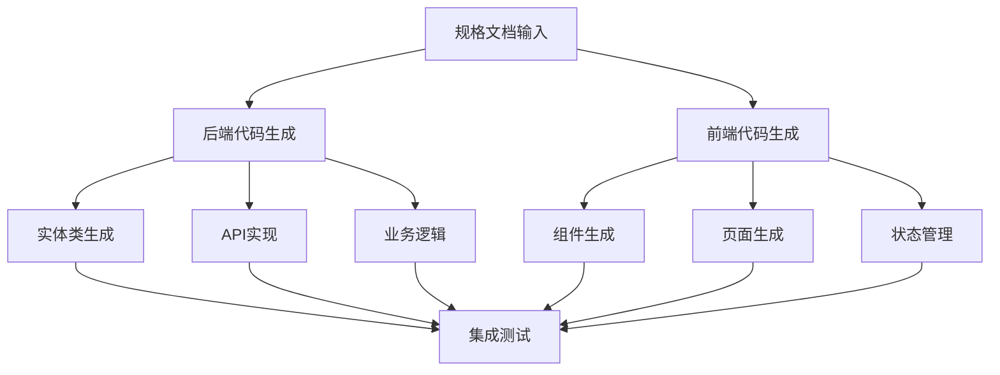

# 基于规格文档的代码生成AI提示词

## 概述

本文档提供了基于第二阶段生成的规格文档（UI描述JSON、设计风格、数据库设计、API文档等）自动生成前后端代码的AI提示词模板。

## 代码生成流程概述



## 1. 后端代码生成AI提示词

### 1.1 实体类生成

#### 提示词模板
```
你是一位Java后端开发专家，请基于数据库设计生成JPA实体类。

**输入信息：**
- 数据库表结构：[粘贴表结构定义]
- 项目包名：com.example.project
- Lombok使用：是
- Swagger文档：是

**生成要求：**
1. 使用JPA注解
2. 添加Swagger注解
3. 使用Lombok简化代码
4. 添加数据验证注解
5. 实现序列化接口
6. 添加必要的注释

**表结构示例：**
```sql
CREATE TABLE users (
    id BIGINT PRIMARY KEY AUTO_INCREMENT,
    email VARCHAR(100) UNIQUE NOT NULL,
    password VARCHAR(255) NOT NULL,
    name VARCHAR(50),
    avatar VARCHAR(255),
    user_type ENUM('individual', 'team', 'enterprise') DEFAULT 'individual',
    created_at TIMESTAMP DEFAULT CURRENT_TIMESTAMP,
    updated_at TIMESTAMP DEFAULT CURRENT_TIMESTAMP ON UPDATE CURRENT_TIMESTAMP
);
```

请生成对应的实体类，包含：
- 完整的JPA注解
- Swagger文档注解
- 数据验证注解
- Lombok注解
- 适当的注释
```

#### 生成示例
```java
package com.example.project.entity;

import com.fasterxml.jackson.annotation.JsonIgnore;
import io.swagger.v3.oas.annotations.media.Schema;
import jakarta.persistence.*;
import jakarta.validation.constraints.Email;
import jakarta.validation.constraints.NotBlank;
import jakarta.validation.constraints.Size;
import lombok.Data;
import lombok.NoArgsConstructor;
import lombok.AllArgsConstructor;
import lombok.Builder;
import org.hibernate.annotations.CreationTimestamp;
import org.hibernate.annotations.UpdateTimestamp;

import java.time.LocalDateTime;

@Entity
@Table(name = "users")
@Data
@NoArgsConstructor
@AllArgsConstructor
@Builder
@Schema(description = "用户实体")
public class User {
    
    @Id
    @GeneratedValue(strategy = GenerationType.IDENTITY)
    @Schema(description = "用户ID")
    private Long id;
    
    @NotBlank(message = "邮箱不能为空")
    @Email(message = "邮箱格式不正确")
    @Column(unique = true, nullable = false, length = 100)
    @Schema(description = "邮箱地址", example = "user@example.com")
    private String email;
    
    @NotBlank(message = "密码不能为空")
    @Size(min = 6, message = "密码长度至少6位")
    @JsonIgnore
    @Column(nullable = false)
    @Schema(description = "密码", accessMode = Schema.AccessMode.READ_ONLY)
    private String password;
    
    @Size(max = 50, message = "姓名长度不能超过50位")
    @Column(name = "name")
    @Schema(description = "用户姓名", example = "张三")
    private String name;
    
    @Column(name = "avatar")
    @Schema(description = "头像URL")
    private String avatar;
    
    @Enumerated(EnumType.STRING)
    @Column(nullable = false)
    @Schema(description = "用户类型", allowableValues = {"individual", "team", "enterprise"})
    private UserType userType;
    
    @CreationTimestamp
    @Column(name = "created_at", updatable = false)
    @Schema(description = "创建时间")
    private LocalDateTime createdAt;
    
    @UpdateTimestamp
    @Column(name = "updated_at")
    @Schema(description = "更新时间")
    private LocalDateTime updatedAt;
    
    public enum UserType {
        INDIVIDUAL, TEAM, ENTERPRISE
    }
}
```

### 1.2 DTO类生成

#### 提示词模板
```
你是一位Java后端开发专家，请基于实体类生成DTO（数据传输对象）。

**输入信息：**
- 实体类定义：[粘贴实体类]
- 业务场景：[创建/更新/查询/响应]
- 使用MapStruct：是

**生成要求：**
1. 生成对应的DTO类
2. 使用MapStruct生成转换器
3. 添加验证注解
4. 添加Swagger注解
5. 考虑安全性（如密码不应返回）

**需要生成的DTO：**
- CreateDTO：创建时使用
- UpdateDTO：更新时使用
- QueryDTO：查询条件
- VO/ResponseDTO：响应数据

请生成完整的DTO类和转换器接口。
```

### 1.3 Controller层生成

#### 提示词模板
```
你是一位Spring Boot开发专家，请基于Swagger API文档生成Controller层代码。

**输入信息：**
- API文档：[粘贴Swagger定义]
- Service接口：已定义
- 基础路径：/api/v1

**生成要求：**
1. 实现RESTful API
2. 添加Swagger注解
3. 参数验证
4. 统一响应格式
5. 异常处理
6. 权限控制注解

**API示例：**
```yaml
/users:
  get:
    summary: 获取用户列表
    parameters:
      - name: page
        in: query
        schema: {type: integer}
      - name: size
        in: query
        schema: {type: integer}
    responses:
      200:
        description: 成功
        content:
          application/json:
            schema:
              type: object
              properties:
                code:
                  type: integer
                data:
                  type: object
                  properties:
                    total:
                      type: integer
                    items:
                      type: array
                      items:
                        $ref: '#/components/schemas/UserVO'
```

请生成对应的Controller实现，包含：
- 完整的CRUD操作
- 分页查询
- 参数验证
- 适当的HTTP状态码
- API文档注解
```

#### 生成示例
```java
package com.example.project.controller;

import com.example.project.dto.UserCreateDTO;
import com.example.project.dto.UserUpdateDTO;
import com.example.project.dto.UserQueryDTO;
import com.example.project.vo.UserVO;
import com.example.project.service.UserService;
import io.swagger.v3.oas.annotations.Operation;
import io.swagger.v3.oas.annotations.Parameter;
import io.swagger.v3.oas.annotations.tags.Tag;
import jakarta.validation.Valid;
import lombok.RequiredArgsConstructor;
import org.springframework.data.domain.Page;
import org.springframework.data.domain.Pageable;
import org.springframework.http.ResponseEntity;
import org.springframework.security.access.prepost.PreAuthorize;
import org.springframework.web.bind.annotation.*;

@Tag(name = "用户管理", description = "用户相关接口")
@RestController
@RequestMapping("/api/v1/users")
@RequiredArgsConstructor
public class UserController {
    
    private final UserService userService;
    
    @Operation(summary = "获取用户列表")
    @GetMapping
    @PreAuthorize("hasRole('ADMIN')")
    public ResponseEntity<Page<UserVO>> getUsers(
            @Parameter(description = "查询条件") UserQueryDTO queryDTO,
            Pageable pageable) {
        Page<UserVO> page = userService.getUsers(queryDTO, pageable);
        return ResponseEntity.ok(page);
    }
    
    @Operation(summary = "获取用户详情")
    @GetMapping("/{id}")
    @PreAuthorize("hasRole('ADMIN') or #id == authentication.principal.id")
    public ResponseEntity<UserVO> getUser(@PathVariable Long id) {
        UserVO user = userService.getUserById(id);
        return ResponseEntity.ok(user);
    }
    
    @Operation(summary = "创建用户")
    @PostMapping
    @PreAuthorize("hasRole('ADMIN')")
    public ResponseEntity<UserVO> createUser(@Valid @RequestBody UserCreateDTO createDTO) {
        UserVO user = userService.createUser(createDTO);
        return ResponseEntity.ok(user);
    }
    
    @Operation(summary = "更新用户")
    @PutMapping("/{id}")
    @PreAuthorize("hasRole('ADMIN') or #id == authentication.principal.id")
    public ResponseEntity<UserVO> updateUser(
            @PathVariable Long id,
            @Valid @RequestBody UserUpdateDTO updateDTO) {
        UserVO user = userService.updateUser(id, updateDTO);
        return ResponseEntity.ok(user);
    }
    
    @Operation(summary = "删除用户")
    @DeleteMapping("/{id}")
    @PreAuthorize("hasRole('ADMIN')")
    public ResponseEntity<Void> deleteUser(@PathVariable Long id) {
        userService.deleteUser(id);
        return ResponseEntity.noContent().build();
    }
}
```

### 1.4 Service层生成

#### 提示词模板
```
你是一位Spring Boot开发专家，请基于业务需求生成Service层代码。

**输入信息：**
- 实体类：[已定义]
- 业务规则：[业务逻辑描述]
- API定义：[已定义]

**生成要求：**
1. 实现Service接口
2. 实现ServiceImpl类
3. 添加事务管理
4. 实现业务逻辑
5. 异常处理
6. 日志记录

**业务规则示例：**
- 用户创建时检查邮箱唯一性
- 用户更新时验证权限
- 删除用户时检查关联数据
- 密码加密存储

请生成完整的Service实现，包含：
- 接口定义
- 实现类
- 业务逻辑
- 异步处理（如需要）
- 缓存使用
```

## 2. 前端代码生成AI提示词

### 2.1 React组件生成（基于Ant Design）

#### 提示词模板
```
你是一位React开发专家，请基于UI描述JSON和设计规范生成React组件。

**输入信息：**
- UI描述JSON：[粘贴JSON内容]
- 设计规范：[粘贴关键规范]
- 组件类型：[页面/表单/列表/卡片]

**生成要求：**
1. 使用TypeScript
2. 使用Ant Design组件
3. 实现Props接口
4. 添加必要的注释
5. 实现交互逻辑
6. 集成状态管理

**UI描述示例：**
```json
{
  "module_id": "user_list",
  "module_name": "用户列表",
  "fields": [
    {
      "field_id": "username",
      "label": "用户名",
      "type": "text"
    },
    {
      "field_id": "email",
      "label": "邮箱",
      "type": "email"
    }
  ],
  "actions": [
    {
      "action_id": "search",
      "label": "搜索",
      "type": "primary"
    }
  ]
}
```

请生成对应的React组件，包含：
- 完整的组件结构
- TypeScript类型定义
- Ant Design组件使用
- 状态管理
- 事件处理
- API集成
```

#### 生成示例
```tsx
// pages/user/UserList.tsx
import React, { useState, useEffect } from 'react';
import { 
  Card, 
  Table, 
  Input, 
  Button, 
  Space, 
  Tag,
  message,
  Modal 
} from 'antd';
import { SearchOutlined, PlusOutlined, EditOutlined, DeleteOutlined } from '@ant-design/icons';
import type { ColumnsType } from 'antd/es/table';
import { useRequest, useModal } from 'ahooks';
import { UserService } from '@/services/user.service';
import { User } from '@/types/user';
import UserForm from './UserForm';

const UserList: React.FC = () => {
  const [searchText, setSearchText] = useState('');
  const [currentPage, setCurrentPage] = useState(1);
  const [pageSize, setPageSize] = useState(10);
  const [selectedRowKeys, setSelectedRowKeys] = useState<React.Key[]>([]);
  
  // 获取用户列表
  const { data, loading, refresh } = useRequest(
    () => UserService.getUsers({
      page: currentPage,
      size: pageSize,
      keyword: searchText
    }),
    {
      refreshDeps: [currentPage, pageSize, searchText]
    }
  );
  
  // 删除用户
  const { run: deleteUser, loading: deleteLoading } = useRequest(
    UserService.deleteUser,
    {
      manual: true,
      onSuccess: () => {
        message.success('删除成功');
        refresh();
      }
    }
  );
  
  // 用户表单弹窗
  const [modal, modalApi] = useModal();
  
  const columns: ColumnsType<User> = [
    {
      title: '用户名',
      dataIndex: 'username',
      key: 'username',
      filteredValue: [searchText],
      onFilter: (value, record) =>
        record.username.toLowerCase().includes(value.toString().toLowerCase()),
    },
    {
      title: '邮箱',
      dataIndex: 'email',
      key: 'email',
    },
    {
      title: '用户类型',
      dataIndex: 'userType',
      key: 'userType',
      render: (type: string) => (
        <Tag color={type === 'ADMIN' ? 'red' : 'blue'}>
          {type === 'ADMIN' ? '管理员' : '普通用户'}
        </Tag>
      ),
    },
    {
      title: '创建时间',
      dataIndex: 'createdAt',
      key: 'createdAt',
      render: (time: string) => new Date(time).toLocaleString(),
    },
    {
      title: '操作',
      key: 'action',
      render: (_, record) => (
        <Space>
          <Button
            type="link"
            icon={<EditOutlined />}
            onClick={() => {
              modalApi.show({
                title: '编辑用户',
                content: (
                  <UserForm
                    initialValues={record}
                    onSuccess={() => {
                      modalApi.hide();
                      refresh();
                    }}
                  />
                ),
              });
            }}
          >
            编辑
          </Button>
          <Button
            type="link"
            danger
            icon={<DeleteOutlined />}
            onClick={() => {
              Modal.confirm({
                title: '确认删除',
                content: `确定要删除用户 ${record.username} 吗？`,
                onOk: () => deleteUser(record.id),
              });
            }}
          >
            删除
          </Button>
        </Space>
      ),
    },
  ];
  
  return (
    <div className="user-list">
      <Card>
        <div className="table-operations">
          <Space>
            <Input.Search
              placeholder="搜索用户名"
              allowClear
              onSearch={setSearchText}
              style={{ width: 200 }}
            />
            <Button
              type="primary"
              icon={<PlusOutlined />}
              onClick={() => {
                modalApi.show({
                  title: '新建用户',
                  content: (
                    <UserForm
                      onSuccess={() => {
                        modalApi.hide();
                        refresh();
                      }}
                    />
                  ),
                });
              }}
            >
              新建用户
            </Button>
          </Space>
        </div>
        
        <Table
          columns={columns}
          dataSource={data?.items || []}
          rowKey="id"
          loading={loading || deleteLoading}
          pagination={{
            current: currentPage,
            pageSize,
            total: data?.total || 0,
            showSizeChanger: true,
            showQuickJumper: true,
            showTotal: (total, range) =>
              `第 ${range[0]}-${range[1]} 条/共 ${total} 条`,
            onChange: (page, size) => {
              setCurrentPage(page);
              setPageSize(size!);
            },
          }}
        />
      </Card>
    </div>
  );
};

export default UserList;
```

### 2.2 表单组件生成

#### 提示词模板
```
你是一位React表单专家，请基于UI描述生成表单组件。

**输入信息：**
- UI描述JSON：[表单字段定义]
- 验证规则：[验证要求]
- API接口：[提交接口]

**生成要求：**
1. 使用Formik或React Hook Form
2. 实现表单验证
3. 支持编辑模式
4. 异步提交
5. 错误处理
6. 成功/失败反馈

请生成完整的表单组件，包含：
- 表单字段定义
- 验证规则
- 提交逻辑
- 重置功能
```

### 2.3 API服务生成

#### 提示词模板
```
你是一位前端API集成专家，请基于Swagger文档生成API服务类。

**输入信息：**
- Swagger文档：[API定义]
- 基础URL：[API地址]
- 认证方式：JWT

**生成要求：**
1. 使用axios
2. 实现请求拦截
3. 实现响应拦截
4. 错误处理
5. TypeScript类型定义
6. 支持取消请求

请生成完整的API服务，包含：
- 接口定义
- 请求方法
- 类型定义
- 错误处理
```

#### 生成示例
```typescript
// services/user.service.ts
import { request } from '@/utils/request';
import type { User, UserQueryParams, UserCreateParams, UserUpdateParams } from '@/types/user';

export class UserService {
  // 获取用户列表
  static getUsers(params: UserQueryParams) {
    return request.get<{
      total: number;
      items: User[];
    }>('/users', { params });
  }

  // 获取用户详情
  static getUserById(id: number) {
    return request.get<User>(`/users/${id}`);
  }

  // 创建用户
  static createUser(data: UserCreateParams) {
    return request.post<User>('/users', data);
  }

  // 更新用户
  static updateUser(id: number, data: UserUpdateParams) {
    return request.put<User>(`/users/${id}`, data);
  }

  // 删除用户
  static deleteUser(id: number) {
    return request.delete(`/users/${id}`);
  }

  // 修改密码
  static changePassword(id: number, data: { oldPassword: string; newPassword: string }) {
    return request.post(`/users/${id}/change-password`, data);
  }

  // 重置密码
  static resetPassword(id: number) {
    return request.post(`/users/${id}/reset-password`);
  }
}
```

## 3. 测试代码生成AI提示词

### 3.1 单元测试生成

#### 提示词模板
```
你是一位测试专家，请为生成的代码编写单元测试。

**输入信息：**
- 源代码：[需要测试的代码]
- 测试框架：Jest
- 覆盖率要求：80%+

**生成要求：**
1. 测试所有公共方法
2. 包含正常场景
3. 包含异常场景
4. Mock外部依赖
5. 断言清晰

请生成完整的测试代码。
```

### 3.2 E2E测试生成

#### 提示词模板
```
你是一位E2E测试专家，请基于用户故事生成端到端测试。

**输入信息：**
- 用户故事：[用户操作流程]
- 关键路径：[核心功能]
- 测试工具：Cypress

**生成要求：**
1. 模拟真实用户操作
2. 包含数据准备
3. 验证关键结果
4. 处理异步操作

请生成E2E测试脚本。
```

## 4. 代码生成优化策略

### 4.1 增量生成
```
对于已存在的代码，实现增量更新：

1. **代码分析**
   - 识别现有代码结构
   - 找出需要修改的部分
   - 保留自定义逻辑

2. **差异化生成**
   - 只生成变化的部分
   - 提供合并建议
   - 生成迁移脚本

3. **冲突处理**
   - 标记冲突位置
   - 提供解决方案
   - 支持人工审核
```

### 4.2 质量保证
```
生成代码的质量检查清单：

1. **代码规范**
   - 遵循项目编码规范
   - 使用统一的代码风格
   - 包含必要的注释

2. **安全性**
   - 输入验证
   - SQL注入防护
   - XSS防护
   - 权限控制

3. **性能**
   - 避免N+1查询
   - 实现分页
   - 添加缓存
   - 异步处理

4. **可维护性**
   - 模块化设计
   - 清晰的命名
   - 合理的抽象
   - 错误处理
```

---

*文档版本：1.0*  
*最后更新：2025-09-22*