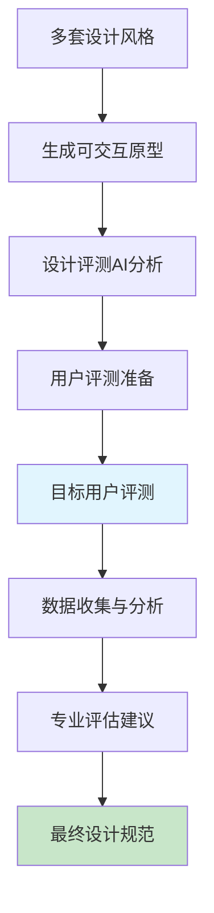

# 设计风格评测与确认流程

## 概述

设计风格评测是第三阶段的关键起点，通过系统化的评测流程，从第二阶段生成的多套设计风格中选择最适合的方案。本流程确保最终设计方案既符合业务需求，又能满足用户期望。

## 流程概览



## 详细流程说明

### 第一步：原型生成（4小时）

#### 1.1 原型生成AI提示词
```
你是一位专业的原型设计师，擅长快速创建可交互原型。

任务：基于设计风格文档生成Figma可交互原型

输入：
- 设计风格文档（多套）
- UI描述JSON文件
- 关键用户流程

输出要求：
1. 使用Figma创建高保真原型
2. 每套风格实现3-5个核心页面
3. 包含关键交互效果
4. 体现设计风格特点
5. 生成原型分享链接

工作流程：
1. 分析设计风格特点
2. 设计页面布局
3. 创建组件库
4. 实现交互效果
5. 优化用户体验
```

#### 1.2 原型内容清单
- **首页/仪表板** - 展示整体风格
- **核心功能页面** - 体现主要交互
- **表单页面** - 输入和验证样式
- **数据展示页面** - 表格、卡片等
- **响应式设计** - 移动端适配

### 第二步：AI预评估（2小时）

#### 2.1 设计评估AI提示词
```
你是一位设计评估专家，擅长从专业角度评估设计方案。

任务：预评估多套设计方案的优劣势

评估维度：
1. **品牌一致性**
   - 是否符合品牌调性
   - 视觉识别度
   - 差异化程度

2. **用户体验**
   - 易用性评分
   - 学习成本
   - 效率指标

3. **技术可行性**
   - 实现难度
   - 性能影响
   - 维护成本

4. **扩展性**
   - 组件复用性
   - 风格延展性
   - 主题切换能力

输出格式：
- 每套方案的评分（1-10分）
- 优势和劣势分析
- 改进建议
- 风险提示
```

### 第三步：评测方案设计（2小时）

#### 3.1 评测方案AI提示词
```
你是一位用户研究专家，擅长设计科学的评测方案。

任务：设计用户评测方案

评测目标：
- 验证设计偏好
- 发现可用性问题
- 收集改进建议
- 评估情感反应

评测方案：
1. **问卷调查**
   - A/B测试偏好选择
   - 语义差异量表
   - 开放式问题

2. **任务测试**
   - 设计5个核心任务
   - 记录完成时间
   - 收集成功率

3. **访谈提纲**
   - 第一印象问题
   - 深度探究问题
   - 建议收集问题

目标用户：
- 用户画像匹配
- 样本量：10-15人
- 覆盖不同角色
```

### 第四步：用户评测执行（1-2天）

#### 4.1 评测执行指南
```markdown
# 用户评测执行指南

## 准备工作
1. **环境准备**
   - 确保原型可正常访问
   - 准备评测设备（桌面/移动）
   - 录屏软件准备

2. **用户筛选**
   - 符合目标用户画像
   - 无设计背景优先
   - 未参与过项目

3. **流程设计**
   - 欢迎和说明（5分钟）
   - 无干扰测试（30分钟）
   - 访谈环节（15分钟）

## 评测执行
### 第一部分：A/B测试（10分钟）
1. 展示两套设计方案
2. 记录第一选择
3. 询问选择理由

### 第二部分：任务测试（20分钟）
1. 任务1：[具体任务描述]
2. 任务2：[具体任务描述]
3. 任务3：[具体任务描述]

### 第三部分：深度访谈（15分钟）
1. 整体感受
2. 喜欢和不喜欢的地方
3. 改进建议
```

### 第五步：数据分析（4小时）

#### 5.1 数据分析AI提示词
```
你是一位数据分析师，擅长处理和解读用户评测数据。

任务：分析评测数据，提供决策建议

输入数据：
- 用户选择偏好数据
- 任务完成率数据
- 访谈记录文本
- 问卷评分数据

分析要求：
1. **偏好分析**
   - 计算选择比例
   - 分析偏好原因
   - 识别共性特征

2. **任务表现**
   - 完成率统计
   - 时间效率分析
   - 错误模式识别

3. **情感分析**
   - 正负面情感分类
   - 情感强度评分
   - 关键词提取

4. **建议汇总**
   - 优化建议优先级
   - 风险提醒
   - 决策建议
```

#### 5.2 分析报告模板
```markdown
# 设计风格评测报告

## 执行摘要
- 评测概况
- 主要发现
- 核心建议

## 数据概览
- 参与用户统计
- 整体偏好分布
- 关键指标对比

## 详细分析
### 方案A：简约专业风
- 选择比例：XX%
- 平均完成时间：XX秒
- 用户评价关键词：
  - 正面：专业、清晰、高效
  - 负面：冷峻、单调

### 方案B：友好活力风
- 选择比例：XX%
- 平均完成时间：XX秒
- 用户评价关键词：
  - 正面：友好、活泼、现代
  - 负面：花哨、不够稳重

## 建议
1. **推荐方案**：[方案X]
2. **优化建议**：
   - 保留方案X的优点
   - 吸收方案Y的某些元素
   - 需要改进的地方
3. **风险提示**：
   - 实施难度
   - 用户接受度
   - 维护成本

## 附录
- 原始数据
- 用户评论
- 详细图表
```

### 第六步：最终设计规范（4小时）

#### 6.1 设计规范整合AI提示词
```
你是一位设计系统专家，负责整合和优化最终的设计规范。

任务：基于评测结果，生成最终设计规范

输入：
- 选中的设计方案
- 评测反馈和建议
- 原始设计文档

输出要求：
1. **设计原则**
   - 核心价值观
   - 设计理念
   - 指导原则

2. **视觉系统**
   - 色彩规范（主色、辅助色、中性色）
   - 字体系统（字号、字重、行高）
   - 间距系统（基础单位、比例）
   - 圆角和阴影规范

3. **组件库规范**
   - 基础组件（按钮、输入框等）
   - 复合组件（表单、卡片等）
   - 布局组件（网格、容器等）
   - 交互规范（动效、过渡）

4. **使用指南**
   - 最佳实践
   - 常见错误
   - 实例展示
```

## 工具和模板

### 1. 评测工具
- **原型工具**：Figma、Sketch
- **问卷工具**：问卷星、Google Forms
- **数据分析**：Excel、SPSS、Python
- **可视化**：Tableau、Power BI

### 2. 评测模板
```markdown
# 设计评测问卷模板

## 基本信息
- 年龄段：
- 职业类型：
- 技术熟悉度：

## A/B测试
![方案A截图]
![方案B截图]

1. 你更喜欢哪个方案？
   □ 方案A  □ 方案B

2. 选择理由（多选）：
   □ 更美观  □ 更易用  □ 更专业
   □ 更现代  □ 更友好  □ 其他：___

## 任务测试
[任务列表和记录表]

## 满意度评分
1-5分评价：
- 视觉吸引力：___分
- 易用性：___分
- 专业性：___分
- 整体满意度：___分

## 开放建议
1. 你最喜欢的地方：
2. 需要改进的地方：
3. 其他建议：
```

## 最佳实践

### 1. 评测设计
- 确保评测任务真实
- 避免引导性问题
- 控制变量（只测试风格差异）
- 包含不同类型用户

### 2. 执行过程
- 保持中立态度
- 记录详细反馈
- 鼓励畅所欲言
- 注意非语言反馈

### 3. 结果分析
- 定量与定性结合
- 寻找模式和洞察
- 区分必要和锦上添花
- 考虑实现成本

## 常见陷阱

### 1. 样本偏差
- **问题**：用户群体不具代表性
- **解决**：严格筛选，确保多样性

### 2. 主观偏见
- **问题**：内部人员偏好影响判断
- **解决**：让目标用户做决策

### 3. 过度设计
- **问题**：追求完美导致延误
- **解决**：设定时间限制，快速决策

### 4. 忽视技术
- **问题**：设计方案难以实现
- **解决**：让开发团队早期参与

---

*流程文档版本：1.0*  
*最后更新：2025-09-22*