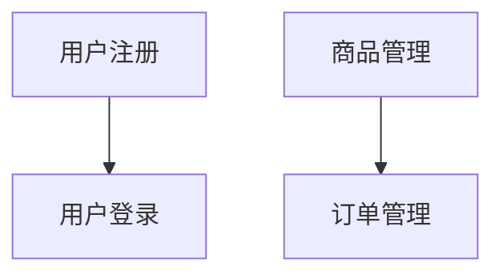

# 功能导向的代码组织方法 - AI辅助编程最佳实践

> 作者: 张三 VX：qfyd095

## 引言

在AI辅助编程的时代，我们需要重新思考代码组织的最佳实践。传统的软件工程原则，如代码复用、继承、多态等，是为了帮助人类开发者更好地管理和维护代码。然而，当AI成为我们的编程伙伴时，这些原则可能不再是最优选择。

本文提出了一种以功能为中心的文件组织方法，通过清晰的文件命名和结构，显著提升AI编码的效率和准确性。

## 核心理念

### 1. 功能清单先行

在与AI开始编码之前，首先创建一个功能清单表格：

| 功能ID | 功能说明 |
| ---- | ---- |
| F001 | 用户注册 |
| F002 | 用户登录 |
| F003 | 商品查询 |
| F004 | 订单创建 |
| F005 | 支付处理 |

**重要提示**：这个表格不仅仅是文档，它是整个开发过程的导航图。

### 2. 基于功能ID的文件组织

摒弃传统的分层架构（如controller、service、model），改用功能ID作为文件组织的基本单位：

```plaintext
project/
├── README.md              # 功能清单表格
├── F001/                  # 用户注册
│   ├── RegisterController.js
│   ├── RegisterService.js
│   ├── RegisterModel.js
│   └── tests/
├── F002/                  # 用户登录
│   ├── LoginController.js
│   ├── LoginService.js
│   └── ...
└── F003/                  # 商品查询
    ├── ProductSearch.js
    └── ...
```

### 3. 开发工作流程

当需要实现或修改功能时：

1. **第一步**：查阅功能清单表格，找到对应的功能ID

2. **第二步**：进入该功能ID对应的文件夹

3. **第三步**：在该文件夹内进行所有代码操作

**示例对话**：

```plaintext
人类：请修改用户注册功能，增加邮箱验证
AI：好的，我来修改F001（用户注册）功能。首先让我查看F001文件夹的内容...
```

## 为什么这种方法适合AI编码？

### 1. 减少搜索干扰

传统架构的问题：

```java
// 在UserService中搜索"validate"可能返回多个结果
public class UserService {
    public void validateUser(User user) { ... }
    public void validateEmail(String email) { ... }
    public void validatePhone(String phone) { ... }
}

// 在UserValidator中也有类似方法
public class UserValidator {
    public boolean validate(User user) { ... }
}
```

AI搜索时可能找到多个不相关的结果，影响判断。

新架构的优势：

```plaintext
F001/
└── RegisterService.js
    export function validateRegistration(data) {
        // 明确知道这是注册验证
    }
```

### 2. 明确的代码边界

每个功能都是独立的代码单元，AI不需要理解复杂的继承关系和多态调用。

### 3. 精准的上下文范围

AI操作时只需要关注当前功能文件夹，不会意外修改其他功能的代码。

## 处理功能间依赖

### 显式的依赖声明

当功能B需要使用功能A的能力时，采用显式的依赖声明：

```plaintext
F001/  # 用户认证（基础功能）
├── exposes/
│   ├── auth-check.js      # 对外暴露的认证检查接口
│   └── user-session.js    # 用户会话管理
└── ...内部实现

F005/  # 支付处理（依赖认证）
├── depends/
│   └── F001.json          # 声明依赖F001
│       {
│         "uses": ["auth-check", "user-session"]
│       }
└── PaymentService.js
```

### 依赖关系的优势

1. **透明性**：任何人（包括AI）都能清楚看到功能间的依赖关系

2. **可维护性**：修改基础功能时，可以快速找到所有依赖它的功能

3. **可测试性**：可以单独测试每个功能，模拟其依赖

## 实施指南

### 1. 创建功能清单

```markdown
# 项目功能清单

| 功能ID | 功能描述 | 优先级 | 状态 | 备注 |
|--------|----------|--------|------|------|
| F001   | 用户注册 | 高 | 开发中 | 需要邮箱验证 |
| F002   | 用户登录 | 高 | 已完成 |  |
| F003   | 商品查询 | 中 | 待开发 |  |
```

### 2. 功能文件夹结构示例

```plaintext
F001/
├── README.md            # 本功能的详细说明
├── api/                 # API接口定义
│   └── register.js
├── service/             # 业务逻辑
│   └── register.js
├── model/               # 数据模型
│   └── User.js
├── exposes/             # 对外暴露的能力
│   └── user-creation.js
├── tests/               # 测试文件
│   └── register.test.js
└── depends/             # 依赖声明（如果有）
```

### 3. 与AI协作的最佳实践

**请求AI实现新功能**：

```plaintext
请根据功能清单实现F003（商品查询）。需要实现：
1. 按名称搜索商品
2. 按分类筛选商品
3. 分页显示结果

请创建F003文件夹并实现相关代码。
```

**请求AI修改现有功能**：

```plaintext
请修改F001（用户注册）功能：
1. 在用户注册时增加手机号验证
2. 发送验证码到用户手机
3. 验证码输入正确才能完成注册

修改范围仅限于F001文件夹。
```

## 对传统思维的颠覆

### 1. 放弃DRY原则？

是的，在这个架构中，我们有意放弃了一些代码复用。原因：

* **AI的理解成本**：找到并理解可复用代码的成本可能高于重新编写

* **维护的复杂性**：复用代码的修改可能影响多个功能

* **定位的准确性**：独立的代码让AI更容易定位和修改

### 2. 不使用继承和多态？

传统的设计模式是为了人类开发者设计的，它们：

* 增加了代码的抽象层次

* 让AI难以追踪执行流程

* 产生多个可能的搜索结果

## 实际效果对比

### 传统架构的AI协作

```plaintext
人类：修改用户验证逻辑
AI：在项目中搜索"validate"，找到50个结果...
    需要分析继承关系...
    确定修改哪个方法...
    可能影响其他功能...
```

### 新架构的AI协作

```plaintext
人类：修改用户注册的验证逻辑
AI：定位到F001文件夹...
    查看该文件夹内的验证代码...
    精确修改，不影响其他功能...
```

## 与SPARC方法论的结合

这种功能导向的组织方法与SPARC方法论完美结合：

1. **Specification（规范）**：每个功能ID对应明确的规格说明

2. **Pseudocode（伪代码）**：在功能文件夹内编写伪代码

3. **Architecture（架构）**：功能间的依赖关系构成了整体架构

4. **Refinement（优化）**：可以独立优化每个功能

5. **Completion（完成）**：功能完成状态清晰可追踪

## AI工具集成建议

### 1. Claude Code配置

```json
{
  "featureMapping": {
    "F001": "用户注册",
    "F002": "用户登录",
    "F003": "商品查询"
  },
  "workingDirectory": "feature-based",
  "searchScope": "current-feature"
}
```

### 2. 提示词模板

```plaintext
你现在在实现功能{FEATURE_ID}（{FEATURE_NAME}）。
请只在 {FEATURE_ID}/ 文件夹内工作。
功能描述：{FEATURE_DESCRIPTION}
依赖关系：{DEPENDENCIES}
```

## 结论

在AI辅助编程的时代，我们需要重新思考什么是"好的代码组织"。功能导向的文件命名和组织方式，虽然看起来"不够优雅"，但却能：

1. **提升AI编码效率**：减少搜索和理解成本

2. **降低错误率**：明确的代码边界防止误改

3. **简化协作流程**：功能ID成为人类和AI的共同语言

这不是技术的倒退，而是适应新工具的思维进化。就像我们不再用汇编编写代码一样，在AI时代，我们也需要新的代码组织原则。

记住：**让AI能够高效工作的代码结构，才是真正的好结构**。

## 附录：功能清单模板

```markdown
# 项目功能清单

## 核心功能
| 功能ID | 功能描述 | 依赖功能 | 状态 | 最后更新 |
|--------|----------|----------|------|----------|
| F001   |  |  |  |  |
| F002   |  |  |  |  |

## 功能依赖图


## 实施步骤

* [ ] 创建功能清单

* [ ] 确定功能ID分配规则

* [ ] 迁移现有代码

* [ ] 建立依赖管理机制

* [ ] 培训团队成员
```

## 常见问题

### Q1: 这种方法是否会导致代码重复？

A: 是的，会有一些重复。但是考虑到AI的理解成本和维护效率，适当的重复是可以接受的。每个功能的独立性带来的好处远大于代码重复的代价。

### Q2: 如何处理大型功能？

A: 大型功能可以拆分为多个子功能，使用子ID（如F001-1, F001-2）。或者在一个功能文件夹内使用子目录组织。

### Q3: 团队协作时如何处理冲突？

A: 功能ID天然成为了代码的边界，不同开发者负责不同功能，大大减少了冲突的可能性。

---

**最后更新：2025-01-14**
**适用场景：AI辅助编程、快速原型开发、中小型项目**