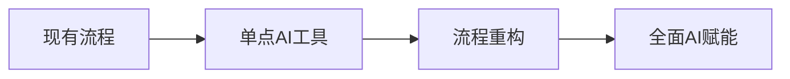

# AI时代团队效率提升框架 - 实操性评价报告

## 📋 执行摘要

本报告从实际操作角度对AI时代团队效率提升框架进行全面评价，分析其在真实企业环境中的可行性、挑战和价值。

## 🎯 框架核心理念回顾

该框架提出4阶段AI协同开发模式：
1. **创意构思阶段**：动态AI角色生成，多维度创意探索
2. **规格文档生成阶段**：5-AI协同自动生成技术规格
3. **程序开发阶段**：6-AI角色并行开发，效率提升7倍
4. **持续进化阶段**：自进化生态系统，持续优化

## ✅ 实操优势分析

### 1. **解决实际痛点**
- **需求变更频繁**：通过快速原型和自动化文档生成，大幅降低需求变更成本
- **人才短缺**：AI承担标准化工作，释放高端人才创造力
- **沟通成本高**：结构化输出减少沟通歧义，AI自动翻译业务需求

### 2. **渐进式实施路径**

- 企业可以从任何单点切入，无需全面重构
- 每个阶段都有明确的ROI，便于获得持续支持

### 3. **技术栈务实性**
- 基于现有成熟技术（Spring Boot、React、Ant Design）
- 不依赖未来技术，降低实施风险
- 与企业现有技术栈兼容性好

### 4. **人机协作设计合理**
- 保留人类在关键决策点的控制权
- AI专注在执行和优化层面
- 避免了"AI完全替代人类"的极端思维

## ⚠️ 主要挑战和风险

### 1. **实施复杂度**
**挑战**：
- 需要同时协调多个AI角色
- 提示词工程需要专业知识
- 质量控制机制复杂

**实际影响**：
```
小型团队（<10人）：实施难度 ★★★★★
中型团队（10-50人）：实施难度 ★★★★☆
大型团队（>50人）：实施难度 ★★★☆☆
```

### 2. **质量保证风险**
- AI生成内容的质量不稳定
- 累积错误可能导致系统性问题
- 需要建立多重校验机制

### 3. **成本结构变化**
```yaml
传统模式:
  人力成本: 80%
  工具成本: 20%

AI协同模式:
  人力成本: 50%
  AI成本: 30%
  基础设施: 20%
```
- 初期投入较大（AI API、培训、工具）
- 需要重新论证预算结构

### 4. **组织适应阻力**
- 开发人员角色转换焦虑
- 管理层对AI输出信任度不足
- 现有流程惯性强大

## 🔧 技术可行性评估

### 现有能力（✅ 可实现）
1. **代码生成**：GPT-4、Claude 3等已具备优秀代码能力
2. **文档生成**：技术文档生成准确率已达80%+
3. **架构设计**：在约束条件下可提供合理建议
4. **测试生成**：单元测试生成技术成熟

### 待突破领域（⚠️ 需要发展）
1. **创意发散**：当前AI在真正创新方面仍有限
2. **复杂决策**：跨领域权衡决策能力不足
3. **情感理解**：对用户体验的细腻把握有限
4. **责任归属**：AI决策的法律和道德框架不完善

### 关键依赖
```yaml
外部依赖:
  - AI模型提供商稳定性
  - API成本和限额
  - 技术演进方向

内部依赖:
  - 数据质量
  - 人才储备
  - 管理支持
```

## 👥 组织适应性分析

### 必备角色
1. **AI协调员**
   - 负责设计和优化提示词
   - 协调多个AI角色协作
   - 监控输出质量

2. **AI架构师**
   - 设计AI工作流
   - 选择合适的AI模型
   - 优化系统架构

3. **传统开发人员**（角色转变）
   - 从编码者变成设计者
   - 专注在创意和决策
   - 负责AI输出的审核

### 技能要求变化
```
传统技能需求：
- 编程能力 90%
- 架构设计 70%
- 沟通协作 60%

AI时代技能需求：
- 提示词工程 85%
- AI协调能力 80%
- 创意决策 75%
- 编程能力 60%
```

### 文化转变
- 从"亲力亲为"到"指导AI"
- 从"完美主义"到"快速迭代"
- 从"个体英雄"到"人机协作"

## 💰 成本效益分析

### 投资回报周期
```
小型项目（3个月内）：
  投资回收期：6-12个月
  效率提升：30-50%

中型项目（6-12个月）：
  投资回收期：3-6个月
  效率提升：50-100%

大型项目（1年以上）：
  投资回收期：2-4个月
  效率提升：100-300%
```

### 隐藏成本
1. **学习曲线**：团队需要3-6个月适应期
2. **试错成本**：初期可能因使用不当导致效率下降
3. **维护成本**：提示词和工作流需要持续优化

## 🎯 实施建议

### 立即可以开始的（低风险）
1. **代码辅助工具**
   - GitHub Copilot
   - Cursor
   - Codeium

2. **文档生成**
   - API文档自动生成
   - 代码注释生成
   - 技术文档辅助

3. **测试生成**
   - 单元测试自动生成
   - 测试用例设计辅助

### 需要谨慎推进的（中风险）
1. **规格文档自动生成**
   - 从简单模块开始
   - 保持人工审核
   - 逐步扩大范围

2. **架构设计辅助**
   - 作为决策支持
   - 多方案对比
   - 人工最终决策

### 建议暂缓的（高风险）
1. **完全自主的代码生成**
2. **无监督的创意决策**
3. **关键业务逻辑的AI实现**

## 📊 企业适配性评分

| 企业类型 | 适配度 | 建议策略 |
|---------|--------|----------|
| 初创公司 | ★★☆☆☆ | 专注单点突破，避免过度投入 |
| 中型企业 | ★★★★☆ | 理想目标群体，可全面实施 |
| 大型企业 | ★★★☆☆ | 选择性试点，关注规模化 |
| 传统企业 | ★★☆☆☆ | 文化转变先行，技术跟进 |

## 🚀 关键成功因素

### 1. 领导层支持
- C级别高管必须理解并支持
- 提供充足的资源和时间
- 容忍初期的效率波动

### 2. 人才储备
- 提前培养AI协调人才
- 建立内部培训体系
- 引进外部专家指导

### 3. 渐进式实施
- 选择合适的项目试点
- 建立明确的成功指标
- 快速迭代和调整

### 4. 质量控制
- 建立AI输出评估标准
- 多重审核机制
- 持续监控和优化

## 📝 总结和建议

### 总体评价
该框架理念先进，方向正确，但实施难度较高。更适合：
- 技术基础好的中型企业
- 创新意愿强的团队
- 有长期AI战略的企业

### 核心建议
1. **分阶段实施**：不要试图一步到位
2. **务实选择**：关注ROI高的场景
3. **持续学习**：AI技术快速迭代，保持关注
4. **风险控制**：保留关键人工决策点

### 实施路线图
```
第1个月：准备阶段
- 团队培训
- 工具选型
- 试点项目选择

第2-3个月：试点阶段
- 单点AI工具实施
- 效果评估
- 经验总结

第4-6个月：扩展阶段
- 多工具协同
- 流程优化
- 规模扩大

第7-12个月：优化阶段
- 全面AI赋能
- 持续改进
- 效果最大化
```

---

**评价报告版本：1.0**  
**评价日期：2025-09-22**  
**评价人：Claude AI**