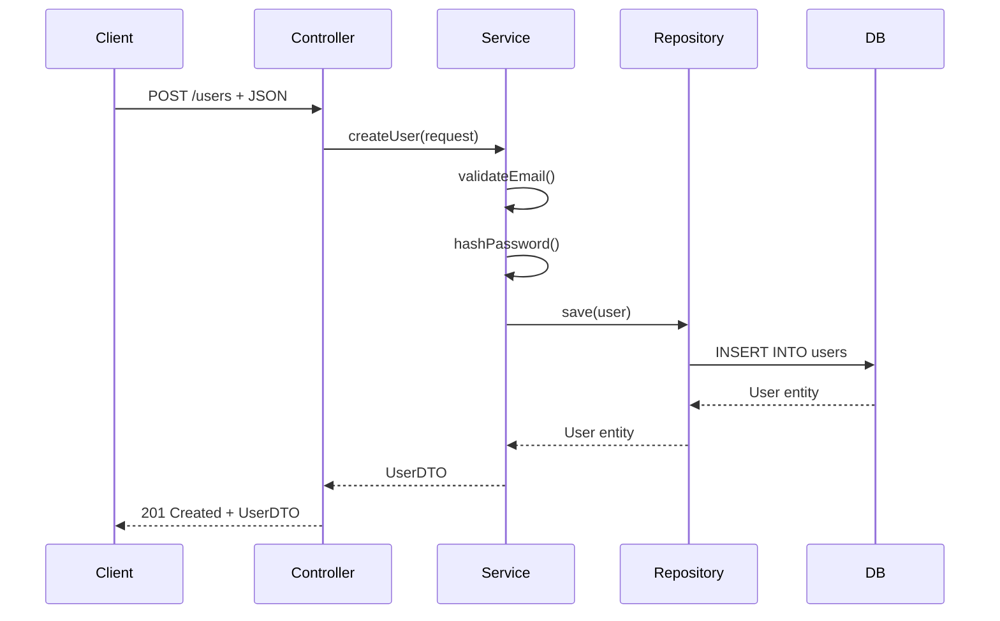

# 第四步：HTTP端点调用链分析 - 理论基础

## 核心目标

通过静态分析HTTP端点，完整追踪从Controller到Service再到Repository的调用链路，最终生成每个端点的完整文档，包括：
1. HTTP接口说明
2. 完整调用链路
3. 数据流转路径
4. 实际使用的实现类（AI推理）
5. 关联的Interface

## 分析范围

### 1. HTTP端点识别
- Spring MVC注解：@RestController、@Controller、@RequestMapping
- 具体映射注解：@GetMapping、@PostMapping、@PutMapping、@DeleteMapping
- JAX-RS注解：@Path、@GET、@POST等
- 配置文件定义的路由

### 2. 调用链路追踪
- Controller → Service → Repository
- 跨层调用和横向调用
- 异步调用和消息队列
- 外部服务调用

### 3. 依赖注入分析
- @Autowired、@Resource注入
- 构造器注入
- @Configuration配置的Bean
- 条件化注入(@Conditional)

## 静态分析策略

### 1. 入口点分析

#### Controller类识别
```java
@RestController
@RequestMapping("/api/v1/users")
public class UserController {
    // 端点方法分析
}
```

#### 端点信息提取
- HTTP方法和路径
- 请求参数（@RequestParam、@PathVariable、@RequestBody）
- 响应类型（@ResponseBody）
- 异常处理（@ExceptionHandler）
- 拦截器应用

### 2. 方法调用分析

#### 调用图构建
- 使用ASM或Javassist分析字节码
- 构建方法调用关系图
- 识别动态代理调用
- 追踪反射调用

#### 调用深度控制
- 避免无限递归
- 设置最大追踪深度
- 识别循环依赖
- 剪枝不重要的分支

### 3. 依赖关系分析

#### Spring容器分析
- Bean定义解析
- 依赖注入图构建
- 作用域分析
- 生命周期管理

#### 接口实现映射
- 接口与实现类的对应关系
- 多实现情况的条件判断
- @Primary和@Qualifier的影响
- AOP代理的识别

## AI推理实现类选择

### 1. 推理依据

#### 上下文分析
- 调用环境（Controller层特征）
- 业务场景（URL路径、HTTP方法）
- 参数特征（请求类型、数据大小）

#### 实现类特征
- 命名模式推断
- 包路径规律
- 注解配置分析
- 历史使用模式

#### 运行时条件
- 配置文件设置
- 环境变量影响
- Feature Flag状态
- 外部依赖可用性

### 2. 推理维度

#### 环境维度
- Production环境 → 稳定实现
- Test环境 → Mock实现
- Dev环境 → Debug实现

#### 性能维度
- 高并发 → 缓存实现
- 大数据 → 批量实现
- 实时要求 → 异步实现

#### 功能维度
- 核心业务 → 完整实现
- 辅助功能 → 简化实现
- 实验功能 → 新版本实现

### 3. 推理置信度

#### 高置信度
- 有明确@Conditional注解
- 配置文件有明确配置
- 命名有明确规律

#### 中等置信度
- 基于调用上下文推断
- 基于包路径规律
- 基于注解组合

#### 低置信度
- 缺少明确线索
- 存在多个可能性
- 需要运行时决定

## 数据流图生成

### 1. 数据结构识别

#### 输入数据
- 请求参数类型
- 请求体结构
- Header信息
- 路径变量

#### 输出数据
- 响应体结构
- 响应头
- 状态码
- 错误信息

#### 中间数据
- DTO转换
- 实体对象
- 缓存数据
- 临时数据

### 2. 数据流转路径

#### 层级流转
```
Request → DTO → Domain → Entity → Database
         ↓        ↓        ↓        ↓
     Response ← DTO ← Domain ← Entity
```

#### 横向流转
- Service之间的调用
- 消息队列的发布订阅
- 缓存读写操作
- 外部API调用

### 3. 变换点识别

#### 类型转换
- JSON → Object
- DTO → Entity
- Entity → DTO
- Object → JSON

#### 数据处理
- 验证和校验
- 业务规则应用
- 数据聚合
- 格式转换

## 文档输出标准

### 1. 端点文档结构

#### 基本信息
- 端点路径和方法
- 功能描述
- 权限要求
- 限流规则

#### 请求说明
- 请求参数表
- 请求体结构
- Header说明
- 示例请求

#### 响应说明
- 响应结构
- 状态码含义
- 错误格式
- 示例响应

#### 调用链路
- 完整调用路径
- 关键节点说明
- 性能关键点
- 异常处理点

#### 数据流图
- Mermaid流程图
- 数据结构图
- 时序图
- 部署图

### 2. 实现类说明

#### 选择理由
- AI推理过程
- 置信度评分
- 备选方案
- 切换条件

#### 实现特征
- 技术特点
- 性能特征
- 依赖组件
- 配置要求

### 3. Interface关联

#### 接口映射
- 使用的Interface列表
- 方法对应关系
- 调用模式
- 异常处理

#### 实现细节
- 具体实现类
- 方法重写情况
- 增强处理
- 特殊逻辑

## 质量保证

### 1. 分析完整性
- 所有端点都被覆盖
- 调用链路完整
- 无断链情况
- 无遗漏分支

### 2. 推理准确性
- 置信度评估
- 多候选排序
- 不确定性标记
- 人工审核点

### 3. 文档一致性
- 格式统一
- 术语一致
- 链接有效
- 示例可执行

## 特殊情况处理

### 1. 动态路由
-PathVariable变量路径
- 动态映射
- 条件路由
- 拦截器路由

### 2. 异步处理
- @Async方法
- CompletableFuture
- 消息队列
- 事件驱动

### 3. 多线程场景
- 线程池配置
- 并发控制
- 锁机制
- 事务边界

### 4. 微服务调用
- Feign客户端
- RestTemplate
- WebClient
- 服务发现

## 输出示例

### 端点文档示例
```markdown
# POST /api/v1/users

## 功能描述
创建新用户账户

## 请求参数
| 参数 | 类型 | 必填 | 说明 |
|------|------|------|------|
| username | String | 是 | 用户名，3-20字符 |
| email | String | 是 | 邮箱地址 |
| password | String | 是 | 密码，至少8位 |

## 调用链路
```
UserController.createUser()
  ↓
UserService.createUser() (使用UserServiceImpl)
  ↓
UserRepository.save() (JPA实现)
  ↓
Database
```

## 使用的实现类
- UserServiceImpl（推理置信度：95%）
  - 理由：标准创建流程，生产环境默认实现
  - 备选：UserServiceAsync（高并发时）

## 关联Interface
- UserService
  - createUser方法
  - validateEmail方法
  - hashPassword方法
```

### 数据流图示例
