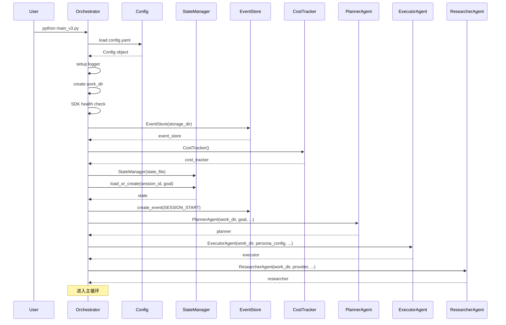
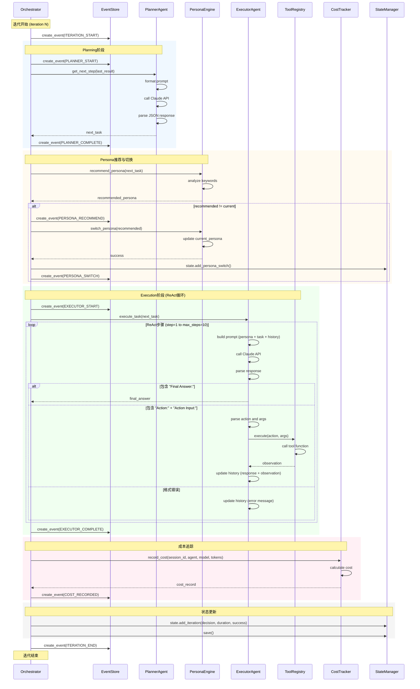
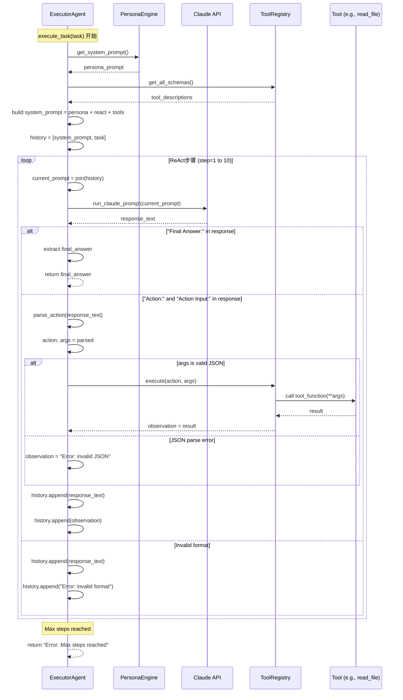
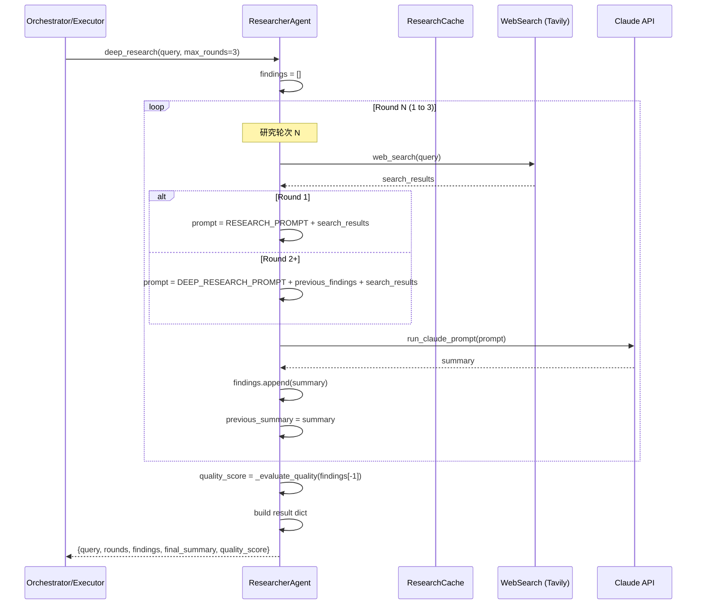
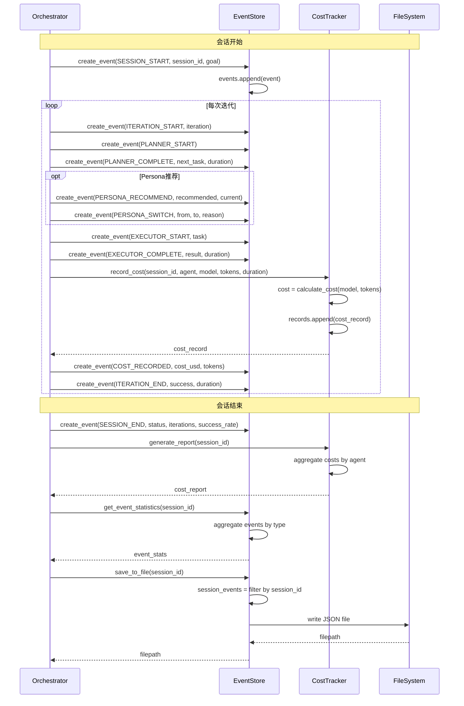
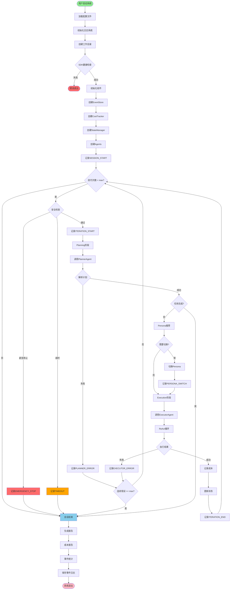
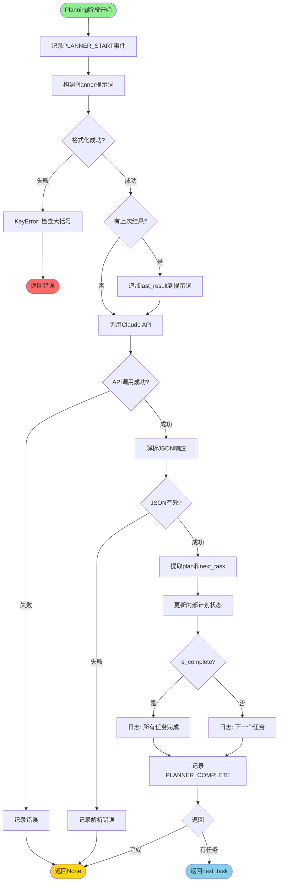
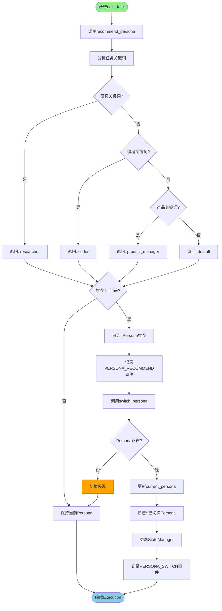
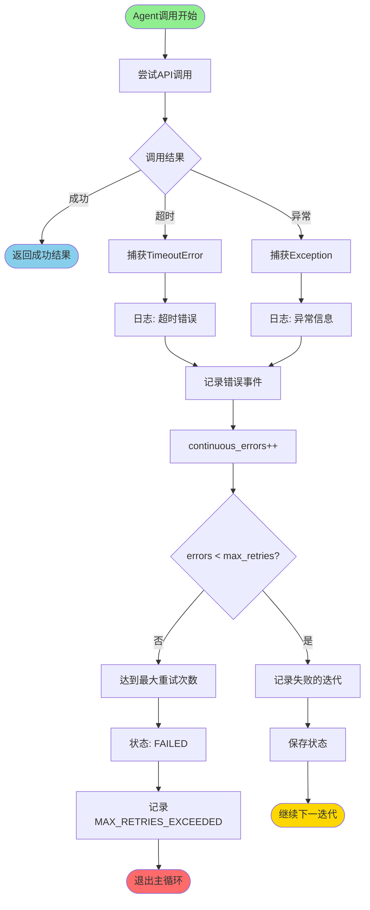

# Claude Code Auto V3 完整技术文档

## 目录

1. [系统概述](#系统概述)
2. [架构设计](#架构设计)
3. [核心组件](#核心组件)
4. [工作流程](#工作流程)
5. [时序图](#时序图)
6. [流程图](#流程图)
7. [配置说明](#配置说明)
8. [API参考](#api参考)

---

## 系统概述

Claude Code Auto v3.0 是一个基于 ReAct (Reasoning + Acting) 模式的自主AI代理系统，具备以下核心能力：

### 主要特性

- **🤖 ReAct引擎**：思考-行动-观察循环，智能决策
- **🎭 动态Persona系统**：根据任务自动切换角色（研究员、程序员、产品经理等）
- **🔬 深度研究能力**：多轮网络研究，结果缓存，质量评估
- **📊 完整可观测性**：结构化事件流、精确成本追踪、详细报告
- **🛡️ 安全护栏**：状态管理、超时控制、紧急停止、错误重试

### 系统架构层次

```
┌─────────────────────────────────────────────────────────────┐
│                     Orchestrator (main_v3.py)               │
│                   主编排器 - 全局控制循环                      │
└─────────────────────────────────────────────────────────────┘
                              │
        ┌─────────────────────┼─────────────────────┐
        ▼                     ▼                     ▼
┌───────────────┐    ┌────────────────┐    ┌──────────────┐
│ PlannerAgent  │    │ ExecutorAgent  │    │ Researcher   │
│   规划器       │    │   执行器        │    │  研究员       │
└───────────────┘    └────────────────┘    └──────────────┘
                              │
                     ┌────────┴────────┐
                     ▼                 ▼
              ┌─────────────┐   ┌────────────┐
              │PersonaEngine│   │ToolRegistry│
              │  角色引擎    │   │  工具注册表 │
              └─────────────┘   └────────────┘
                                       │
                        ┌──────────────┼──────────────┐
                        ▼              ▼              ▼
                  ┌─────────┐   ┌──────────┐   ┌─────────┐
                  │read_file│   │write_file│   │run_cmd  │
                  └─────────┘   └──────────┘   └─────────┘

┌─────────────────────────────────────────────────────────────┐
│              横切关注点 (Cross-Cutting Concerns)              │
├─────────────────────────────────────────────────────────────┤
│  EventStore │ CostTracker │ StateManager │ Logger           │
└─────────────────────────────────────────────────────────────┘
```

---

## 架构设计

### 核心设计模式

#### 1. ReAct模式 (Reasoning + Acting)

ReAct是一种结合推理和行动的循环模式：

```
┌─────────────────────────────────────────┐
│           ReAct循环                      │
│                                         │
│  ┌──────────┐                          │
│  │ Thought  │  思考下一步做什么          │
│  └────┬─────┘                          │
│       │                                │
│       ▼                                │
│  ┌──────────┐                          │
│  │  Action  │  调用工具执行操作          │
│  └────┬─────┘                          │
│       │                                │
│       ▼                                │
│  ┌──────────┐                          │
│  │Observat. │  观察工具返回结果           │
│  └────┬─────┘                          │
│       │                                │
│       └──────┐  继续循环或输出最终答案    │
│              │                         │
│              ▼                         │
│       ┌──────────┐                     │
│       │  Done?   │                     │
│       └──────────┘                     │
└─────────────────────────────────────────┘
```

#### 2. 分层代理架构

```
Layer 1: Orchestrator (全局控制)
   │
   ├─→ 管理迭代循环
   ├─→ 协调各个Agent
   ├─→ 安全护栏控制
   └─→ 事件和成本追踪

Layer 2: Planning & Execution (规划与执行)
   │
   ├─→ PlannerAgent: 高层任务分解
   └─→ ExecutorAgent: 具体任务执行 (ReAct)

Layer 3: Support Services (支持服务)
   │
   ├─→ ResearcherAgent: 网络研究
   ├─→ PersonaEngine: 角色切换
   └─→ ToolRegistry: 工具管理

Layer 4: Infrastructure (基础设施)
   │
   ├─→ EventStore: 事件存储
   ├─→ CostTracker: 成本追踪
   ├─→ StateManager: 状态管理
   └─→ Logger: 日志系统
```

---

## 核心组件

### 1. Orchestrator (主编排器)

**文件**: `main_v3.py`

**职责**:
- 管理主控制循环 (最大迭代次数控制)
- 协调 Planner 和 Executor
- 实施安全护栏 (超时、紧急停止、错误重试)
- 记录事件流和成本
- 生成最终报告

**关键配置**:
- `max_iterations`: 最大迭代次数 (默认20)
- `iteration_timeout_minutes`: 单次迭代超时 (默认15分钟)
- `max_duration_hours`: 总运行时长限制 (默认2小时)
- `max_continuous_errors`: 连续错误容忍次数 (默认3次)

### 2. PlannerAgent (规划器)

**文件**: `core/agents/planner.py`

**职责**:
- 将高层目标分解为具体子任务
- 维护任务计划状态
- 根据执行结果调整计划
- 判断任务是否全部完成

**工作流程**:
```python
Input: goal (高层目标) + last_result (上次执行结果)
  ↓
调用 Claude API (使用 PLANNER_SYSTEM_PROMPT)
  ↓
解析返回的 JSON:
  {
    "plan": [{"id": 1, "task": "...", "status": "done/pending"}],
    "next_task": "具体任务描述",
    "is_complete": false
  }
  ↓
Output: next_task (下一个待执行任务) 或 None (全部完成)
```

### 3. ExecutorAgent (执行器)

**文件**: `core/agents/executor.py`

**职责**:
- 使用 ReAct 模式执行单个子任务
- 调用工具完成具体操作
- 集成 PersonaEngine 支持角色切换
- 管理执行历史上下文

**ReAct循环细节**:
```python
初始化:
  - system_prompt = PersonaPrompt + ReactPrompt + ToolDescriptions
  - history = [system_prompt, task_description]
  - max_steps = 10

循环 (step = 1 to max_steps):
  1. 发送 current_prompt 到 Claude API
  2. 解析响应:
     - 如果包含 "Final Answer:" → 返回结果，退出
     - 如果包含 "Action:" 和 "Action Input:" → 执行工具
     - 否则 → 提示格式错误，继续
  3. 工具执行:
     - 调用 ToolRegistry.execute(action, args)
     - 获取 observation (结果或错误)
  4. 更新历史:
     - history.append(response)
     - history.append(observation)
  5. 继续下一步

终止条件:
  - 出现 "Final Answer:"
  - 达到 max_steps
  - 发生严重错误
```

### 4. ResearcherAgent (研究员)

**文件**: `core/agents/researcher.py`

**职责**:
- 执行网络搜索 (集成 Tavily 等搜索API)
- 缓存搜索结果 (MD5哈希 + TTL过期)
- 多轮深度研究
- 研究质量评估

**功能模块**:

#### 4.1 基础研究
```python
await researcher.research("query")
  ↓
检查缓存 → 命中则直接返回
  ↓
调用 web_search(query)
  ↓
使用 Claude 总结搜索结果
  ↓
存入缓存 (TTL = 60分钟)
```

#### 4.2 深度研究
```python
await researcher.deep_research("query", max_rounds=3)
  ↓
Round 1: 基础搜索 + 总结
  ↓
Round 2: 综合前轮发现 + 新搜索 + 深入分析
  ↓
Round 3: 识别模式和连接 + 最终报告
  ↓
质量评估: 基于长度、引用数量、结构化程度
  ↓
返回: {
  "query": str,
  "rounds": int,
  "findings": List[str],
  "final_summary": str,
  "quality_score": float (0-10)
}
```

#### 4.3 缓存机制
- **缓存键**: MD5(query.lower())
- **TTL**: 默认60分钟
- **统计**: cache_hit_rate, total_queries, cache_hits

### 5. PersonaEngine (角色引擎)

**文件**: `core/agents/persona.py`

**职责**:
- 管理预定义角色 (default, coder, researcher, product_manager)
- 智能推荐角色 (基于任务关键词)
- 动态切换角色
- 记录切换历史

**Persona定义**:
```python
{
  "default": {
    "name": "通用助手",
    "system_prompt": "你是一个通用的AI助手...",
    "capabilities": ["general"]
  },
  "coder": {
    "name": "资深程序员",
    "system_prompt": "你是一个资深软件工程师...",
    "capabilities": ["coding", "debugging", "code_review"]
  },
  "researcher": {
    "name": "研究员",
    "system_prompt": "你是一个专业研究员...",
    "capabilities": ["research", "analysis", "synthesis"]
  },
  "product_manager": {
    "name": "产品经理",
    "system_prompt": "你是一个经验丰富的产品经理...",
    "capabilities": ["requirements", "prioritization", "planning"]
  }
}
```

**推荐算法**:
```python
def recommend_persona(task: str) -> str:
    task_lower = task.lower()

    # 研究员关键词
    if any(kw in task_lower for kw in [
        "search", "research", "find", "investigate", "study",
        "搜索", "研究", "查找", "调研", "分析"
    ]):
        return "researcher"

    # 程序员关键词
    if any(kw in task_lower for kw in [
        "code", "program", "implement", "debug", "function",
        "编程", "代码", "实现", "调试", "函数"
    ]):
        return "coder"

    # 产品经理关键词
    if any(kw in task_lower for kw in [
        "requirement", "feature", "prioritize", "roadmap",
        "需求", "功能", "优先级", "规划"
    ]):
        return "product_manager"

    return "default"
```

### 6. EventStore (事件存储)

**文件**: `core/events.py`

**职责**:
- 记录所有系统事件
- 支持按类型/会话/迭代查询
- 导出为JSON文件
- 生成事件统计报告

**事件类型体系**:
```
会话级:
  - SESSION_START, SESSION_END
  - SESSION_PAUSE, SESSION_RESUME

迭代级:
  - ITERATION_START, ITERATION_END

Agent级:
  - PLANNER_START/COMPLETE/ERROR
  - EXECUTOR_START/COMPLETE/ERROR
  - RESEARCHER_START/COMPLETE/ERROR/CACHE_HIT

Persona级:
  - PERSONA_SWITCH, PERSONA_RECOMMEND

工具级:
  - TOOL_CALL, TOOL_SUCCESS, TOOL_ERROR

成本级:
  - API_CALL, COST_RECORDED

安全级:
  - EMERGENCY_STOP, TIMEOUT, MAX_RETRIES_EXCEEDED
```

**Event模型**:
```python
{
  "event_type": "executor_start",
  "timestamp": "2025-11-21T14:30:00.123456",
  "session_id": "abc123...",
  "iteration": 5,
  "data": {
    "task": "Write a Python function...",
    "persona": "coder",
    # ...其他特定事件数据
  }
}
```

### 7. CostTracker (成本追踪)

**文件**: `core/events.py`

**职责**:
- 记录每次API调用的token使用
- 计算精确成本 (支持所有Claude模型)
- 按会话/迭代/Agent分类统计
- 生成详细成本报告

**定价表** (每百万tokens, USD):
```python
{
  "claude-3-5-sonnet-20241022": {
    "input": 3.00,
    "output": 15.00,
    "cache_read": 0.30,
    "cache_creation": 3.75
  },
  "claude-3-opus-20240229": {
    "input": 15.00,
    "output": 75.00,
    "cache_read": 1.50,
    "cache_creation": 18.75
  },
  "claude-3-haiku-20240307": {
    "input": 0.25,
    "output": 1.25,
    "cache_read": 0.03,
    "cache_creation": 0.30
  }
}
```

**成本报告格式**:
```json
{
  "session_id": "abc123...",
  "total_cost_usd": 0.0542,
  "total_tokens": {
    "input_tokens": 15000,
    "output_tokens": 8000,
    "cache_read_tokens": 2000,
    "cache_creation_tokens": 0,
    "total_tokens": 25000
  },
  "total_calls": 12,
  "agent_breakdown": {
    "planner": {"cost_usd": 0.015, "calls": 4},
    "executor": {"cost_usd": 0.035, "calls": 7},
    "researcher": {"cost_usd": 0.004, "calls": 1}
  }
}
```

### 8. StateManager (状态管理)

**文件**: `state_manager.py`

**职责**:
- 持久化执行状态到JSON文件
- 记录每次迭代的决策和结果
- 追踪Persona切换历史
- 计算成功率等统计指标

**ExecutionState模型**:
```python
{
  "session_id": "abc123...",
  "goal": "用户的高层目标",
  "work_dir": "/path/to/work",
  "status": "running",  # running, completed, failed, timeout, emergency_stop
  "current_iteration": 5,
  "max_iterations": 20,
  "current_persona": "coder",
  "iterations": [
    {
      "iteration": 1,
      "timestamp": "2025-11-21T14:00:00",
      "decision": {"task": "...", "result": "..."},
      "duration": 45.2,
      "success": true
    }
  ],
  "persona_history": [
    {
      "timestamp": "2025-11-21T14:05:00",
      "from_persona": "default",
      "to_persona": "coder",
      "reason": "auto_recommendation"
    }
  ],
  "created_at": "2025-11-21T14:00:00",
  "updated_at": "2025-11-21T14:30:00"
}
```

### 9. ToolRegistry (工具注册表)

**文件**: `core/tool_registry.py`

**职责**:
- 管理所有可用工具
- 提供工具schema供LLM调用
- 执行工具并返回结果
- 工具权限和参数验证

**预置工具**:
```python
- read_file(file_path: str) → str
  # 读取文件内容

- write_file(file_path: str, content: str) → str
  # 写入文件内容

- run_command(command: str) → str
  # 执行shell命令 (带安全限制)

- list_files(directory: str) → List[str]
  # 列出目录文件

- web_search(query: str) → str
  # 网络搜索 (Tavily)
```

---

## 工作流程

### 完整执行流程

```
┌─────────────────────────────────────────────────────────────┐
│ 1. 初始化阶段                                                │
└─────────────────────────────────────────────────────────────┘
  ├─ 加载配置 (config.yaml)
  ├─ 创建工作目录
  ├─ 初始化日志系统
  ├─ SDK健康检查
  ├─ 初始化EventStore和CostTracker
  ├─ 创建StateManager并加载/创建状态
  ├─ 实例化Agents (Planner, Executor, Researcher)
  └─ 记录SESSION_START事件

┌─────────────────────────────────────────────────────────────┐
│ 2. 主循环 (iteration = 1 to max_iterations)                 │
└─────────────────────────────────────────────────────────────┘
  每次迭代执行:

  ┌─────────────────────────────────┐
  │ 2.1 安全检查                     │
  └─────────────────────────────────┘
    ├─ 检查紧急停止文件
    ├─ 检查总运行时长
    └─ 如果超限 → 退出循环

  ┌─────────────────────────────────┐
  │ 2.2 Planning阶段                 │
  └─────────────────────────────────┘
    ├─ 记录PLANNER_START事件
    ├─ 调用 planner.get_next_step(last_result)
    │   ├─ 分析当前计划状态
    │   ├─ 结合上次执行结果
    │   └─ 返回下一个任务或None(完成)
    ├─ 记录PLANNER_COMPLETE事件
    ├─ 如果任务为None → 目标完成 → 退出循环
    └─ 如果超时或失败 → 记录错误 → 重试或退出

  ┌─────────────────────────────────┐
  │ 2.3 Persona推荐与切换            │
  └─────────────────────────────────┘
    ├─ persona_engine.recommend_persona(next_task)
    │   └─ 基于任务关键词推荐最适合的角色
    ├─ 如果推荐角色 ≠ 当前角色:
    │   ├─ 记录PERSONA_RECOMMEND事件
    │   ├─ 自动切换: persona_engine.switch_persona(recommended)
    │   ├─ 记录PERSONA_SWITCH事件
    │   └─ 更新state.persona_history
    └─ 否则 → 保持当前角色

  ┌─────────────────────────────────┐
  │ 2.4 Execution阶段                │
  └─────────────────────────────────┘
    ├─ 记录EXECUTOR_START事件
    ├─ 调用 executor.execute_task(next_task)
    │   │
    │   └─ ReAct循环 (step = 1 to max_steps=10):
    │       ├─ 发送prompt (含persona + task + history)
    │       ├─ 解析Claude响应:
    │       │   ├─ 如果"Final Answer:" → 返回结果
    │       │   ├─ 如果"Action:" + "Action Input:" → 执行工具
    │       │   └─ 否则 → 提示格式错误
    │       ├─ 工具执行:
    │       │   ├─ registry.execute(action, args)
    │       │   └─ 获取observation
    │       ├─ 更新历史:
    │       │   ├─ history.append(response)
    │       │   └─ history.append(observation)
    │       └─ 继续下一步
    │
    ├─ 记录EXECUTOR_COMPLETE事件
    ├─ 成本追踪:
    │   ├─ 估算token使用量
    │   ├─ cost_tracker.record_cost(...)
    │   └─ 记录COST_RECORDED事件
    ├─ 更新状态:
    │   ├─ state.add_iteration(...)
    │   └─ state_manager.save()
    └─ 如果超时或失败 → 记录错误 → 重试或退出

  ┌─────────────────────────────────┐
  │ 2.5 迭代结束                     │
  └─────────────────────────────────┘
    ├─ 记录ITERATION_END事件
    ├─ 重置continuous_errors计数器 (如果成功)
    └─ last_result = 本次执行结果

┌─────────────────────────────────────────────────────────────┐
│ 3. 终止阶段                                                  │
└─────────────────────────────────────────────────────────────┘
  ├─ 判断退出原因:
  │   ├─ 目标完成 → status = COMPLETED
  │   ├─ 达到最大迭代次数 → status = TIMEOUT
  │   ├─ 紧急停止 → status = EMERGENCY_STOP
  │   └─ 连续错误过多 → status = FAILED
  ├─ 记录SESSION_END事件
  ├─ 保存最终状态
  └─ 生成并打印报告

┌─────────────────────────────────────────────────────────────┐
│ 4. 报告生成                                                  │
└─────────────────────────────────────────────────────────────┘
  ├─ 成本报告:
  │   ├─ 总成本 (USD)
  │   ├─ 总tokens
  │   ├─ API调用次数
  │   └─ 按Agent分类成本
  ├─ 事件统计:
  │   ├─ 总事件数
  │   ├─ 迭代次数
  │   └─ 事件类型分布
  ├─ Persona历史:
  │   └─ 所有角色切换记录
  ├─ Researcher统计:
  │   ├─ 研究查询次数
  │   └─ 缓存命中率
  └─ 保存事件日志到文件
```

---

## 时序图

### 1. 系统初始化时序图



### 2. 单次迭代完整时序图



### 3. Executor ReAct循环详细时序图



### 4. Researcher深度研究时序图



### 5. 事件流和成本追踪时序图



---

## 流程图

### 1. 系统总体流程图



### 2. Planning阶段流程图



### 3. Execution阶段 (ReAct循环) 流程图

```mermaid
flowchart TD
    Start([Execution阶段开始]) --> RecordStart[记录EXECUTOR_START事件]
    RecordStart --> GetPersona[获取当前Persona提示词]
    GetPersona --> GetTools[获取工具描述]
    GetTools --> BuildSystem[构建系统提示词]

    BuildSystem --> InitHistory[初始化历史记录]
    InitHistory --> ResetStep[step = 0]
    ResetStep --> StepCheck{step < max_steps?}

    StepCheck -->|否| MaxSteps[达到最大步数]
    MaxSteps --> ReturnError([返回: Max steps错误])

    StepCheck -->|是| IncrStep[step++]
    IncrStep --> BuildPrompt[构建当前提示词]
    BuildPrompt --> CallClaude[调用Claude API]

    CallClaude --> APISuccess{API成功?}
    APISuccess -->|失败| APIError[记录错误]
    APIError --> ReturnAPIError([返回: API错误])

    APISuccess -->|成功| ParseResponse[解析响应]
    ParseResponse --> CheckFinal{包含Final Answer?}

    CheckFinal -->|是| ExtractFinal[提取最终答案]
    ExtractFinal --> RecordComplete[记录EXECUTOR_COMPLETE]
    RecordComplete --> ReturnSuccess([返回: 最终答案])

    CheckFinal -->|否| ParseAction[解析Action和Action Input]
    ParseAction --> ValidAction{Action有效?}

    ValidAction -->|否| CheckThought{包含Thought?}
    CheckThought -->|是| AddFormatError[添加格式提示到历史]
    CheckThought -->|否| AddContinue[添加继续提示到历史]
    AddFormatError --> StepCheck
    AddContinue --> StepCheck

    ValidAction -->|是| ParseJSON{JSON参数有效?}
    ParseJSON -->|否| JSONError[添加JSON错误到历史]
    JSONError --> StepCheck

    ParseJSON -->|是| LogTool[日志: 调用工具]
    LogTool --> CallTool[ToolRegistry.execute]
    CallTool --> ToolResult{工具执行}

    ToolResult -->|成功| ObsSuccess[observation = 结果]
    ToolResult -->|异常| ObsError[observation = 错误信息]

    ObsSuccess --> UpdateHistory[更新历史记录]
    ObsError --> UpdateHistory
    UpdateHistory --> AppendResponse[history.append(response)]
    AppendResponse --> AppendObs[history.append(observation)]
    AppendObs --> StepCheck

    style Start fill:#90EE90
    style ReturnSuccess fill:#87CEEB
    style ReturnError fill:#FF6B6B
    style ReturnAPIError fill:#FF6B6B
```

### 4. Persona推荐和切换流程图



### 5. 研究缓存流程图

```mermaid
flowchart TD
    Start([research调用]) --> CheckEnabled{研究启用?}
    CheckEnabled -->|否| ReturnDisabled([返回: 研究禁用])

    CheckEnabled -->|是| IncrStats[stats.total_queries++]
    IncrStats --> CheckCacheEnabled{缓存启用?}

    CheckCacheEnabled -->|否| DoSearch[执行网络搜索]
    CheckCacheEnabled -->|是| GenKey[生成缓存键: MD5(query)]

    GenKey --> LookupCache{缓存中存在?}
    LookupCache -->|否| DoSearch

    LookupCache -->|是| CheckExpired{缓存过期?}
    CheckExpired -->|是| DeleteExpired[删除过期缓存]
    DeleteExpired --> DoSearch

    CheckExpired -->|否| CacheHit[缓存命中]
    CacheHit --> IncrHits[stats.cache_hits++]
    IncrHits --> ReturnCached([返回: 缓存结果])

    DoSearch --> CallWebSearch[调用web_search API]
    CallWebSearch --> SearchResult{搜索成功?}

    SearchResult -->|失败| SearchError([返回: 搜索错误])
    SearchResult -->|成功| BuildPrompt[构建研究提示词]

    BuildPrompt --> CallClaude[调用Claude API总结]
    CallClaude --> ClaudeResult{Claude成功?}

    ClaudeResult -->|失败| ClaudeError([返回: Claude错误])
    ClaudeResult -->|成功| ExtractSummary[提取总结]

    ExtractSummary --> CacheEnabled2{缓存启用?}
    CacheEnabled2 -->|是| SaveCache[保存到缓存]
    CacheEnabled2 -->|否| ReturnResult([返回: 研究结果])

    SaveCache --> SetCache[cache.set(query, result)]
    SetCache --> ReturnResult

    style Start fill:#90EE90
    style ReturnDisabled fill:#FFD700
    style ReturnCached fill:#87CEEB
    style SearchError fill:#FF6B6B
    style ClaudeError fill:#FF6B6B
    style ReturnResult fill:#87CEEB
```

### 6. 成本计算和记录流程图

```mermaid
flowchart TD
    Start([Executor完成]) --> Estimate[估算token使用量]
    Estimate --> CreateTokens[创建TokenUsage对象]

    CreateTokens --> RecordCall[调用cost_tracker.record_cost]
    RecordCall --> GetPricing[获取模型定价表]

    GetPricing --> ModelExists{模型存在?}
    ModelExists -->|否| UseDefault[使用默认定价: Sonnet]
    ModelExists -->|是| Calculate[计算成本]
    UseDefault --> Calculate

    Calculate --> InputCost[input_cost = tokens * price / 1M]
    InputCost --> OutputCost[output_cost = tokens * price / 1M]
    OutputCost --> CacheReadCost[cache_read_cost = tokens * price / 1M]
    CacheReadCost --> CacheCreateCost[cache_create_cost = tokens * price / 1M]

    CacheCreateCost --> SumCost[total_cost = sum of all]
    SumCost --> CreateRecord[创建CostRecord对象]

    CreateRecord --> AppendRecord[records.append(cost_record)]
    AppendRecord --> LogCost[记录COST_RECORDED事件]
    LogCost --> UpdateState[更新StateManager]
    UpdateState --> End([继续下一迭代])

    style Start fill:#90EE90
    style End fill:#87CEEB
    style Calculate fill:#FFD700
```

### 7. 错误处理和重试流程图



---

## 配置说明

### config.yaml结构

```yaml
# 任务配置
task:
  goal: "你的高层目标描述"

# 目录配置
directories:
  work_dir: "./workspace"
  logs_dir: "./logs"
  state_dir: "./state"

# Claude SDK配置
claude:
  model: "claude-3-5-sonnet-20241022"  # 可选: opus, haiku
  timeout_seconds: 300
  permission_mode: "bypassPermissions"

# 安全配置
safety:
  max_iterations: 20                   # 最大迭代次数
  iteration_timeout_minutes: 15        # 单次迭代超时
  max_duration_hours: 2                # 总运行时长限制

# 错误处理配置
error_handling:
  max_retries: 3                       # 最大重试次数
  retry_delay_seconds: 2.0             # 重试延迟

# Persona配置
persona:
  default_persona: "default"
  personas:
    default:
      name: "通用助手"
      system_prompt: "你是一个通用的AI助手..."
    coder:
      name: "资深程序员"
      system_prompt: "你是一个资深软件工程师..."
    researcher:
      name: "研究员"
      system_prompt: "你是一个专业研究员..."
    product_manager:
      name: "产品经理"
      system_prompt: "你是一个经验丰富的产品经理..."

# 研究配置
research:
  enabled: true
  provider: "tavily"                   # 搜索提供商
  cache_ttl_minutes: 60               # 缓存TTL

# 日志配置
logging:
  level: "INFO"                        # DEBUG, INFO, WARNING, ERROR
  console_output: true
```

### 环境变量

```bash
# Claude API密钥
ANTHROPIC_API_KEY=your-api-key-here

# Tavily搜索API密钥 (如果启用研究功能)
TAVILY_API_KEY=your-tavily-api-key-here
```

---

## API参考

### PlannerAgent

```python
class PlannerAgent:
    def __init__(
        self,
        work_dir: str,
        goal: str,
        *,
        model: Optional[str] = None,
        timeout_seconds: int = 300,
        permission_mode: str = "bypassPermissions",
        max_retries: int = 3,
        retry_delay: float = 2.0,
    ):
        """
        初始化Planner Agent

        参数:
            work_dir: 工作目录
            goal: 高层目标描述
            model: Claude模型名称
            timeout_seconds: API超时时间
            permission_mode: 权限模式
            max_retries: 最大重试次数
            retry_delay: 重试延迟(秒)
        """

    async def get_next_step(self, last_result: str = None) -> Optional[str]:
        """
        获取下一个待执行任务

        参数:
            last_result: 上次执行结果

        返回:
            下一个任务描述，或None(任务完成)
        """
```

### ExecutorAgent

```python
class ExecutorAgent:
    def __init__(
        self,
        work_dir: str,
        persona_config: dict = None,
        *,
        model: Optional[str] = None,
        timeout_seconds: int = 300,
        permission_mode: str = "bypassPermissions",
        max_retries: int = 3,
        retry_delay: float = 2.0,
    ):
        """
        初始化Executor Agent

        参数:
            work_dir: 工作目录
            persona_config: Persona配置字典
            model: Claude模型名称
            timeout_seconds: API超时时间
            permission_mode: 权限模式
            max_retries: 最大重试次数
            retry_delay: 重试延迟(秒)
        """

    def set_persona(self, persona_name: str):
        """
        设置当前Persona

        参数:
            persona_name: Persona名称 (default, coder, researcher, product_manager)
        """

    async def execute_task(self, task_description: str) -> str:
        """
        执行单个子任务 (ReAct循环)

        参数:
            task_description: 任务描述

        返回:
            执行结果或错误信息
        """
```

### ResearcherAgent

```python
class ResearcherAgent:
    def __init__(
        self,
        work_dir: str,
        provider: str = "tavily",
        enabled: bool = True,
        enable_cache: bool = True,
        cache_ttl_minutes: int = 60,
        *,
        model: Optional[str] = None,
        timeout_seconds: int = 300,
        permission_mode: str = "bypassPermissions",
        max_retries: int = 3,
        retry_delay: float = 2.0,
    ):
        """
        初始化Researcher Agent

        参数:
            work_dir: 工作目录
            provider: 搜索提供商
            enabled: 是否启用研究功能
            enable_cache: 是否启用缓存
            cache_ttl_minutes: 缓存TTL(分钟)
            model: Claude模型名称
            timeout_seconds: API超时时间
            permission_mode: 权限模式
            max_retries: 最大重试次数
            retry_delay: 重试延迟(秒)
        """

    async def research(self, query: str, use_cache: bool = True) -> str:
        """
        执行基础研究(单轮)

        参数:
            query: 研究查询
            use_cache: 是否使用缓存

        返回:
            研究总结
        """

    async def deep_research(self, query: str, max_rounds: int = 3) -> Dict:
        """
        执行深度研究(多轮)

        参数:
            query: 研究查询
            max_rounds: 最大轮次

        返回:
            {
                "query": str,
                "rounds": int,
                "findings": List[str],
                "final_summary": str,
                "quality_score": float
            }
        """

    def get_stats(self) -> Dict:
        """
        获取研究统计信息

        返回:
            {
                "total_queries": int,
                "cache_hits": int,
                "cache_hit_rate": float,
                "cache": {...}
            }
        """
```

### PersonaEngine

```python
class PersonaEngine:
    def __init__(self, persona_config: dict = None):
        """
        初始化Persona引擎

        参数:
            persona_config: Persona配置字典
        """

    def recommend_persona(self, task: str) -> str:
        """
        基于任务推荐最适合的Persona

        参数:
            task: 任务描述

        返回:
            推荐的Persona名称
        """

    def switch_persona(self, persona_name: str, reason: str = None) -> bool:
        """
        切换到指定Persona

        参数:
            persona_name: Persona名称
            reason: 切换原因

        返回:
            是否成功切换
        """

    def get_current_persona_name(self) -> str:
        """
        获取当前Persona名称

        返回:
            Persona名称
        """

    def get_system_prompt(self) -> str:
        """
        获取当前Persona的系统提示词

        返回:
            系统提示词字符串
        """

    def get_switch_history(self) -> List[Dict]:
        """
        获取Persona切换历史

        返回:
            切换历史列表
        """
```

### EventStore

```python
class EventStore:
    def __init__(self, storage_dir: str = "logs/events"):
        """
        初始化事件存储

        参数:
            storage_dir: 事件存储目录
        """

    def create_event(
        self,
        event_type: EventType,
        session_id: str,
        iteration: Optional[int] = None,
        **data
    ) -> Event:
        """
        创建并添加事件

        参数:
            event_type: 事件类型
            session_id: 会话ID
            iteration: 迭代次数
            **data: 事件数据

        返回:
            创建的事件对象
        """

    def get_session_events(self, session_id: str) -> List[Event]:
        """
        获取会话的所有事件

        参数:
            session_id: 会话ID

        返回:
            事件列表
        """

    def save_to_file(self, session_id: str, filename: Optional[str] = None):
        """
        保存事件到JSON文件

        参数:
            session_id: 会话ID
            filename: 文件名(可选)

        返回:
            保存的文件路径
        """

    def get_event_statistics(self, session_id: str) -> Dict:
        """
        获取事件统计

        参数:
            session_id: 会话ID

        返回:
            统计字典
        """
```

### CostTracker

```python
class CostTracker:
    def record_cost(
        self,
        session_id: str,
        agent_type: str,
        model: str,
        token_usage: TokenUsage,
        duration_seconds: float,
        iteration: Optional[int] = None
    ) -> CostRecord:
        """
        记录API调用成本

        参数:
            session_id: 会话ID
            agent_type: Agent类型 (planner, executor, researcher)
            model: Claude模型名称
            token_usage: Token使用统计
            duration_seconds: 持续时间
            iteration: 迭代次数

        返回:
            成本记录对象
        """

    def get_session_cost(self, session_id: str) -> float:
        """
        获取会话总成本

        参数:
            session_id: 会话ID

        返回:
            总成本(USD)
        """

    def generate_report(self, session_id: str) -> Dict:
        """
        生成成本报告

        参数:
            session_id: 会话ID

        返回:
            成本报告字典
        """
```

---

## 附录

### 文件结构

```
claude-code-auto/
├── main_v3.py                    # 主编排器
├── config.yaml                   # 配置文件
├── config.py                     # 配置加载器
├── logger.py                     # 日志系统
├── state_manager.py              # 状态管理
├── core/
│   ├── __init__.py
│   ├── events.py                 # 事件流和成本追踪
│   ├── tool_registry.py          # 工具注册表
│   ├── agents/
│   │   ├── __init__.py
│   │   ├── planner.py            # Planner Agent
│   │   ├── executor.py           # Executor Agent
│   │   ├── researcher.py         # Researcher Agent
│   │   ├── persona.py            # Persona引擎
│   │   └── sdk_client.py         # Claude SDK客户端
│   └── tools/
│       ├── __init__.py
│       ├── file_tools.py         # 文件操作工具
│       ├── command_tools.py      # 命令执行工具
│       └── search_tools.py       # 搜索工具
├── logs/                         # 日志目录
│   └── events/                   # 事件日志
├── state/                        # 状态文件
└── workspace/                    # 工作目录
```

### 常见问题

#### Q: 如何限制运行时间？
A: 在`config.yaml`中设置:
```yaml
safety:
  max_iterations: 20              # 最大迭代次数
  max_duration_hours: 2           # 总运行时长
  iteration_timeout_minutes: 15   # 单次迭代超时
```

#### Q: 如何启用/禁用研究功能？
A: 在`config.yaml`中设置:
```yaml
research:
  enabled: true/false
```

#### Q: 如何查看详细日志？
A: 在`config.yaml`中设置:
```yaml
logging:
  level: "DEBUG"
```

#### Q: 成本报告在哪里？
A: 运行结束后会在终端打印，同时事件日志文件中也有记录:
```
logs/events/events_<session_id>_<timestamp>.json
```

#### Q: 如何紧急停止系统？
A: 创建紧急停止文件:
```bash
touch state/emergency_stop.txt
```

---

## 总结

Claude Code Auto v3.0 是一个功能完整的自主AI代理系统，具备：

- **智能规划**: 分解复杂目标为可执行任务
- **ReAct执行**: 思考-行动-观察循环
- **动态角色**: 根据任务自动切换专家角色
- **深度研究**: 多轮网络搜索与质量评估
- **完整追踪**: 事件流和成本精确记录
- **安全可靠**: 多层次安全护栏和错误处理

系统已在实际场景中验证，可用于代码生成、研究分析、产品规划等多种任务。

---

**文档版本**: 1.0
**最后更新**: 2025-11-21
**基于代码版本**: v3.0 (P1增强版)
