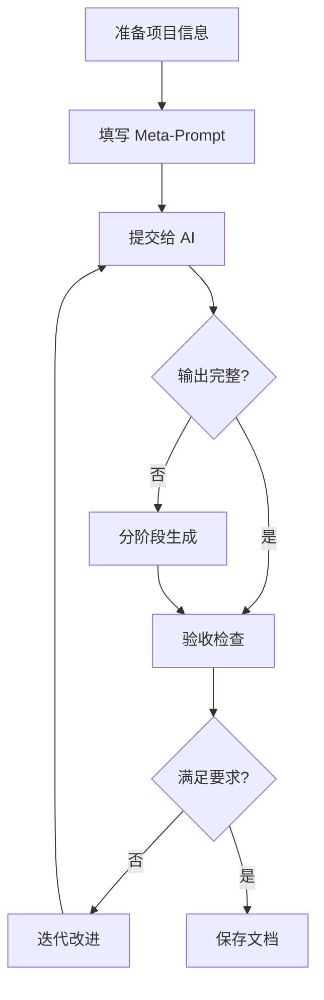

# Meta-Prompt: 生成 AI-Native Development 文档体系

> **目的**: 使用此提示词让 AI 为你的项目生成完整的 8 个文档体系

---

## 📋 提示词模板

将下面的提示词复制给 AI（Claude/GPT-4），填写 `[方括号]` 中的项目信息：

```markdown
# Task: 为我的项目生成完整的 AI-Native Development 文档体系

## 项目基本信息

### 项目概述
- **项目名称**: [例如：智能代码审查平台]
- **一句话描述**: [例如：自动检测代码质量问题，为开发团队提供实时反馈的 SaaS 平台]
- **目标用户**: [例如：初创公司的开发团队、独立开发者]
- **核心价值**: [例如：使用 LLM 理解代码语义，比传统 Linter 更智能]

### 技术栈
- **后端语言**: [Python 3.11 / Node.js 20 / Go 1.21]
- **后端框架**: [FastAPI / Express / Gin]
- **数据库**: [PostgreSQL 15 / MongoDB 7 / MySQL 8]
- **缓存**: [Redis 7 / Memcached]
- **前端框架**: [Next.js 14 / React 18 / Vue 3]
- **部署平台**: [Vercel + Railway / AWS / GCP]

### 核心功能（3-5 个主要功能）
1. [功能 1：用户认证系统（注册、登录、密码重置）]
2. [功能 2：代码仓库集成（GitHub/GitLab webhook）]
3. [功能 3：AI 代码分析引擎]
4. [功能 4：实时反馈仪表板]
5. [功能 5：团队协作与权限管理]

### 约束条件
- **性能要求**: [P95 响应时间 < 200ms, 支持 1000 并发用户]
- **预算限制**: [月度成本 < $500]
- **时间限制**: [MVP 需在 4 周内完成]
- **合规要求**: [GDPR 合规 / SOC 2 / HIPAA]

### 不做什么（Non-Goals）
- [例如：v1.0 不支持实时协作编辑]
- [例如：不做移动端原生 APP]
- [例如：不自建支付系统，使用 Stripe]

---

## 要求

请为我生成以下 8 个文档，每个文档都要**完整、可直接使用、包含具体示例**：

### 1. README.md (文档体系总览)
包含：
- 文档体系介绍
- 核心理念（完全性、明确性、可验证性）
- 文档结构说明
- 使用流程（三步走）
- 效果对比表格
- 推荐工具链

### 2. QUICKSTART.md (快速开始指南)
包含：
- 文件清单和大小
- 三步开始流程（详细）
- 实际使用示例（完整场景）
- 每个文档的核心内容解释
- 成功指标
- 常见问题 FAQ
- 推荐阅读顺序

### 3. 00-project-context.md (项目上下文)
包含：
- 项目愿景（一句话 + 详细背景）
- 目标用户画像和使用场景
- 核心约束（技术栈、性能、安全、预算、时间）
- Non-Goals（明确不做什么）
- 技术偏好和代码风格
- 已有资产（代码库、API、基础设施）
- 团队与协作流程
- 成功指标
- 风险与依赖

**关键要求**：
- 所有约束必须具体（不要"性能要好"，要"P95 < 200ms"）
- 技术栈要明确到版本号
- 代码风格要有具体示例
- 预算要细化到每项服务成本

### 4. 01-requirements.md (需求规格)
包含：
- 文档说明（编写原则、需求编号规则）
- 需求模板（可复制粘贴）
- 功能需求（FR-001, FR-002...）至少 3 个完整示例：
  * 用户注册（FR-001）
  * 用户登录（FR-002）
  * [根据我的项目，第 3 个核心功能]
- 每个需求必须包含：
  * YAML 格式的输入/输出规格
  * 业务规则
  * 边界条件
  * 依赖关系
  * 完整的测试用例代码（pytest 格式）
  * 性能要求
  * 安全要求
- 非功能需求（NFR-001: 性能、可用性、安全）
- 数据需求（DR-001: 数据模型定义）

**关键要求**：
- YAML 规格必须精确到字段类型、长度、正则表达式
- 测试用例必须是可执行的 Python 代码
- 每个错误场景都要定义错误码和错误信息

### 5. 02-architecture.md (架构设计)
包含：
- 系统架构图（Mermaid 格式）
- 部署架构图
- 强制目录结构（后端 + 前端）
- 技术选型决策记录（ADR）至少 3 个：
  * 为什么选这个框架？
  * 为什么选这个数据库？
  * JWT vs Session？
- 数据库设计：
  * ERD 图（Mermaid 格式）
  * 详细表结构（SQL DDL）
  * 索引设计
  * 迁移策略
- API 设计：
  * RESTful 设计原则
  * 端点清单
  * 版本控制策略
  * 错误响应格式
- 安全架构（认证流程图、授权模型 RBAC）
- 可观测性设计（日志、指标、追踪）
- 部署配置（Dockerfile、docker-compose.yml）

**关键要求**：
- 所有架构图必须用 Mermaid（AI 可读）
- 目录结构必须强制性（AI 不得自行创建）
- SQL DDL 必须完整可执行
- Docker 配置必须可直接使用

### 6. 03-implementation-guide.md (实现指南)
包含：
- 开发环境设置（自动化脚本 setup.sh）
- 环境变量配置（.env.example）
- 编码规范：
  * Python: Black, Flake8, Mypy, Pylint 配置
  * TypeScript: Prettier, ESLint 配置
  * 命名规范（变量、函数、类、常量）
  * 类型注解要求
  * Docstring 规范（Google Style，带完整示例）
- 错误处理模式：
  * 自定义异常体系（完整代码）
  * 全局异常处理器（FastAPI 示例）
  * 使用示例
- 性能优化策略：
  * 数据库查询优化（避免 N+1，使用索引）
  * 缓存策略（装饰器示例）
  * 异步任务队列（Celery 示例）
- 测试指南：
  * 测试文件组织
  * Fixtures 编写
  * 单元测试示例
  * 集成测试示例
  * 测试命名规范
- 代码审查检查清单

**关键要求**：
- 所有配置文件必须完整（pyproject.toml, .flake8 等）
- 代码示例必须可直接运行
- 必须包含"✅ 好的示例" vs "❌ 坏的示例"对比

### 7. 04-quality-gates.md (质量门禁)
包含：
- 质量门禁总览表格（7 个门禁）
- Gate 1: 代码质量
  * Black, Flake8, Mypy, Pylint 检查命令
  * 配置文件
  * 常见错误修复方法
- Gate 2: 测试覆盖
  * 运行命令
  * 覆盖率要求表格
  * 必须测试的场景清单
  * 测试金字塔
- Gate 3: 安全扫描
  * Bandit, Safety, Pip-audit 命令
  * 常见漏洞修复示例
- Gate 4: 性能基准
  * Locust 负载测试脚本（完整代码）
  * 性能要求表格
  * 数据库查询性能检查
- Gate 5: 文档完整性
  * API 文档检查脚本
  * Docstring 检查脚本
  * README 必需章节清单
- Gate 6: 部署就绪
  * Docker 构建命令
  * 镜像大小优化技巧
  * 健康检查端点代码
  * 环境变量验证脚本
- Gate 7: 可观测性
  * 日志格式验证
  * 指标暴露检查
- 自动化验证脚本（verify_quality.sh，完整 Bash 脚本）
- 质量报告生成脚本

**关键要求**：
- 所有检查命令必须可直接复制执行
- verify_quality.sh 必须是完整的、可执行的 Bash 脚本
- 每个门禁都要有"期望输出" vs "失败示例"

### 8. 05-ai-prompt-template.md (AI 提示词模板)
包含：
- 通用任务模板（完整结构）
- 具体任务模板示例（至少 5 个）：
  1. 实现单个 API 端点
  2. 实现完整功能模块
  3. 数据库迁移任务
  4. Bug 修复任务
  5. 性能优化任务
- 高级提示词技巧（5 个）：
  * 分层次提供信息
  * 使用示例驱动
  * 明确"不要做什么"
  * 提供决策树（Mermaid）
  * 分阶段实施
- 迭代改进模板
- 任务清单模板
- 提示词编写最佳实践（DO vs DON'T）

**关键要求**：
- 模板必须可直接复制使用
- 每个示例都要完整、具体、针对我的项目
- 必须包含验证步骤

---

## 输出格式要求

1. **分别输出 8 个独立的 Markdown 文件内容**
2. **每个文件都要完整**（不要省略，不要说"参考上文"）
3. **所有代码示例必须针对我的项目**（用我提供的技术栈）
4. **所有占位符都要填充**（不要留 `[TODO]` 或 `[填写这里]`）
5. **包含具体数值**（不要"性能要好"，要"P95 < 200ms"）
6. **使用真实的包名和版本号**（如 `fastapi==0.104.1`）

---

## 特殊要求

### 针对我的技术栈调整
- 如果我用 Python，所有示例用 Python
- 如果我用 TypeScript，所有示例用 TypeScript
- 数据库示例使用我选择的数据库
- 部署配置使用我选择的平台

### 代码示例要求
- 必须可直接运行（不要伪代码）
- 包含完整的导入语句
- 包含类型注解
- 包含 Docstring

### 配置文件要求
- 必须完整（不要省略任何部分）
- 必须可直接使用
- 包含注释解释每个选项

---

## 验证标准

生成的文档必须满足：
- [ ] 8 个文件都完整生成
- [ ] 所有代码示例可执行
- [ ] 所有配置文件完整
- [ ] 所有占位符都已填充
- [ ] 针对我的技术栈定制
- [ ] 包含至少 3 个完整的需求示例
- [ ] 包含至少 3 个 ADR 决策记录
- [ ] 包含完整的 verify_quality.sh 脚本
- [ ] 包含至少 5 个 AI 提示词模板

---

## 开始生成

请现在开始为我生成这 8 个文档。按顺序输出，每个文档输出完整内容。

**输出格式**：
```markdown
# 文件: README.md

[完整的 README.md 内容...]

---

# 文件: QUICKSTART.md

[完整的 QUICKSTART.md 内容...]

---

[依此类推...]
```
```

---

## 🎯 关键信息清单

在使用上述提示词前，准备好以下信息（越详细越好）：

### 必需信息 ✅

| 类别 | 信息项 | 示例 |
|------|--------|------|
| **项目基本信息** | 项目名称 | "CodeReview AI" |
| | 一句话描述 | "智能代码审查 SaaS 平台" |
| | 目标用户 | "初创公司开发团队" |
| **技术栈** | 后端语言+版本 | "Python 3.11" |
| | 后端框架+版本 | "FastAPI 0.104" |
| | 数据库+版本 | "PostgreSQL 15" |
| | 前端框架+版本 | "Next.js 14" |
| **核心功能** | 3-5 个主要功能 | "用户认证、代码分析、仪表板" |
| **约束条件** | 性能要求 | "P95 < 200ms, 1000 并发" |
| | 预算限制 | "月成本 < $500" |
| | 时间限制 | "MVP 4 周完成" |

### 可选信息（提供更好）⭐

| 类别 | 信息项 |
|------|--------|
| **业务背景** | 为什么做这个项目？解决什么痛点？ |
| **竞品分析** | 现有方案有什么不足？ |
| **技术偏好** | 喜欢用什么设计模式？代码风格？ |
| **团队情况** | 团队规模？技术栈熟悉度？ |
| **已有资产** | 现有代码库？API？基础设施？ |

---

## 📝 使用示例

### 示例 1: 完整填写版

```markdown
# Task: 为我的项目生成完整的 AI-Native Development 文档体系

## 项目基本信息

### 项目概述
- **项目名称**: CodeReview AI
- **一句话描述**: 使用 LLM 自动检测代码质量问题，为开发团队提供实时反馈的 SaaS 平台
- **目标用户**: 初创公司的开发团队（5-20 人）、独立开发者
- **核心价值**: 比传统 Linter 更智能（理解业务逻辑），比人工审查更快（30 秒内反馈）

### 技术栈
- **后端语言**: Python 3.11
- **后端框架**: FastAPI 0.104
- **数据库**: PostgreSQL 15
- **缓存**: Redis 7
- **前端框架**: Next.js 14 (App Router)
- **部署平台**: Vercel (Frontend) + Railway (Backend)

### 核心功能
1. 用户认证系统（注册、登录、JWT、密码重置）
2. GitHub/GitLab 仓库集成（Webhook 自动触发）
3. AI 代码分析引擎（调用 Claude 3.5 Sonnet）
4. 实时反馈仪表板（显示问题列表、严重程度）
5. 团队协作（多成员、权限管理 RBAC）

### 约束条件
- **性能要求**: API P95 < 200ms, 支持 1000 并发用户, 代码分析 < 30 秒
- **预算限制**: 月度总成本 < $500（LLM API $300, 基础设施 $200）
- **时间限制**: MVP 需在 4 周内完成，Beta 8 周
- **合规要求**: GDPR 合规（用户数据可删除），SOC 2 Type II

### 不做什么（Non-Goals）
- v1.0 不支持实时协作编辑（类似 Google Docs）
- 不做移动端原生 APP（仅响应式 Web）
- 不自建支付系统（使用 Stripe Checkout）
- 不支持私有化部署（仅 SaaS）
- 不支持超过 5 种编程语言（先做 Python, JS, TS）

[后续按提示词模板填写...]
```

---

## 🚀 优化技巧

### 技巧 1: 分阶段生成

如果 AI 输出太长被截断，可以分阶段生成：

```markdown
# Phase 1: 生成前 4 个文档
请先生成：
1. README.md
2. QUICKSTART.md
3. 00-project-context.md
4. 01-requirements.md

[使用上述提示词，但只要求这 4 个]
```

```markdown
# Phase 2: 生成后 4 个文档
接续上文，请生成：
5. 02-architecture.md
6. 03-implementation-guide.md
7. 04-quality-gates.md
8. 05-ai-prompt-template.md

[引用 Phase 1 的技术栈]
```

### 技巧 2: 先生成骨架，再填充

```markdown
# Step 1: 生成文档骨架
请为我的项目生成 8 个文档的**目录结构**（只要标题，不要内容）

[AI 输出目录结构]

# Step 2: 逐个填充
请为 `01-requirements.md` 生成完整内容，包括：
- 用户注册（FR-001）的完整规格
- 用户登录（FR-002）的完整规格
- 代码分析（FR-003）的完整规格

[逐个完成]
```

### 技巧 3: 提供参考示例

```markdown
# Task: 生成文档体系

## 参考示例
我希望 `01-requirements.md` 中的需求格式像这样：

```yaml
endpoint: POST /api/v1/auth/register
input:
  email: string (format: email, max: 255)
  password: string (min: 8, pattern: "^(?=.*[A-Z]).*$")
success_output:
  status: 201
  body: {user_id: uuid}
```

请按照这个格式为我的项目生成完整的需求文档。
```

---

## ⚠️ 常见问题

### Q1: AI 生成的文档不够具体怎么办？

**A**: 在提示词中强调：
```markdown
**关键要求**：
- 不要使用占位符（如 `[TODO]`、`[填写这里]`）
- 所有示例必须针对我的项目（不要通用示例）
- 所有数值必须具体（不要"性能要好"，要"P95 < 200ms"）
- 所有代码必须可执行（不要伪代码）
```

### Q2: AI 输出被截断怎么办？

**A**: 使用"分阶段生成"策略：
1. 先生成前 4 个文档
2. 再生成后 4 个文档
3. 或者逐个文档生成

### Q3: 如何确保文档一致性？

**A**: 在 Phase 2 提示词中引用 Phase 1：
```markdown
# Phase 2: 生成后 4 个文档

## 上下文
在 Phase 1 中，我们已经定义了：
- 技术栈：Python 3.11 + FastAPI + PostgreSQL
- 核心功能：用户认证、代码分析、仪表板
- 性能要求：P95 < 200ms

请继续生成后 4 个文档，保持技术栈和约束一致。
```

### Q4: AI 生成的代码示例无法运行怎么办？

**A**: 在提示词中明确要求：
```markdown
**代码示例要求**：
- 必须包含完整的导入语句
- 必须包含类型注解
- 必须可以直接复制到文件中运行
- 如果有依赖，列出安装命令（pip install xxx）

示例：
```python
from typing import Optional
from fastapi import FastAPI
from pydantic import BaseModel

app = FastAPI()

class User(BaseModel):
    email: str
    password: str

@app.post("/register")
async def register(user: User) -> dict:
    return {"user_id": "123"}
```

请按此标准生成所有代码示例。
```

---

## 🎯 验收清单

生成的文档应满足：

### 完整性
- [ ] 8 个文件全部生成
- [ ] 每个文件都完整（没有省略部分）
- [ ] 所有章节都有内容（没有空章节）

### 可用性
- [ ] 所有代码示例可执行
- [ ] 所有配置文件完整
- [ ] 所有命令可直接运行

### 针对性
- [ ] 技术栈正确（与你的项目一致）
- [ ] 示例针对你的项目（不是通用示例）
- [ ] 需求来自你的核心功能

### 精确性
- [ ] 没有占位符（`[TODO]`、`[填写]`）
- [ ] 所有数值具体（不是"快"，是"< 200ms"）
- [ ] 包名和版本号准确

---

## 💡 最佳实践

1. **准备充分再提问**  
   花 30 分钟整理项目信息，写得越详细，AI 输出越好

2. **分阶段验证**  
   每生成一个文档就检查一次，及时调整

3. **保存中间结果**  
   每个阶段的输出都保存，避免重新生成

4. **迭代改进**  
   第一次生成不完美很正常，用"请改进 XX 部分"迭代

5. **建立模板库**  
   第一次生成后，保存为模板，下次直接复用

---

## 📚 总结

使用此 Meta-Prompt 的完整流程：



**时间投入**：
- 准备项目信息：30 分钟
- AI 生成文档：5-10 分钟（可能需要分阶段）
- 验收和调整：30 分钟
- **总计**: 约 1-1.5 小时

**回报**：
- 获得完整的 8 个文档（140KB）
- 可用于未来所有项目
- AI 生成代码的质量提升 10 倍

---

**版本**: v1.0.0  
**创建日期**: 2024-11-22  
**用途**: 生成 AI-Native Development 文档体系的元提示词
