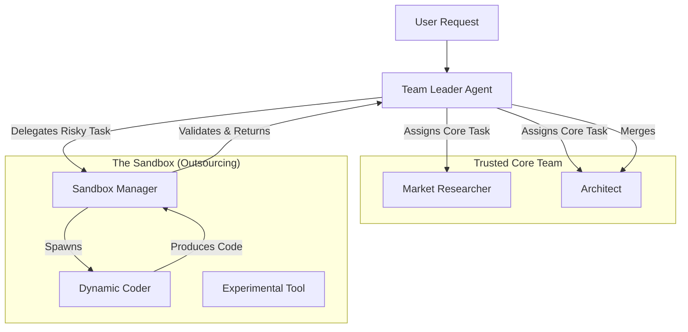

# AI-Native Team Architecture: The "Leader" Model

## Vision
Move from a static "Pipeline" of roles to a dynamic, "Flat" organization led by an intelligent **Team Leader Agent**. This architecture mimics a real-world software team where a Tech Lead/PM assembles the team, assigns specific resources (Skills/Tools), and coordinates execution based on real-time feedback.

## Core Concepts

### 1. The Team Leader Agent
Instead of a script (`TeamAssembler`), we introduce a meta-agent: **The Leader**.
- **Responsibilities**:
    - **Goal Decomposition**: Breaks down the user's request into atomic missions.
    - **Team Assembly**: Selects the best Roles for the job.
    - **Resource Allocation**: Dynamically grants **Skills** (Prompt Chains) and **Tools** (MCP Servers) to each Role.
    - **Orchestration**: Monitors the `trace` logs and `events` of sub-agents. If a role fails or deviates, the Leader intervenes (re-planning).

### 2. The Sandbox (Outsourcing Manager)
**[NEW]** A dedicated secure environment for "Contractor" agents (dynamic/temporary roles).
- **Purpose**: Execute untrusted or experimental code/agents safely.
- **Mechanism**:
    - **Isolation**: Runs in a separate Docker container or restricted environment.
    - **Limited Access**: No direct access to the main codebase or secrets. Only receives specific inputs and returns specific outputs.
    - **Review Gate**: All artifacts produced by the Sandbox must be reviewed by the **Leader** or a **Reviewer Role** before being merged into the main project.

### 3. Dynamic Resource Injection (MCP & Skills)
Roles are no longer defined solely by static YAML files. They are **instantiated** with a dynamic context.
- **Static Definition**: `roles/developer.yaml` (Base Persona, Core Mission).
- **Dynamic Injection**: The Leader injects:
    - **Specific Tools**: e.g., "You get the `github-mcp` tool for this task."
    - **Specific Skills**: e.g., "Use the `React-Best-Practices` skill (a specific prompt/knowledge base)."

### 4. Flat & Traceable Organization
- **Traceability**: Every agent (Leader and Members) logs their "Thinking" to `logs/trace/`.
- **Flat Structure**:
    - Roles focus on their "Expertise" (Persona).
    - They don't just "pass the baton"; they produce artifacts that others consume.
    - The Leader ensures alignment, preventing the "Developer doing Research" anti-pattern by strictly defining the **Scope** of each member.

## Architecture Diagram

## Implementation Roadmap

### Phase 1: The "Smart" Assembler (Current Goal)
- **Strict Dependencies**: Ensure correct order (Researcher -> Developer).
- **Traceability**: Markdown logs for all actions.
- **Planner Integration**: Each Role has a "Brain" (PlannerAgent).

### Phase 2: The Leader Agent (Evolution)
- **Refactor `TeamAssembler`** into `LeaderAgent`.
- **Resource Registry**: Create a registry for MCP tools and "Skills" (Prompts).
- **Dynamic Config**: Allow `LeaderAgent` to override Role YAMLs at runtime.

### Phase 3: The Sandbox (Security)
- **Sandbox Environment**: Dockerized execution for dynamic agents.
- **Sandbox Manager**: A specialized agent that oversees the sandbox.
