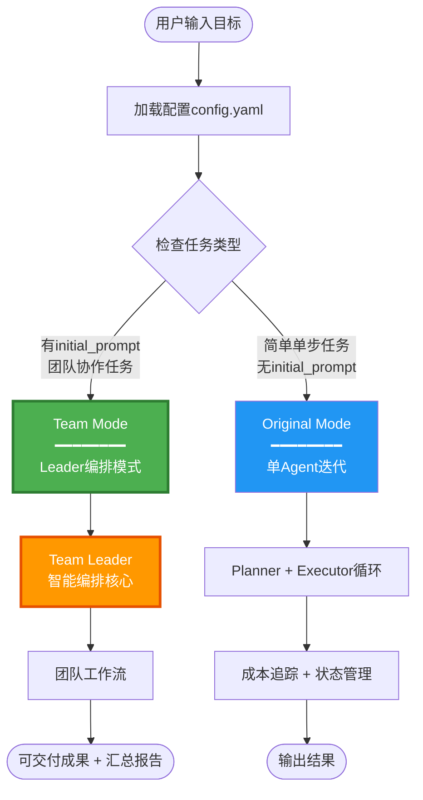
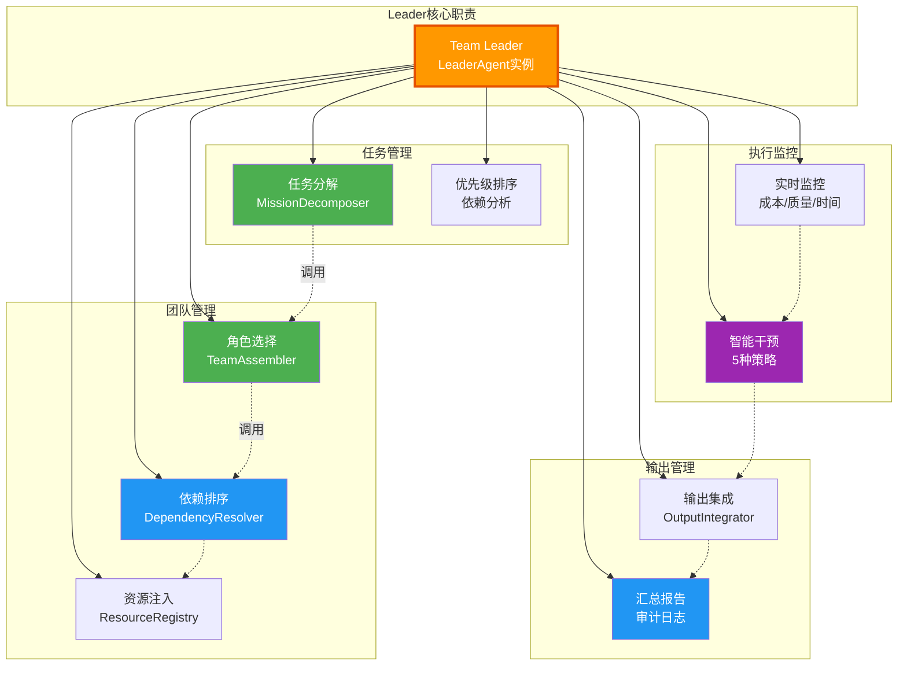
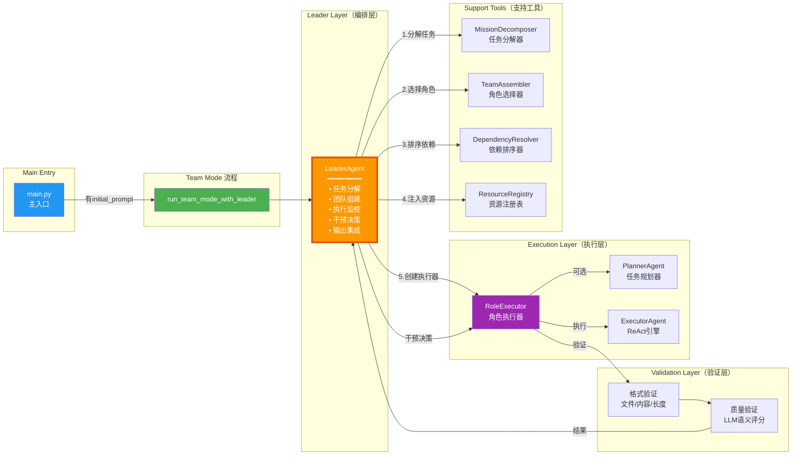
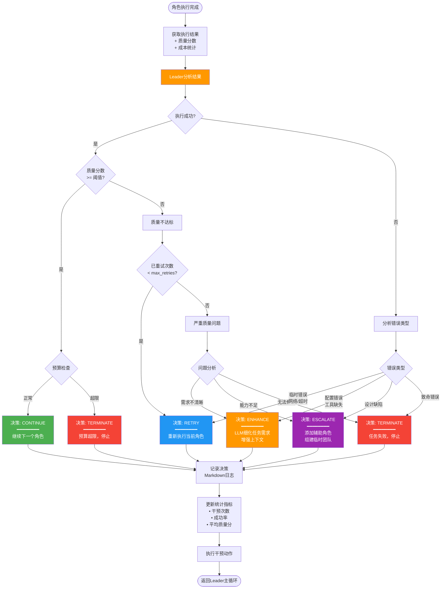

# 架构重构方案 v4.0 - Team Mode with Leader

## 📋 当前架构问题

### 问题分析

当前系统存在**三层并列模式**，导致概念混淆：

```python
# 当前的三层并列架构（问题）
if config.leader.enabled:
    run_leader_mode()        # ❌ Leader作为独立模式
elif config.task.initial_prompt:
    run_team_mode()          # ❌ Team模式没有智能编排
else:
    run_original_mode()      # ✅ 单Agent模式
```

**核心问题**：
1. ❌ **概念混淆**：Leader应该是Team的编排者，而非独立的第三种模式
2. ❌ **职责重叠**：LeaderAgent和TeamOrchestrator都在做编排工作
3. ❌ **配置复杂**：需要在`leader.enabled`和`initial_prompt`之间做选择
4. ❌ **维护困难**：三条执行路径，测试和维护成本高

---

## 🎯 新架构设计

### 核心理念

> **Leader是Team Mode的内部编排者，而非独立模式**

### 新的两层模式

```python
# 重构后的两层架构（清晰）
if config.task.initial_prompt:
    run_team_mode_with_leader()  # ✅ Team Mode（Leader作为编排核心）
else:
    run_original_mode()          # ✅ 单Agent模式
```

**决策逻辑**：
- 有团队任务/初始提示 → Team Mode（自动启用Leader编排）
- 简单单Agent任务 → Original Mode

---

## 🏗️ 新架构流程图

### 1️⃣ 整体系统架构（两层模式）



---

### 2️⃣ Team Mode with Leader 详细流程

```mermaid
flowchart TD
    Start([Team Mode启动<br/>initial_prompt]) --> InitLeader[初始化 Team Leader<br/>使用v4.0 LeaderAgent]

    InitLeader --> LeaderConfig[Leader配置<br/>━━━━━━━━<br/>• 质量阈值<br/>• 成本预算<br/>• 最大重试次数<br/>• 干预策略]

    LeaderConfig --> TaskDecomp[Leader: 任务分解<br/>━━━━━━━━<br/>调用 MissionDecomposer<br/>将goal拆分为SubMissions]

    TaskDecomp --> ParseMissions[Leader: 解析任务<br/>━━━━━━━━<br/>• 任务类型<br/>• 成功标准<br/>• 优先级<br/>• 依赖关系]

    ParseMissions --> AssembleTeam[Leader: 组装团队<br/>━━━━━━━━<br/>调用 TeamAssembler<br/>根据missions选择角色]

    AssembleTeam --> LoadRoles[加载角色定义<br/>roles/*.yaml]
    LoadRoles --> ValidateDep[验证角色依赖关系]

    ValidateDep --> CallResolver[Leader: 依赖排序<br/>━━━━━━━━<br/>调用 DependencyResolver<br/>拓扑排序角色]

    CallResolver --> CheckCycle{检测循环依赖}
    CheckCycle -->|有循环| ErrorCycle([错误: 循环依赖<br/>Leader终止流程])
    CheckCycle -->|无循环| SortedRoles[获得已排序角色列表<br/>execution_order]

    SortedRoles --> LeaderLoop[Leader: 编排循环<br/>━━━━━━━━<br/>遍历每个角色]

    LeaderLoop --> HasNext{还有角色?}
    HasNext -->|否| FinalIntegrate
    HasNext -->|是| NextRole[取出下一个角色<br/>+ SubMission]

    NextRole --> InjectResources[Leader: 资源注入<br/>━━━━━━━━<br/>• 分配工具集<br/>• 注入技能提示<br/>• 配置MCP服务器]

    InjectResources --> CreateExecutor[Leader: 创建执行器<br/>━━━━━━━━<br/>实例化 RoleExecutor]

    CreateExecutor --> AssignTask[Leader: 下发任务<br/>━━━━━━━━<br/>• SubMission goal<br/>• 上游输出context<br/>• 资源配置]

    AssignTask --> MonitorStart[Leader: 开始监控<br/>━━━━━━━━<br/>• 成本追踪<br/>• 时间追踪<br/>• 质量预警]

    MonitorStart --> ExecuteRole[RoleExecutor执行<br/>━━━━━━━━<br/>• Planner分解（可选）<br/>• Executor ReAct循环<br/>• 双层验证]

    ExecuteRole --> GetResult[获取角色输出<br/>+ 执行统计]

    GetResult --> LeaderEval[Leader: 质量评估<br/>━━━━━━━━<br/>• LLM语义评分<br/>• 成本检查<br/>• 预算检查]

    LeaderEval --> DecideIntervention[Leader: 干预决策<br/>━━━━━━━━<br/>决定下一步行动]

    DecideIntervention --> ActionType{干预类型?}

    ActionType -->|CONTINUE<br/>质量达标| RoleSuccess[角色任务成功]
    ActionType -->|RETRY<br/>临时失败| RetryCheck{重试 < max_retries?}
    ActionType -->|ENHANCE<br/>需求不清| EnhanceTask[Leader: 增强任务<br/>━━━━━━━━<br/>LLM细化需求]
    ActionType -->|ESCALATE<br/>能力不足| AddHelper[Leader: 角色升级<br/>━━━━━━━━<br/>添加辅助角色]
    ActionType -->|TERMINATE<br/>无法完成| RoleFail[角色任务失败]

    RetryCheck -->|是| MonitorStart
    RetryCheck -->|否| RoleFail

    EnhanceTask --> MonitorStart
    AddHelper --> CreateExecutor

    RoleSuccess --> CollectOutput[Leader: 收集输出<br/>━━━━━━━━<br/>• 保存角色输出<br/>• 准备上下文传递<br/>• 记录Trace日志]

    CollectOutput --> UpdateContext[Leader: 更新Context<br/>━━━━━━━━<br/>• 完整内容/摘要<br/>• 传递给下游角色]

    UpdateContext --> CheckBudget{Leader: 预算检查}
    CheckBudget -->|超限| BudgetStop([Leader终止流程<br/>预算超限])
    CheckBudget -->|正常| LeaderLoop

    RoleFail --> LogFailure[Leader: 记录失败<br/>━━━━━━━━<br/>Markdown日志]
    LogFailure --> UserDecision{用户干预?}
    UserDecision -->|继续| LeaderLoop
    UserDecision -->|停止| End

    FinalIntegrate[Leader: 输出集成<br/>━━━━━━━━<br/>调用 OutputIntegrator]
    FinalIntegrate --> GenSummary[生成汇总文档<br/>• README<br/>• 项目总结]

    GenSummary --> GenReport[Leader: 生成报告<br/>━━━━━━━━<br/>• 成本报告<br/>• 质量报告<br/>• 干预决策日志<br/>• 执行时间线]

    GenReport --> End([Team任务完成<br/>可交付成果])

    ErrorCycle -.-> End
    BudgetStop -.-> End

    style InitLeader fill:#FF9800,color:#fff,stroke:#E65100,stroke-width:3px
    style LeaderConfig fill:#FF9800,color:#fff
    style TaskDecomp fill:#FF9800,color:#fff
    style AssembleTeam fill:#4CAF50,color:#fff
    style CallResolver fill:#2196F3,color:#fff
    style DecideIntervention fill:#9C27B0,color:#fff
    style FinalIntegrate fill:#4CAF50,color:#fff
    style GenReport fill:#2196F3,color:#fff
```



---

### 3️⃣ Leader职责矩阵



---

### 4️⃣ 组件调用关系



---

### 5️⃣ Leader干预策略决策树



---

## 📊 权责划分表

| 组件 | 职责 | 调用者 | 被调用者 |
|------|------|--------|----------|
| **LeaderAgent** | • 任务分解<br/>• 团队组建<br/>• 执行监控<br/>• 干预决策<br/>• 输出集成<br/>• 汇总报告 | main.py | • MissionDecomposer<br/>• TeamAssembler<br/>• DependencyResolver<br/>• ResourceRegistry<br/>• RoleExecutor |
| **MissionDecomposer** | • LLM分解任务<br/>• 识别依赖关系<br/>• 估算优先级 | LeaderAgent | Claude SDK |
| **TeamAssembler** | • 分析任务需求<br/>• 选择合适角色<br/>• 加载角色定义 | LeaderAgent | RoleRegistry |
| **DependencyResolver** | • 构建依赖图<br/>• 拓扑排序<br/>• 循环检测 | LeaderAgent | - |
| **ResourceRegistry** | • 工具映射<br/>• 技能注入<br/>• MCP配置 | LeaderAgent | - |
| **RoleExecutor** | • 执行角色任务<br/>• 调用Planner/Executor<br/>• 双层验证<br/>• 上下文传递 | LeaderAgent | • PlannerAgent<br/>• ExecutorAgent<br/>• QualityValidator |
| **ExecutorAgent** | • ReAct执行<br/>• 工具调用<br/>• 错误处理 | RoleExecutor | ToolRegistry |
| **QualityValidator** | • LLM语义评分<br/>• 问题识别<br/>• 改进建议 | RoleExecutor | Claude SDK (Haiku) |

---

## 🔄 对比分析

### 旧架构（三层并列）

```
❌ 问题架构
━━━━━━━━━━━━━━━━━━━━━━━━━━━━
main.py
  ├─ Original Mode (单Agent)
  ├─ Team Mode (静态编排)
  └─ Leader Mode (独立编排)  ← 概念混乱
```

**问题**：
- Leader和Team职责重叠
- 配置复杂（两个开关）
- 维护困难（三条路径）

### 新架构（两层模式）

```
✅ 清晰架构
━━━━━━━━━━━━━━━━━━━━━━━━━━━━
main.py
  ├─ Original Mode (单Agent迭代)
  └─ Team Mode (Leader编排)
       └─ Leader Agent
            ├─ 任务分解
            ├─ 团队组建
            ├─ 执行监控
            ├─ 干预决策
            └─ 输出集成
```

**优势**：
- ✅ 概念清晰：Leader是Team的内部组件
- ✅ 配置简单：只需检查initial_prompt
- ✅ 维护友好：两条清晰路径
- ✅ 职责明确：Leader专注编排，RoleExecutor专注执行

---

## 💻 代码重构建议

### Phase 1: 重构main.py

#### 当前代码（问题）

```python
# src/main.py - 当前的三层分支
async def main():
    config = get_config()

    # 三层并列决策
    if config.leader.enabled:
        # Leader独立模式
        await run_leader_mode(config, ...)
    elif config.task.initial_prompt:
        # Team模式（无Leader）
        await run_team_mode(config, ...)
    else:
        # 单Agent模式
        await run_original_mode(config, ...)
```

#### 重构后代码（清晰）

```python
# src/main.py - 重构为两层决策
async def main():
    config = get_config()

    # 两层清晰决策
    if config.task.initial_prompt:
        # Team模式（自动使用Leader编排）
        await run_team_mode_with_leader(config, ...)
    else:
        # 单Agent模式
        await run_original_mode(config, ...)
```

---

### Phase 2: 重构Team Mode入口

#### 新增函数：run_team_mode_with_leader

```python
# src/main.py

async def run_team_mode_with_leader(
    config,
    work_dir,
    logger,
    event_store,
    cost_tracker,
    session_id
):
    """
    Execute Team Mode with Leader orchestration.

    Leader acts as the team orchestrator, replacing static TeamAssembler.

    Workflow:
        1. Initialize Leader Agent
        2. Leader decomposes goal into missions
        3. Leader assembles team (calls TeamAssembler)
        4. Leader resolves dependencies (calls DependencyResolver)
        5. Leader orchestrates execution (calls RoleExecutor)
        6. Leader monitors and intervenes
        7. Leader integrates outputs

    Args:
        config: Configuration object
        work_dir: Working directory
        logger: Logger instance
        event_store: Event store
        cost_tracker: Cost tracker
        session_id: Session ID

    Returns:
        bool: True if team succeeded, False otherwise
    """
    logger.info("🎯 Team Mode with Leader Orchestration")
    logger.info(f"Goal: {config.task.goal}")
    logger.info(f"Initial Prompt: {config.task.initial_prompt[:100]}...")

    # Log team mode start
    event_store.create_event(
        EventType.SESSION_START,
        session_id=session_id,
        mode="team_with_leader",
        goal=config.task.goal
    )

    try:
        # Initialize Leader Agent
        leader = LeaderAgent(
            work_dir=str(work_dir),
            model=config.claude.model,
            max_mission_retries=config.leader.max_mission_retries,
            quality_threshold=config.leader.quality_threshold,
            budget_limit_usd=config.cost_control.max_budget_usd if config.cost_control.enabled else None,
            enable_intervention=config.leader.enable_intervention,
            session_id=session_id
        )

        # Execute with Leader orchestration
        # Leader will internally:
        #   1. Call MissionDecomposer
        #   2. Call TeamAssembler
        #   3. Call DependencyResolver
        #   4. Create and monitor RoleExecutors
        #   5. Intervene when needed
        #   6. Integrate outputs
        result = await leader.execute_team_workflow(
            goal=config.task.goal,
            initial_prompt=config.task.initial_prompt,
            event_store=event_store,
            cost_tracker=cost_tracker
        )

        # Log completion
        logger.info(f"✅ Team Mode completed: {result['success']}")
        logger.info(f"Completed roles: {result['completed_roles']}/{result['total_roles']}")
        logger.info(f"Total cost: ${result['total_cost_usd']:.4f}")
        logger.info(f"Interventions: {result['intervention_count']}")

        event_store.create_event(
            EventType.SESSION_END,
            session_id=session_id,
            success=result['success'],
            total_cost=result['total_cost_usd']
        )

        return result['success']

    except Exception as e:
        logger.error(f"❌ Team Mode failed: {e}")
        event_store.create_event(
            EventType.SESSION_END,
            session_id=session_id,
            success=False,
            error=str(e)
        )
        return False
```

---

### Phase 3: 重构LeaderAgent

#### 新增方法：execute_team_workflow

```python
# src/core/leader/leader_agent.py

class LeaderAgent:
    """
    Leader Agent - Team Mode orchestrator.

    No longer a standalone mode, but the core orchestrator within Team Mode.
    """

    async def execute_team_workflow(
        self,
        goal: str,
        initial_prompt: str,
        event_store: EventStore,
        cost_tracker: CostTracker
    ) -> Dict[str, Any]:
        """
        Execute complete team workflow with Leader orchestration.

        This is the main entry point for Team Mode.

        Workflow:
            1. Decompose goal into sub-missions
            2. Assemble team (call TeamAssembler)
            3. Resolve dependencies (call DependencyResolver)
            4. Execute roles in order
            5. Monitor and intervene
            6. Integrate outputs
            7. Generate report

        Args:
            goal: Overall goal
            initial_prompt: Team task description
            event_store: Event store for tracking
            cost_tracker: Cost tracker

        Returns:
            {
                "success": bool,
                "total_roles": int,
                "completed_roles": int,
                "total_cost_usd": float,
                "intervention_count": int,
                "deliverables": List[str],
                "report_path": str
            }
        """
        logger.info("🎯 Leader: Starting team workflow orchestration")

        # Step 1: Decompose missions
        logger.info("Step 1/7: Decomposing goal into missions")
        missions = await self._decompose_missions(goal, initial_prompt)

        # Step 2: Assemble team
        logger.info("Step 2/7: Assembling team")
        roles = await self._assemble_team(missions, initial_prompt)

        # Step 3: Resolve dependencies
        logger.info("Step 3/7: Resolving role dependencies")
        sorted_roles = await self._resolve_dependencies(roles)

        # Step 4-6: Execute, monitor, intervene
        logger.info("Step 4-6/7: Executing roles with monitoring")
        execution_result = await self._orchestrate_execution(
            sorted_roles,
            missions,
            event_store,
            cost_tracker
        )

        # Step 7: Integrate and report
        logger.info("Step 7/7: Integrating outputs and generating report")
        final_result = await self._integrate_and_report(execution_result)

        return final_result

    async def _decompose_missions(
        self,
        goal: str,
        initial_prompt: str
    ) -> List[SubMission]:
        """
        Step 1: Decompose goal into sub-missions.

        Calls MissionDecomposer (LLM-driven).
        """
        decomposer = MissionDecomposer(
            work_dir=str(self.work_dir),
            model=self.model
        )
        missions = await decomposer.decompose(goal, initial_prompt)
        logger.info(f"Leader: Decomposed into {len(missions)} missions")
        return missions

    async def _assemble_team(
        self,
        missions: List[SubMission],
        initial_prompt: str
    ) -> List[Role]:
        """
        Step 2: Assemble team by selecting roles.

        Calls TeamAssembler (LLM-driven role selection).
        """
        assembler = TeamAssembler(
            work_dir=str(self.work_dir),
            model=self.model
        )

        # TeamAssembler analyzes missions and selects roles
        roles = await assembler.assemble(initial_prompt)
        logger.info(f"Leader: Assembled team of {len(roles)} roles")
        return roles

    async def _resolve_dependencies(
        self,
        roles: List[Role]
    ) -> List[Role]:
        """
        Step 3: Resolve role dependencies using topological sort.

        Calls DependencyResolver (Kahn algorithm).
        """
        resolver = DependencyResolver()
        sorted_roles = resolver.resolve(roles)
        logger.info(f"Leader: Sorted {len(sorted_roles)} roles")
        logger.info(f"Execution order: {[r.name for r in sorted_roles]}")
        return sorted_roles

    async def _orchestrate_execution(
        self,
        sorted_roles: List[Role],
        missions: List[SubMission],
        event_store: EventStore,
        cost_tracker: CostTracker
    ) -> Dict[str, Any]:
        """
        Steps 4-6: Orchestrate role execution with monitoring and intervention.

        For each role:
            1. Inject resources (tools, skills)
            2. Create RoleExecutor
            3. Assign mission and context
            4. Monitor execution (cost, quality, time)
            5. Evaluate result
            6. Decide intervention (CONTINUE/RETRY/ENHANCE/ESCALATE/TERMINATE)
            7. Collect output and update context
        """
        context = {}
        results = {}
        intervention_count = 0
        total_cost = 0.0

        for i, role in enumerate(sorted_roles):
            logger.info(f"\n{'='*60}")
            logger.info(f"Leader: Orchestrating Role {i+1}/{len(sorted_roles)}: {role.name}")
            logger.info(f"{'='*60}")

            # Find matching mission
            mission = self._match_mission(role, missions)

            # Inject resources
            await self._inject_resources(role, mission)

            # Create executor
            role_executor = RoleExecutor(
                role=role,
                executor_agent=self.executor,  # Shared ExecutorAgent
                work_dir=str(self.work_dir)
            )

            # Execute with retry loop
            retry_count = 0
            while retry_count <= self.max_mission_retries:
                # Monitor start
                start_time = time.time()
                start_cost = cost_tracker.get_total_cost()

                # Execute
                result = await role_executor.execute(context=context)

                # Monitor end
                duration = time.time() - start_time
                role_cost = cost_tracker.get_total_cost() - start_cost
                total_cost += role_cost

                # Evaluate and decide intervention
                decision = await self._evaluate_and_decide(
                    role,
                    result,
                    role_cost,
                    duration
                )

                logger.info(f"Leader: Intervention decision: {decision.action.value}")
                logger.info(f"Reason: {decision.reason}")

                intervention_count += 1

                if decision.action == InterventionAction.CONTINUE:
                    # Success - collect output and move to next role
                    results[role.name] = result
                    context = self._update_context(context, role, result)
                    break

                elif decision.action == InterventionAction.RETRY:
                    retry_count += 1
                    logger.warning(f"Leader: Retrying role (attempt {retry_count}/{self.max_mission_retries})")
                    continue

                elif decision.action == InterventionAction.ENHANCE:
                    # Enhance mission and retry
                    mission = await self._enhance_mission(mission, decision.enhancements)
                    retry_count += 1
                    continue

                elif decision.action == InterventionAction.ESCALATE:
                    # Add helper role
                    helper_role = await self._add_helper_role(role, decision.adjustments)
                    # Execute helper first, then retry
                    # ... (implementation)
                    retry_count += 1
                    continue

                elif decision.action == InterventionAction.TERMINATE:
                    logger.error(f"Leader: Terminating workflow - {decision.reason}")
                    return {
                        "success": False,
                        "completed_roles": i,
                        "total_roles": len(sorted_roles),
                        "total_cost_usd": total_cost,
                        "intervention_count": intervention_count,
                        "error": decision.reason
                    }

        return {
            "success": True,
            "completed_roles": len(sorted_roles),
            "total_roles": len(sorted_roles),
            "total_cost_usd": total_cost,
            "intervention_count": intervention_count,
            "results": results,
            "context": context
        }

    async def _evaluate_and_decide(
        self,
        role: Role,
        result: Dict[str, Any],
        cost: float,
        duration: float
    ) -> InterventionDecision:
        """
        Evaluate role execution result and decide intervention strategy.

        Decision logic:
            1. Check execution success
            2. Check quality score vs threshold
            3. Check budget
            4. Analyze error type
            5. Return intervention decision
        """
        # Check success
        if not result.get("success", False):
            error_type = self._analyze_error(result)
            if error_type == "temporary":
                return InterventionDecision(
                    action=InterventionAction.RETRY,
                    reason="Temporary error detected (network/timeout)"
                )
            elif error_type == "config":
                return InterventionDecision(
                    action=InterventionAction.ENHANCE,
                    reason="Configuration issue - enhancing task definition"
                )
            else:
                return InterventionDecision(
                    action=InterventionAction.TERMINATE,
                    reason=f"Fatal error: {result.get('error', 'Unknown')}"
                )

        # Check quality
        quality_score = result.get("quality_score", 0)
        if quality_score < self.quality_threshold:
            if quality_score < self.quality_threshold * 0.5:
                # Very low quality - might need more help
                return InterventionDecision(
                    action=InterventionAction.ESCALATE,
                    reason=f"Quality too low ({quality_score:.1f}), escalating with helper role"
                )
            else:
                # Moderate quality - retry might help
                return InterventionDecision(
                    action=InterventionAction.RETRY,
                    reason=f"Quality below threshold ({quality_score:.1f} < {self.quality_threshold})"
                )

        # Check budget
        if self.budget_limit_usd and cost > self.budget_limit_usd:
            return InterventionDecision(
                action=InterventionAction.TERMINATE,
                reason=f"Budget exceeded (${cost:.2f} > ${self.budget_limit_usd:.2f})"
            )

        # All good
        return InterventionDecision(
            action=InterventionAction.CONTINUE,
            reason=f"Success - quality: {quality_score:.1f}, cost: ${cost:.4f}"
        )

    async def _integrate_and_report(
        self,
        execution_result: Dict[str, Any]
    ) -> Dict[str, Any]:
        """
        Step 7: Integrate outputs and generate final report.

        1. Collect all role outputs
        2. Generate summary README
        3. Generate execution report (cost, quality, timeline, interventions)
        4. Save to work_dir
        """
        # ... (implementation)
        pass
```

---

### Phase 4: 移除独立Leader Mode

```python
# 删除或注释掉旧的 run_leader_mode 函数
# src/main.py

# async def run_leader_mode(...):  # ❌ DELETE THIS
#     ...
```

---

### Phase 5: 更新配置

#### config.yaml

```yaml
# 移除 leader.enabled 配置项（不再需要独立开关）
# leader:
#   enabled: false  # ❌ 删除此项

# 保留 Leader 的配置参数（Team Mode会自动使用）
leader:
  max_mission_retries: 3
  quality_threshold: 70.0
  enable_intervention: true

# Team Mode 触发条件：有 initial_prompt
task:
  goal: "漫画利基市场app开发"
  initial_prompt: |  # 有此字段 → 触发Team Mode（自动使用Leader）
    你们是顶级app创业团队...
```

---

## 🧪 测试策略

### 单元测试

```python
# tests/test_leader_team_integration.py

async def test_leader_team_workflow():
    """测试 Leader 作为 Team Mode 编排者"""
    config = get_test_config()
    config.task.initial_prompt = "测试团队任务"

    # 应该触发 Team Mode with Leader
    result = await run_team_mode_with_leader(config, ...)

    assert result == True
    assert "intervention_count" in result
    assert "completed_roles" in result
```

### 集成测试

```python
# tests/test_two_mode_architecture.py

async def test_mode_selection():
    """测试两层模式选择逻辑"""

    # Case 1: 有 initial_prompt → Team Mode
    config1 = get_config()
    config1.task.initial_prompt = "团队任务"
    mode1 = detect_mode(config1)
    assert mode1 == "team_with_leader"

    # Case 2: 无 initial_prompt → Original Mode
    config2 = get_config()
    config2.task.initial_prompt = None
    mode2 = detect_mode(config2)
    assert mode2 == "original"
```

---

## 📈 迁移步骤

### Step 1: 准备阶段
- [x] 分析当前架构问题
- [x] 设计新架构流程图
- [x] 编写重构文档

### Step 2: 代码重构
- [ ] 重构 `main.py` 为两层决策
- [ ] 新增 `run_team_mode_with_leader` 函数
- [ ] 重构 `LeaderAgent.execute_team_workflow` 方法
- [ ] 移除独立 `run_leader_mode` 函数

### Step 3: 配置更新
- [ ] 移除 `leader.enabled` 配置项
- [ ] 更新配置文档
- [ ] 更新示例配置文件

### Step 4: 测试验证
- [ ] 编写单元测试
- [ ] 编写集成测试
- [ ] 端到端测试（实际场景）

### Step 5: 文档更新
- [ ] 更新 README.md
- [ ] 更新架构文档
- [ ] 更新流程图

---

## ✅ 总结

### 新架构优势

| 维度 | 旧架构 | 新架构 |
|------|--------|--------|
| **概念清晰度** | ⭐⭐ 三层并列，混淆 | ⭐⭐⭐⭐⭐ 两层清晰 |
| **配置复杂度** | ⭐⭐ 两个开关 | ⭐⭐⭐⭐⭐ 一个条件 |
| **代码维护性** | ⭐⭐ 三条路径 | ⭐⭐⭐⭐⭐ 两条路径 |
| **职责划分** | ⭐⭐⭐ 部分重叠 | ⭐⭐⭐⭐⭐ 完全清晰 |
| **测试难度** | ⭐⭐ 需测试3种模式 | ⭐⭐⭐⭐ 只测2种模式 |
| **用户理解** | ⭐⭐ "Leader是什么?" | ⭐⭐⭐⭐⭐ "Team=Leader编排" |

### 核心变化

**Before (旧架构)**:
```
3种模式: Original | Team | Leader
         并列    并列   并列

问题: Leader职责不清
```

**After (新架构)**:
```
2种模式: Original | Team (含Leader)

清晰: Leader是Team的编排核心
```

### 下一步行动

1. ✅ **已完成**: 架构设计和流程图
2. 🔄 **进行中**: 代码重构实施
3. ⏳ **待开始**: 测试和文档更新

---

**文档版本**: v4.0-refactor
**创建日期**: 2025-01-22
**作者**: Architecture Team
**状态**: 设计完成，待实施
