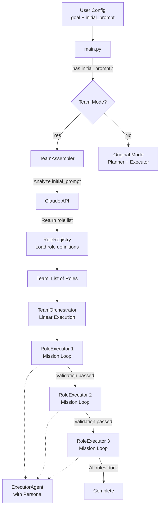
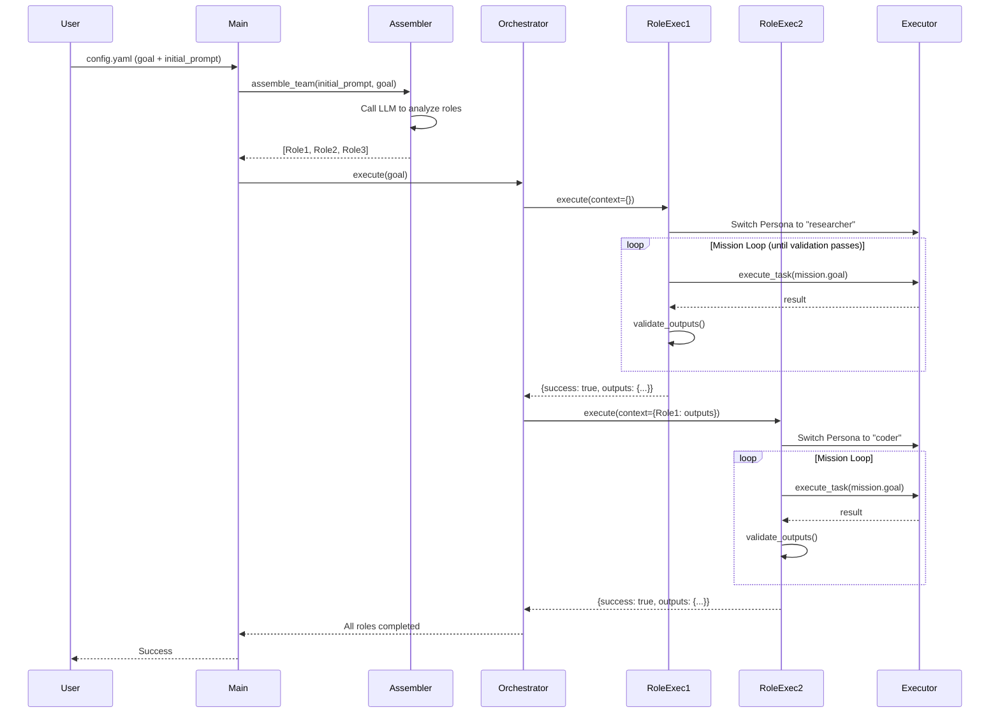

# Feature Specification: Dynamic Team Assembly System

**Feature ID**: FEAT-001  
**Version**: 1.0.0  
**Status**: Ready for Implementation  
**Created**: 2025-11-22  
**Target Version**: v3.2

---

## 📋 Executive Summary

### What
Add a **Dynamic Team Assembly System** that allows the agent to automatically form specialized teams based on `initial_prompt`, where each role has specific missions, output standards, and validation gates.

### Why
- **Current Limitation**: Single Executor with Persona switching is not sufficient for complex, multi-stage tasks
- **Business Value**: Enable the agent to handle structured workflows (e.g., market research → documentation → SEO) with guaranteed quality
- **User Benefit**: Users can describe complex workflows in `initial_prompt`, and the system automatically assembles and coordinates the right team

### How
Introduce a **Role-based team system** that:
1. Analyzes `initial_prompt` to identify required roles
2. Executes roles **linearly** (sequential, not parallel)
3. Each role has a **mission** (sub-goal) and runs in a **small loop** until validation passes
4. Integrates with existing **Persona system** (Role defines mission, Persona provides execution capability)
5. Passes **context** from one role to the next

---

## 🎯 Goals and Non-Goals

### Goals ✅
- [x] Enable dynamic team formation based on `initial_prompt`
- [x] Linear execution with validation gates between roles
- [x] Integration with existing `ExecutorAgent` and `PersonaEngine`
- [x] Support for role-specific output standards (e.g., META-PROMPT for AI-Native-Writer)
- [x] Context passing between roles
- [x] Backward compatibility (existing `goal`-only mode still works)

### Non-Goals ❌
- [ ] Parallel role execution (v1 is sequential only)
- [ ] Dynamic role creation at runtime (roles are pre-defined in YAML)
- [ ] Human-in-the-loop approval between roles (fully automated)
- [ ] Role failure recovery strategies (v1 fails fast)

---

## 🏗️ Architecture

### System Architecture



### Component Hierarchy

```
TeamOrchestrator (协调器)
  ├── RoleExecutor 1 (角色执行器)
  │     ├── Role (角色定义: mission, output_standard, validation_rules)
  │     └── ExecutorAgent (复用现有)
  │           └── PersonaEngine (复用现有)
  ├── RoleExecutor 2
  │     └── ...
  └── RoleExecutor 3
        └── ...
```

### Data Flow



---

## 📐 Detailed Design

### 1. Role Definition (YAML)

**File**: `roles/{role_name}.yaml`

```yaml
# Example: roles/market_researcher.yaml
name: "Market-Researcher"
description: "Market research specialist for target market analysis"
category: "research"

# Role's mission (sub-goal)
mission:
  goal: "Complete in-depth market research and output market analysis report"
  
  success_criteria:
    - "Identify at least 3 target user segments"
    - "Analyze at least 5 competitors"
    - "Provide specific market size data"
    - "Output market-research.md file"
  
  max_iterations: 10  # Max iterations for mission loop

# Output standard
output_standard:
  required_files:
    - "market-research.md"
  
  validation_rules:
    - type: "file_exists"
      file: "market-research.md"
    
    - type: "content_check"
      file: "market-research.md"
      must_contain:
        - "## Target Users"
        - "## Competitor Analysis"
        - "## Market Size"
    
    - type: "min_length"
      file: "market-research.md"
      min_chars: 2000

# Recommended Persona (integrates with existing PersonaEngine)
recommended_persona: "researcher"

# Available tools
tools:
  - "web_search"
  - "write_file"
  - "read_file"

# Dependencies (which roles must complete before this one)
dependencies: []
```

**Schema**:

```yaml
name: string (required)
description: string (required)
category: string (optional, e.g., "research", "documentation", "marketing")

mission:
  goal: string (required)
  success_criteria: list[string] (required)
  max_iterations: int (default: 10)

output_standard:
  template: string (optional, path to standard document like META-PROMPT)
  required_files: list[string] (required)
  validation_rules: list[ValidationRule] (required)

recommended_persona: string (optional, must exist in PersonaEngine)
tools: list[string] (optional)
dependencies: list[string] (optional, role names)
```

**Validation Rule Types**:

| Type | Parameters | Description |
|------|------------|-------------|
| `file_exists` | `file: string` | Check if file exists |
| `all_files_exist` | `files: list[string]` | Check if all files exist |
| `content_check` | `file: string, must_contain: list[string]` | Check if file contains required sections |
| `no_placeholders` | `files: list[string], forbidden_patterns: list[string]` | Check for placeholders like `[TODO]` |
| `min_length` | `file: string, min_chars: int` | Check minimum file length |
| `code_blocks_valid` | `files: list[string]` | Check if code blocks are syntactically valid |

### 2. RoleRegistry

**File**: `src/core/team/role_registry.py`

```python
from pathlib import Path
from typing import Dict, Optional
import yaml
from pydantic import BaseModel

class ValidationRule(BaseModel):
    type: str
    file: Optional[str] = None
    files: Optional[list[str]] = None
    must_contain: Optional[list[str]] = None
    forbidden_patterns: Optional[list[str]] = None
    min_chars: Optional[int] = None

class Mission(BaseModel):
    goal: str
    success_criteria: list[str]
    max_iterations: int = 10

class OutputStandard(BaseModel):
    template: Optional[str] = None
    required_files: list[str]
    validation_rules: list[ValidationRule]

class Role(BaseModel):
    name: str
    description: str
    category: Optional[str] = None
    mission: Mission
    output_standard: OutputStandard
    recommended_persona: Optional[str] = None
    tools: list[str] = []
    dependencies: list[str] = []

class RoleRegistry:
    """Registry for all available roles"""
    
    def __init__(self, roles_dir: str = "roles"):
        self.roles_dir = Path(roles_dir)
        self.roles: Dict[str, Role] = {}
        self._load_roles()
    
    def _load_roles(self):
        """Load all role definitions from YAML files"""
        if not self.roles_dir.exists():
            logger.warning(f"Roles directory not found: {self.roles_dir}")
            return
        
        for role_file in self.roles_dir.glob("*.yaml"):
            try:
                with open(role_file, encoding='utf-8') as f:
                    config = yaml.safe_load(f)
                    role = Role(**config)
                    self.roles[role.name] = role
                    logger.info(f"Loaded role: {role.name}")
            except Exception as e:
                logger.error(f"Failed to load role from {role_file}: {e}")
    
    def get_role(self, name: str) -> Optional[Role]:
        """Get role by name"""
        return self.roles.get(name)
    
    def list_roles(self) -> list[str]:
        """List all available role names"""
        return list(self.roles.keys())
    
    def get_roles_by_category(self, category: str) -> list[Role]:
        """Get all roles in a category"""
        return [r for r in self.roles.values() if r.category == category]
```

### 3. TeamAssembler

**File**: `src/core/team/team_assembler.py`

```python
from typing import List
from src.core.team.role_registry import RoleRegistry, Role
from src.core.agents.sdk_client import run_claude_prompt
from src.utils.json_utils import extract_json
import logging

logger = logging.getLogger(__name__)

class TeamAssembler:
    """Assembles a team of roles based on initial_prompt"""
    
    def __init__(self, role_registry: RoleRegistry):
        self.registry = role_registry
    
    async def assemble_team(
        self,
        initial_prompt: str,
        goal: str,
        work_dir: str = ".",
        model: str = None,
        timeout: int = 60
    ) -> List[Role]:
        """
        Analyze initial_prompt and goal to determine which roles are needed.
        
        Returns:
            List of Role objects in execution order
        """
        # Build analysis prompt
        analysis_prompt = self._build_analysis_prompt(initial_prompt, goal)
        
        # Call LLM to analyze
        logger.info("Analyzing initial_prompt to determine required roles...")
        response, _ = await run_claude_prompt(
            analysis_prompt,
            work_dir,
            model=model,
            timeout=timeout
        )
        
        # Parse response
        data = extract_json(response)
        if not data:
            logger.error("Failed to parse team assembly response")
            return []
        
        role_names = data.get('roles', [])
        reasoning = data.get('reasoning', '')
        
        logger.info(f"Team assembled: {role_names}")
        logger.info(f"Reasoning: {reasoning}")
        
        # Load roles
        team = []
        for name in role_names:
            role = self.registry.get_role(name)
            if role:
                team.append(role)
            else:
                logger.warning(f"Role not found: {name}")
        
        return team
    
    def _build_analysis_prompt(self, initial_prompt: str, goal: str) -> str:
        """Build the prompt for LLM to analyze required roles"""
        available_roles = self._format_available_roles()
        
        return f"""
Analyze the following task and determine which roles are needed to complete it.

## Initial Prompt
{initial_prompt}

## Goal
{goal}

## Available Roles
{available_roles}

## Instructions
1. Identify which roles are needed for this task
2. Consider dependencies between roles (e.g., Architect must come before AI-Native-Writer)
3. Order roles by execution sequence (linear, not parallel)
4. Output ONLY a JSON object with this structure:

{{
    "roles": ["Role-Name-1", "Role-Name-2", "Role-Name-3"],
    "reasoning": "Brief explanation of why these roles and this order"
}}

CRITICAL: Output ONLY the JSON object. No explanatory text before or after.
"""
    
    def _format_available_roles(self) -> str:
        """Format available roles for the prompt"""
        lines = []
        for name, role in self.registry.roles.items():
            lines.append(f"- **{name}**: {role.description}")
            if role.dependencies:
                lines.append(f"  Dependencies: {', '.join(role.dependencies)}")
        return "\n".join(lines)
```

### 4. RoleExecutor

**File**: `src/core/team/role_executor.py`

```python
from typing import Dict, Any
from pathlib import Path
from src.core.team.role_registry import Role
from src.core.agents.executor import ExecutorAgent
import logging
import re

logger = logging.getLogger(__name__)

class RoleExecutor:
    """
    Executes a single role's mission.
    Runs a small loop until mission is completed and validated.
    """
    
    def __init__(
        self,
        role: Role,
        executor_agent: ExecutorAgent,
        work_dir: str
    ):
        self.role = role
        self.executor = executor_agent
        self.work_dir = Path(work_dir)
        
        # Switch to recommended Persona
        if self.role.recommended_persona:
            self.executor.persona_engine.switch_persona(
                self.role.recommended_persona,
                reason=f"role_requirement: {self.role.name}"
            )
            logger.info(f"Switched Persona to: {self.role.recommended_persona}")
    
    async def execute(self, context: Dict[str, Any] = None) -> Dict[str, Any]:
        """
        Execute role's mission.
        
        Args:
            context: Outputs from previous roles
        
        Returns:
            {
                "success": bool,
                "outputs": Dict[str, str],  # filename -> content
                "iterations": int,
                "validation_result": Dict
            }
        """
        mission = self.role.mission
        max_iterations = mission.max_iterations
        
        logger.info(f"🎭 {self.role.name} starting mission: {mission.goal}")
        
        # Build initial task
        task = self._build_task(mission, context)
        
        # Mission loop
        iteration = 0
        while iteration < max_iterations:
            iteration += 1
            logger.info(f"  Iteration {iteration}/{max_iterations}")
            
            # Execute task using existing Executor
            result = await self.executor.execute_task(task)
            
            # Validate outputs
            validation = self._validate_outputs()
            
            if validation['passed']:
                logger.info(f"✅ {self.role.name} mission completed!")
                return {
                    "success": True,
                    "outputs": self._collect_outputs(),
                    "iterations": iteration,
                    "validation_result": validation
                }
            else:
                logger.warning(f"⚠️ Validation failed: {validation['errors']}")
                # Build retry task with specific errors to fix
                task = self._build_retry_task(validation['errors'])
        
        # Max iterations reached
        logger.error(f"❌ {self.role.name} failed to complete mission in {max_iterations} iterations")
        return {
            "success": False,
            "outputs": self._collect_outputs(),
            "iterations": iteration,
            "validation_result": validation
        }
    
    def _build_task(self, mission: Mission, context: Dict) -> str:
        """Build task description for Executor"""
        context_str = self._format_context(context) if context else "No previous context."
        criteria_str = "\n".join(f"- {c}" for c in mission.success_criteria)
        required_files_str = "\n".join(f"- {f}" for f in self.role.output_standard.required_files)
        
        template_info = ""
        if self.role.output_standard.template:
            template_info = f"\nYou MUST follow the standard defined in: {self.role.output_standard.template}"
        
        return f"""
# Mission: {mission.goal}

## Success Criteria
{criteria_str}

## Context from Previous Roles
{context_str}

## Output Standard{template_info}

Required files:
{required_files_str}

## Instructions
1. Complete all success criteria
2. Generate all required files
3. Ensure outputs meet validation rules
4. Use the tools available to you
"""
    
    def _build_retry_task(self, errors: list) -> str:
        """Build retry task with specific errors to fix"""
        errors_str = "\n".join(f"- {error}" for error in errors)
        return f"""
# Mission: Fix Validation Errors

## Issues to Fix
{errors_str}

## Instructions
Fix the above issues and ensure all validation rules pass.
Do NOT regenerate everything, just fix the specific issues.
"""
    
    def _validate_outputs(self) -> Dict[str, Any]:
        """Validate outputs against validation rules"""
        errors = []
        
        for rule in self.role.output_standard.validation_rules:
            rule_type = rule.type
            
            if rule_type == "file_exists":
                file_path = self.work_dir / rule.file
                if not file_path.exists():
                    errors.append(f"Missing required file: {rule.file}")
            
            elif rule_type == "all_files_exist":
                for file in rule.files:
                    file_path = self.work_dir / file
                    if not file_path.exists():
                        errors.append(f"Missing required file: {file}")
            
            elif rule_type == "content_check":
                file_path = self.work_dir / rule.file
                if file_path.exists():
                    content = file_path.read_text(encoding='utf-8')
                    for required in rule.must_contain:
                        if required not in content:
                            errors.append(f"{rule.file} missing section: {required}")
                else:
                    errors.append(f"Cannot check content, file missing: {rule.file}")
            
            elif rule_type == "no_placeholders":
                for file in rule.files:
                    file_path = self.work_dir / file
                    if file_path.exists():
                        content = file_path.read_text(encoding='utf-8')
                        for pattern in rule.forbidden_patterns:
                            if re.search(pattern, content):
                                errors.append(f"{file} contains placeholder: {pattern}")
            
            elif rule_type == "min_length":
                file_path = self.work_dir / rule.file
                if file_path.exists():
                    content = file_path.read_text(encoding='utf-8')
                    if len(content) < rule.min_chars:
                        errors.append(f"{rule.file} too short: {len(content)} < {rule.min_chars} chars")
        
        return {
            "passed": len(errors) == 0,
            "errors": errors
        }
    
    def _collect_outputs(self) -> Dict[str, str]:
        """Collect all generated outputs"""
        outputs = {}
        for file in self.role.output_standard.required_files:
            file_path = self.work_dir / file
            if file_path.exists():
                outputs[file] = file_path.read_text(encoding='utf-8')
        return outputs
    
    def _format_context(self, context: Dict) -> str:
        """Format context from previous roles"""
        lines = []
        for role_name, role_result in context.items():
            lines.append(f"### {role_name}")
            if 'outputs' in role_result:
                for file, content in role_result['outputs'].items():
                    preview = content[:300] + "..." if len(content) > 300 else content
                    lines.append(f"**{file}**:\n```\n{preview}\n```")
        return "\n".join(lines)
```

### 5. TeamOrchestrator

**File**: `src/core/team/team_orchestrator.py`

```python
from typing import List, Dict, Any
from src.core.team.role_registry import Role
from src.core.team.role_executor import RoleExecutor
from src.core.agents.executor import ExecutorAgent
import logging

logger = logging.getLogger(__name__)

class TeamOrchestrator:
    """
    Orchestrates linear execution of a team of roles.
    Each role completes its mission before the next one starts.
    """
    
    def __init__(
        self,
        roles: List[Role],
        executor_agent: ExecutorAgent,
        work_dir: str
    ):
        self.roles = roles
        self.executor = executor_agent
        self.work_dir = work_dir
        
        # Context storage (outputs from completed roles)
        self.context: Dict[str, Any] = {}
    
    async def execute(self, goal: str) -> Dict[str, Any]:
        """
        Execute team workflow linearly.
        
        Returns:
            {
                "success": bool,
                "completed_roles": int,
                "results": Dict[role_name, result]
            }
        """
        logger.info(f"🎯 Team Goal: {goal}")
        logger.info(f"👥 Team Size: {len(self.roles)}")
        logger.info(f"📋 Role Sequence: {[r.name for r in self.roles]}")
        
        results = {}
        
        for i, role in enumerate(self.roles):
            logger.info(f"\n{'='*60}")
            logger.info(f"Role {i+1}/{len(self.roles)}: {role.name}")
            logger.info(f"{'='*60}")
            
            # Create role executor
            role_executor = RoleExecutor(
                role=role,
                executor_agent=self.executor,
                work_dir=self.work_dir
            )
            
            # Execute role mission (small loop)
            result = await role_executor.execute(context=self.context)
            
            # Save result
            results[role.name] = result
            
            # Check success
            if not result['success']:
                logger.error(f"❌ {role.name} failed. Stopping team execution.")
                return {
                    "success": False,
                    "completed_roles": i,
                    "results": results
                }
            
            # Add to context for next role
            self.context[role.name] = result
            
            logger.info(f"✅ {role.name} completed in {result['iterations']} iterations")
        
        logger.info(f"\n🎉 All {len(self.roles)} roles completed successfully!")
        
        return {
            "success": True,
            "completed_roles": len(self.roles),
            "results": results
        }
```

### 6. Integration with main.py

**File**: `src/main.py` (modifications)

```python
# Add imports
from src.core.team.role_registry import RoleRegistry
from src.core.team.team_assembler import TeamAssembler
from src.core.team.team_orchestrator import TeamOrchestrator

async def main(config_path: str = "config.yaml"):
    """Main orchestrator with team mode support"""
    
    # ... existing initialization code ...
    
    # Initialize Executor (reuse existing)
    executor = ExecutorAgent(
        work_dir=str(work_dir),
        persona_config=config.persona.model_dump(),
        model=config.claude.model,
        timeout_seconds=config.claude.timeout_seconds,
        permission_mode=config.claude.permission_mode,
        max_retries=config.error_handling.max_retries,
        retry_delay=config.error_handling.retry_delay_seconds,
    )
    
    # Check for team mode
    if config.task.initial_prompt:
        logger.info("🎭 Team Mode Activated")
        await run_team_mode(config, executor, work_dir, logger)
    else:
        logger.info("🔄 Original Mode (Planner + Executor)")
        await run_original_mode(config, executor, work_dir, logger)

async def run_team_mode(config, executor, work_dir, logger):
    """Execute in team mode"""
    
    # 1. Load role registry
    role_registry = RoleRegistry(roles_dir="roles")
    logger.info(f"Loaded {len(role_registry.roles)} roles: {role_registry.list_roles()}")
    
    # 2. Assemble team
    assembler = TeamAssembler(role_registry)
    roles = await assembler.assemble_team(
        initial_prompt=config.task.initial_prompt,
        goal=config.task.goal,
        work_dir=str(work_dir),
        model=config.claude.model,
        timeout=config.claude.timeout_seconds
    )
    
    if not roles:
        logger.error("Failed to assemble team. Falling back to original mode.")
        await run_original_mode(config, executor, work_dir, logger)
        return
    
    logger.info(f"Team assembled: {[r.name for r in roles]}")
    
    # 3. Execute team workflow
    orchestrator = TeamOrchestrator(
        roles=roles,
        executor_agent=executor,
        work_dir=str(work_dir)
    )
    
    result = await orchestrator.execute(config.task.goal)
    
    # 4. Report results
    if result['success']:
        logger.info("✅ Team mission accomplished!")
        logger.info(f"Completed {result['completed_roles']} roles")
    else:
        logger.error(f"❌ Team failed at role {result['completed_roles']}")

async def run_original_mode(config, executor, work_dir, logger):
    """Execute in original mode (existing logic)"""
    # ... existing main loop code ...
    pass
```

---

## 📝 Implementation Steps

### Phase 1: Core Infrastructure (2-3 days)

#### Step 1.1: Create Role Registry
- [ ] Create `src/core/team/` directory
- [ ] Implement `src/core/team/role_registry.py`
- [ ] Create `roles/` directory
- [ ] Add unit tests: `tests/test_role_registry.py`

**Acceptance Criteria**:
- RoleRegistry can load YAML files
- Pydantic validation works for Role schema
- Can retrieve roles by name and category

#### Step 1.2: Implement Team Assembler
- [ ] Implement `src/core/team/team_assembler.py`
- [ ] Add LLM prompt for role analysis
- [ ] Add unit tests: `tests/test_team_assembler.py`

**Acceptance Criteria**:
- Can analyze `initial_prompt` and return role list
- Handles invalid LLM responses gracefully
- Returns roles in correct order

#### Step 1.3: Implement Role Executor
- [ ] Implement `src/core/team/role_executor.py`
- [ ] Implement validation logic for all rule types
- [ ] Add unit tests: `tests/test_role_executor.py`

**Acceptance Criteria**:
- Can execute mission loop
- Validation rules work correctly
- Integrates with ExecutorAgent and PersonaEngine

#### Step 1.4: Implement Team Orchestrator
- [ ] Implement `src/core/team/team_orchestrator.py`
- [ ] Add context passing logic
- [ ] Add unit tests: `tests/test_team_orchestrator.py`

**Acceptance Criteria**:
- Executes roles linearly
- Passes context between roles
- Stops on first failure

### Phase 2: Role Definitions (1-2 days)

#### Step 2.1: Create Core Roles
- [ ] `roles/market_researcher.yaml`
- [ ] `roles/ai_native_writer.yaml`
- [ ] `roles/seo_specialist.yaml`
- [ ] `roles/architect.yaml`
- [ ] `roles/qa_engineer.yaml`

**Acceptance Criteria**:
- All roles have complete YAML definitions
- Validation rules are comprehensive
- Recommended personas are valid

### Phase 3: Integration (1 day)

#### Step 3.1: Modify main.py
- [ ] Add team mode detection
- [ ] Implement `run_team_mode()`
- [ ] Ensure backward compatibility

**Acceptance Criteria**:
- Team mode activates when `initial_prompt` is present
- Original mode still works without `initial_prompt`
- No breaking changes to existing functionality

#### Step 3.2: Update config.yaml schema
- [ ] Add `initial_prompt` field to task section
- [ ] Update documentation

### Phase 4: Testing & Documentation (1-2 days)

#### Step 4.1: Integration Tests
- [ ] `tests/integration/test_team_workflow.py`
- [ ] Test full workflow: Market Research → Documentation → SEO

**Acceptance Criteria**:
- End-to-end test passes
- All roles complete successfully
- Outputs are validated

#### Step 4.2: Documentation
- [ ] Update `README.md` with team mode usage
- [ ] Create `docs/TEAM_MODE_GUIDE.md`
- [ ] Add example `config.yaml` for team mode

---

## 🧪 Testing Strategy

### Unit Tests

```python
# tests/test_role_registry.py
def test_load_roles():
    registry = RoleRegistry("tests/fixtures/roles")
    assert len(registry.roles) > 0
    assert "Market-Researcher" in registry.roles

def test_get_role():
    registry = RoleRegistry("tests/fixtures/roles")
    role = registry.get_role("Market-Researcher")
    assert role is not None
    assert role.mission.goal != ""

# tests/test_role_executor.py
@pytest.mark.asyncio
async def test_mission_loop():
    # Mock ExecutorAgent
    executor = MockExecutorAgent()
    role = create_test_role()
    
    role_executor = RoleExecutor(role, executor, "test_work_dir")
    result = await role_executor.execute()
    
    assert result['success'] == True
    assert result['iterations'] > 0

# tests/test_validation.py
def test_file_exists_validation():
    # Create test file
    Path("test_work_dir/output.md").write_text("test")
    
    rule = ValidationRule(type="file_exists", file="output.md")
    result = validate_rule(rule, "test_work_dir")
    
    assert result['passed'] == True
```

### Integration Tests

```python
# tests/integration/test_team_workflow.py
@pytest.mark.asyncio
async def test_full_team_workflow():
    config = load_test_config()
    config.task.initial_prompt = "Do market research then generate docs"
    
    # Run team mode
    result = await run_team_mode(config)
    
    # Verify all roles completed
    assert result['success'] == True
    assert result['completed_roles'] == 3
    
    # Verify outputs exist
    assert Path("work_dir/market-research.md").exists()
    assert Path("work_dir/00-project-context.md").exists()
```

### Manual Testing Checklist

- [ ] Team mode activates with `initial_prompt`
- [ ] Original mode still works without `initial_prompt`
- [ ] Roles execute in correct order
- [ ] Validation catches missing files
- [ ] Validation catches placeholders
- [ ] Context is passed between roles
- [ ] Persona switches correctly
- [ ] Failure stops execution

---

## 📊 Success Metrics

### Functional Metrics
- [ ] Team assembly success rate > 95%
- [ ] Role completion rate > 90%
- [ ] Validation accuracy > 95%

### Performance Metrics
- [ ] Team assembly time < 10 seconds
- [ ] Average role execution time < 5 minutes
- [ ] Total workflow time < 30 minutes (for 3-role team)

### Quality Metrics
- [ ] No placeholders in generated documents
- [ ] All required files generated
- [ ] Code examples are syntactically valid

---

## 🔒 Security & Safety

### Input Validation
- Validate `initial_prompt` length (max 10,000 chars)
- Sanitize file paths to prevent directory traversal
- Validate role names against whitelist

### Resource Limits
- Max team size: 10 roles
- Max iterations per role: 20
- Max total execution time: 2 hours
- Max file size: 10 MB per file

### Error Handling
- Graceful degradation: fall back to original mode on team assembly failure
- Detailed error logging for debugging
- User-friendly error messages

---

## 📚 API Reference

### Config Schema

```yaml
# config.yaml
task:
  goal: string (required)
  initial_prompt: string (optional, triggers team mode)
  
  # Example:
  goal: "Generate complete development documentation for chemistry calculator"
  initial_prompt: |
    I need:
    1. Market research report
    2. AI-Native development docs (8 files)
    3. SEO optimization plan
```

### Role YAML Schema

See section "1. Role Definition (YAML)" above.

### Python API

```python
# Load roles
registry = RoleRegistry(roles_dir="roles")

# Assemble team
assembler = TeamAssembler(registry)
roles = await assembler.assemble_team(initial_prompt, goal)

# Execute team
orchestrator = TeamOrchestrator(roles, executor, work_dir)
result = await orchestrator.execute(goal)
```

---

## 🚀 Deployment

### Prerequisites
- Python 3.11+
- All existing dependencies
- No new external dependencies required

### Installation
```bash
# No additional installation needed
# Just add role YAML files to roles/ directory
```

### Configuration
```yaml
# config.yaml (add to existing)
task:
  initial_prompt: |
    Your workflow description here
```

### Rollback Plan
- Team mode is opt-in (requires `initial_prompt`)
- Original mode is unchanged
- Can disable team mode by removing `initial_prompt`

---

## 📖 Usage Examples

### Example 1: Market Research + Documentation

```yaml
# config.yaml
task:
  goal: "Create complete documentation for chemistry calculator app"
  
  initial_prompt: |
    I need to prepare for developing a chemistry calculator app.
    Steps:
    1. Research the K12 and university chemistry calculator market
    2. Generate AI-Native development documentation (8 files)
    
    Please assemble the appropriate team.
```

**Expected Output**:
```
Team: [Market-Researcher, AI-Native-Writer]

Role 1: Market-Researcher
  ✅ Generated: market-research.md (3,500 chars)

Role 2: AI-Native-Writer
  ✅ Generated: 00-project-context.md
  ✅ Generated: 01-requirements.md
  ✅ Generated: 02-architecture.md
  ✅ Generated: 03-implementation-guide.md
  ✅ Generated: 04-quality-gates.md
  ✅ Generated: 05-ai-prompt-template.md

🎉 All roles completed!
```

### Example 2: Full Development Pipeline

```yaml
task:
  goal: "Complete development pipeline for e-commerce platform"
  
  initial_prompt: |
    I need a complete development pipeline:
    1. System architecture design
    2. AI-Native documentation
    3. QA test plan
    4. SEO strategy
```

**Expected Team**: `[Architect, AI-Native-Writer, QA-Engineer, SEO-Specialist]`

---

## ❓ FAQ

### Q: What if team assembly fails?
**A**: The system falls back to original mode (Planner + Executor).

### Q: Can I mix team mode and original mode?
**A**: No, it's either/or based on presence of `initial_prompt`.

### Q: How do I add a new role?
**A**: Create a YAML file in `roles/` directory following the schema.

### Q: Can roles run in parallel?
**A**: Not in v1. All roles execute linearly.

### Q: What if a role fails validation?
**A**: It retries up to `max_iterations`, then fails the entire workflow.

### Q: Can I customize validation rules?
**A**: Yes, edit the role's YAML file `validation_rules` section.

---

## 🔄 Future Enhancements (Out of Scope for v1)

- [ ] Parallel role execution for independent roles
- [ ] Human-in-the-loop approval gates
- [ ] Dynamic role creation at runtime
- [ ] Role failure recovery strategies
- [ ] Role output caching
- [ ] Team performance analytics
- [ ] Visual workflow designer

---

## 📞 Support

For questions or issues:
1. Check `docs/TEAM_MODE_GUIDE.md`
2. Review role YAML examples in `roles/`
3. Check logs in `logs/workflow.log`

---

**Document Version**: 1.0.0  
**Last Updated**: 2025-11-22  
**Status**: ✅ Ready for Implementation
