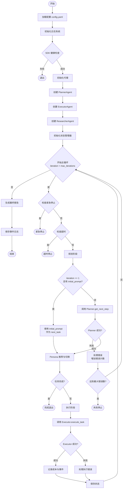
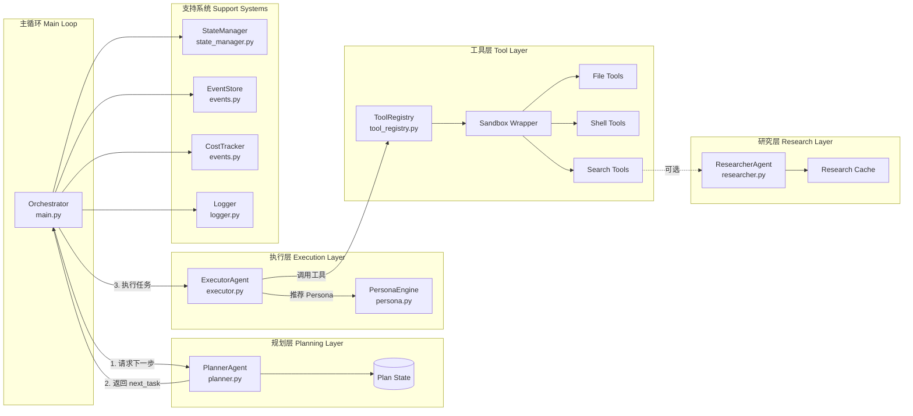
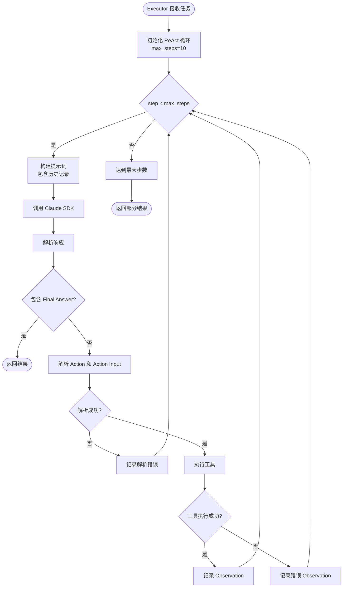
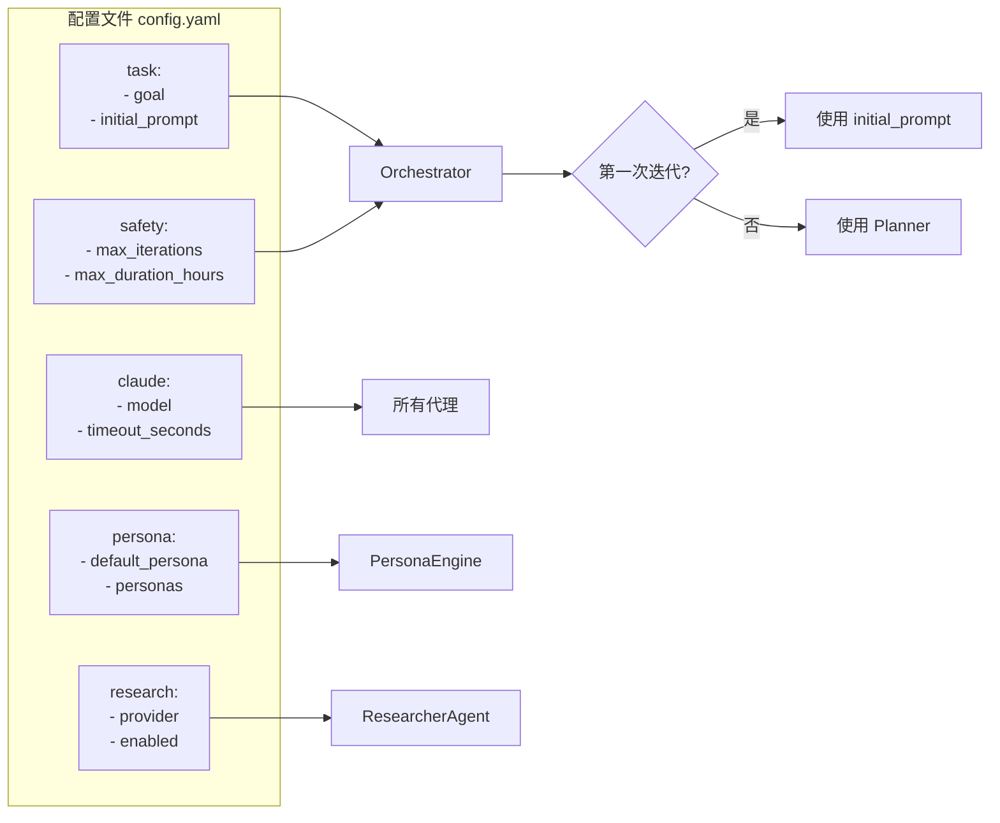
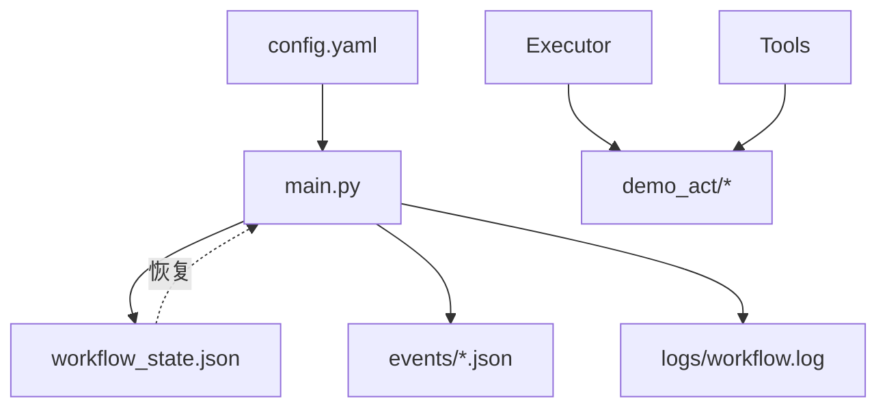

# Claude Code Auto v3 - 代码执行流程图

本文档描述了 Claude Code Auto v3 的完整执行流程。

## 主流程图

## 详细组件交互图

## ReAct 循环详细流程

## 配置驱动流程

## 关键特性

### 1. 显式初始步骤 (Explicit Initial Step)
- **触发条件**: `iteration == 1` 且 `config.task.initial_prompt` 已设置
- **行为**: 跳过 Planner，直接使用 `initial_prompt` 作为第一个任务
- **目的**: 允许用户手动驱动工作流的启动

### 2. Persona 动态切换
- **推荐**: 基于任务关键词自动推荐合适的 Persona
- **切换**: 自动切换到推荐的 Persona
- **记录**: 所有切换都被记录到状态历史中

### 3. 研究缓存
- **缓存**: 研究结果缓存 60 分钟
- **命中率**: 跟踪缓存命中率以优化性能

### 4. 安全护栏
- **最大迭代数**: 防止无限循环
- **超时控制**: 全局和单次迭代超时
- **紧急停止**: 通过文件触发紧急停止
- **错误计数**: 连续错误达到阈值后停止

### 5. 工具沙箱
- **异常捕获**: 所有工具执行都在沙箱中
- **错误返回**: 工具错误作为字符串返回，而非抛出异常
- **日志记录**: 详细记录工具执行情况

## 数据流

