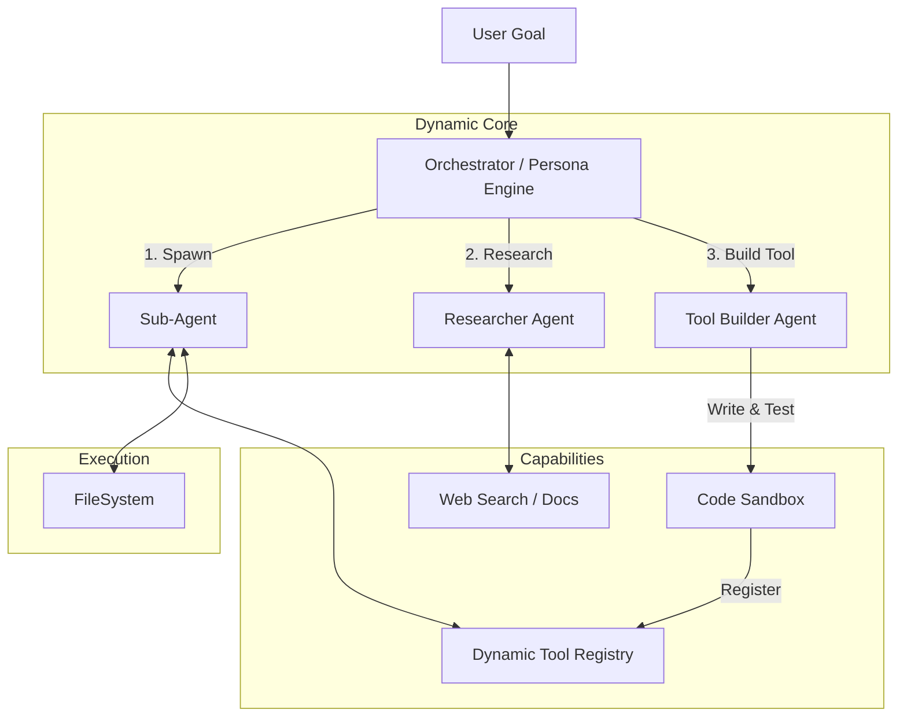
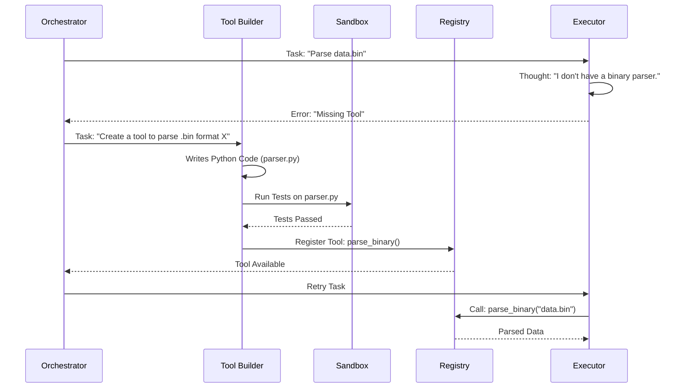

# v3.1 Architecture Specification: Dynamic Super-Agent

## 1. Vision & Value Proposition (愿景与价值)

The goal is to build a **"Self-Evolving Super-Agent"** that is not limited by static code or roles. It adapts its persona, tools, and knowledge base dynamically to solve any problem.

| Feature | v3.0 (ReAct) | v3.1 (Super-Agent) | Value |
| :--- | :--- | :--- | :--- |
| **Role** | Static (Planner/Executor) | **Dynamic Persona** | Can be a "CTO", "Hacker", or "Researcher" on demand. |
| **Knowledge** | Local Files | **Live Internet** | Solves problems using *latest* 2024/2025 solutions. |
| **Tools** | Pre-defined Registry | **Self-Building** | Writes its own tools (e.g., "I need a PDF parser, I'll write one"). |
| **Prompts** | Hardcoded Templates | **Meta-Prompting** | Optimizes its own prompts for best results. |

---

## 2. Feasibility Assessment (可行性评估)

Implementing this vision is **Feasible** but carries **High Complexity** and **Risks**.

| Capability | Feasibility | Technical Challenge | Risk |
| :--- | :--- | :--- | :--- |
| **Dynamic Roles** | ✅ High | Context management, Prompt injection. | Low. |
| **Web Search** | ✅ High | Integration with Search APIs (Tavily/SerpAPI). | Token cost, Info overload. |
| **Sub-Agents** | ✅ Medium | Orchestrating state between agents. | Infinite loops, Deadlocks. |
| **Tool Building** | ⚠️ Medium | **Sandboxing**: Executing AI-written code is dangerous. | **High**: System crash, Security breach. |
| **Meta-Prompting**| ✅ High | Evaluating prompt quality. | Degradation of performance. |

**Conclusion**: We can build this, but we must implement a **"Sandbox Layer"** for dynamic tools and a **"Cost Monitor"** for web search.

---

## 3. High-Level Architecture (系统架构)

The architecture evolves from a simple "Brain + Hands" to a **"Dynamic Organism"**.

### Core Components

1.  **The Orchestrator (The Soul)**:
    *   Manages the high-level goal.
    *   **Dynamic Persona Engine**: Decides "Who should I be right now?" (e.g., switches to "Security Expert" to audit code).
    *   **Meta-Cognition**: "My current prompt isn't working, let me rewrite it."

2.  **The Tool Builder (The Engineer)**:
    *   Detects missing capabilities.
    *   **Writes Python code** for new tools.
    *   **Validates** the tool in a Sandbox.
    *   **Hot-loads** the tool into the registry.

3.  **The Researcher (The Explorer)**:
    *   Access to **Web Search** (Google/Bing/Tavily).
    *   Access to **Documentation Scraper**.
    *   Summarizes findings into the context.

4.  **The Sub-Agent Swarm (The Team)**:
    *   Spawns specialized sub-agents (e.g., "Frontend Coder", "QA Tester") for parallel tasks.

### Architecture Diagram



---

## 4. Dynamic Workflows (动态工作流)

### Scenario: "I need to parse a specific binary format, but I don't have a tool for it."



---

## 5. Technical Implementation Details (技术细节)

### 5.1 Dynamic Persona Engine
We use **System Message Injection** to change roles.

```python
class PersonaEngine:
    def switch_persona(self, role: str):
        base_prompt = load_prompt("base_agent")
        role_prompt = load_prompt(f"roles/{role}") # e.g., "senior_architect"
        self.current_system_message = base_prompt + "\n" + role_prompt
```

### 5.2 Dynamic Tool Builder (The Risky Part)
To safely allow the agent to build tools:
1.  **Code Generation**: Agent writes the function string.
2.  **Static Analysis**: Use `ast` to check for forbidden imports (e.g., `os.system`, `subprocess` - unless authorized).
3.  **Sandboxed Execution**: Run the tool in a separate process or Docker container first.
4.  **Hot-Loading**: Use `importlib` to load the validated module.

### 5.3 Web Search Integration
We will integrate a search provider (e.g., Tavily API for AI-optimized results).

```python
@tool
def web_search(query: str) -> str:
    """Searches the internet for current info."""
    results = tavily.search(query)
    return summarize(results)
```

## 6. Roadmap to Super-Agent

1.  **Phase 1: The Foundation (v3.0)**
    *   Implement ReAct Loop.
    *   Implement Basic Tool Registry.

2.  **Phase 2: Connectivity (v3.1)**
    *   Add **Web Search Tool**.
    *   Add **Persona Switching** (Prompt Management).

3.  **Phase 3: Self-Evolution (v3.2)**
    *   Implement **Tool Builder** (Code-writing-code).
    *   Implement **Sandbox** for safety.
